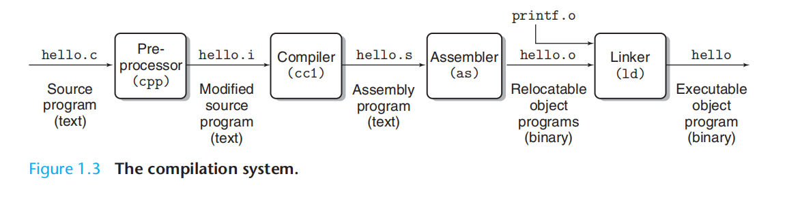
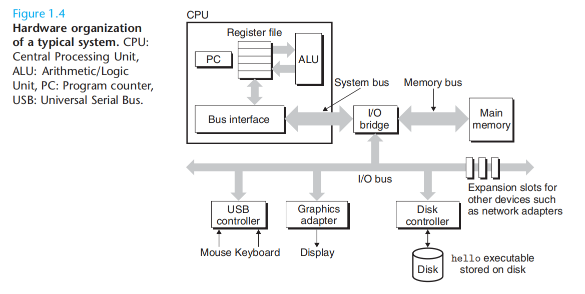
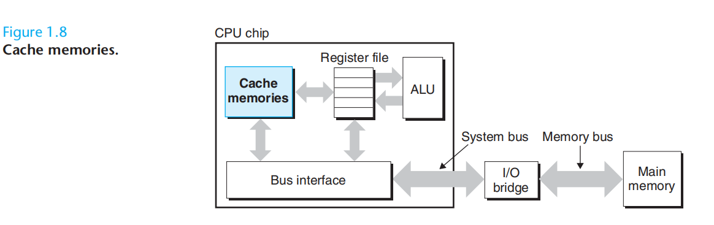
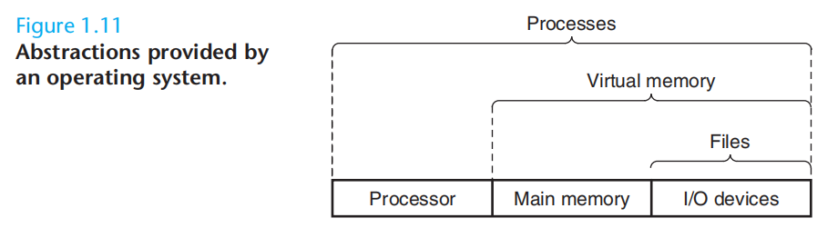
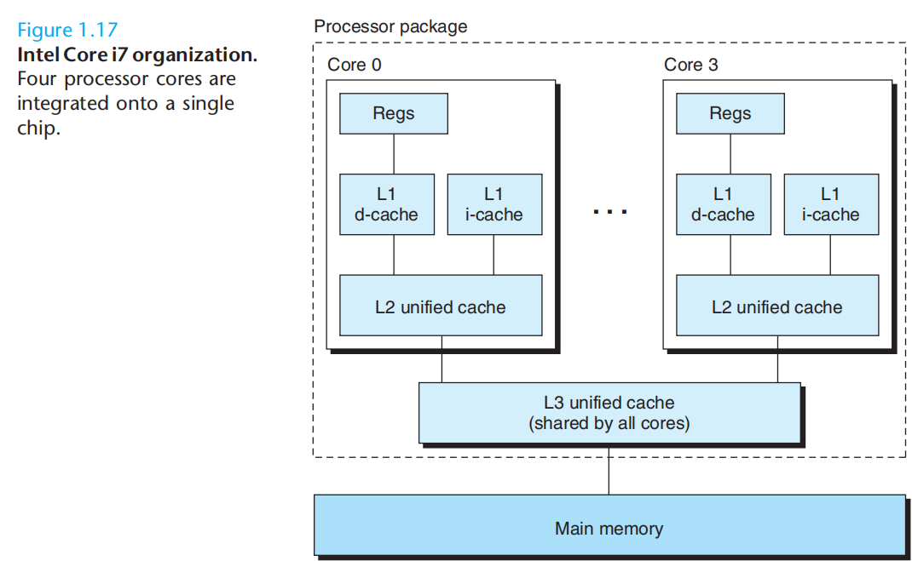
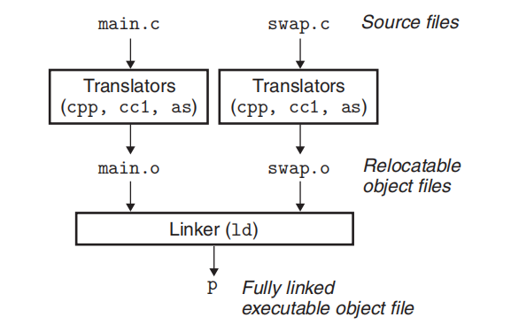
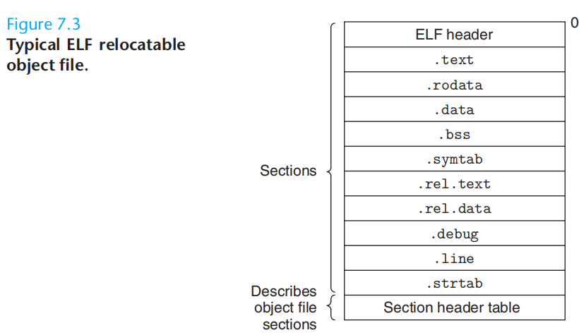
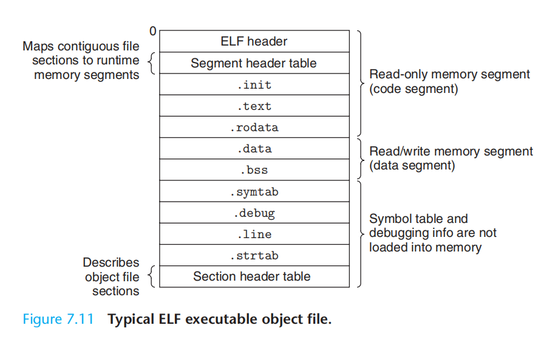
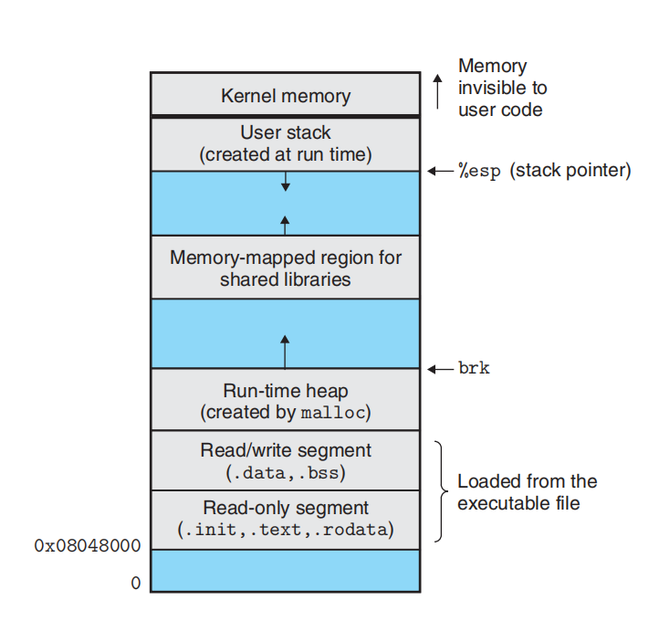
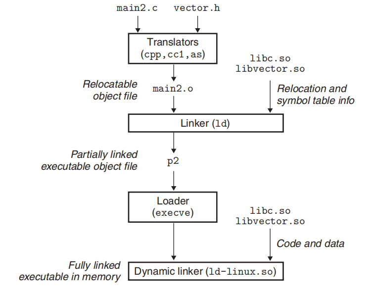

从第一版看到第三版，他这本书是非常全，对应国内多门课，如计算机原理/计算机组成。

# chp1: A Tour of Computer Systems

## compilation



## Processor



这是一个不包含cache 的简化模型

The central processing unit (CPU), or simply processor, is the engine that interprets (or executes) instructions stored in main memory. At its core is a word-sized storage device (or register) called the program counter (PC). At any point in time, the PC points at (contains the address of) some machine-language instruction in main memory

The processor reads the instruction from memory pointed at by the program counter (PC), interprets the bits in the instruction, performs some simple
operation dictated by the instruction, and then updates the PC to point to the next instruction, which may or may not be contiguous in memory to the instruction that was just executed.

There are only a few of these simple operations, and they revolve around main memory, the register file, and the arithmetic/logic unit (ALU). The register
file is a small storage device that consists of a collection of word-sized registers, each with its own unique name (如 IA-32的 EAX、EBX、ECX、EDX). The ALU computes new data and address values.

## cache
To deal with the processor-memory gap, system designers include smaller faster storage devices called cache memories (or simply caches) that serve as
temporary staging areas for information that the processor is likely to need in the near future.



The idea behind caching is that a system can get the effect of both a very large memory and a very fast one by exploiting locality, the tendency for
programs to access data and code in localized regions. By setting up caches to hold data that is likely to be accessed often, we can perform most memory operations using the fast caches.

locality 对各种不能预先判断的jmp 指令应该是深恶痛绝。

## OS


As this figure suggests,
* files are abstractions for I/O devices, 
* virtual memory is an abstraction for both the main memory and disk I/O devices, and
* processes are abstractions for the processor, main memory, and I/O devices.(alex: 应该是process认为自己独占镇整台computer 资源的含义吧。process is the operating system’s abstraction for a running program. Multiple processes can run concurrently on the same system, and each process appears to have exclusive use of the hardware.)

## multi-core processors and hyperthreading. 


Hyperthreading, sometimes called simultaneous multi-threading, is a technique that allows a single CPU to execute multiple flows of control. It involves
having multiple copies of some of the CPU hardware, such as program counters and register files, while having only single copies of other parts of the hardware, such as the units that perform floating-point arithmetic (alex:浮点运算还是由coprocessor完成，所以此时cpu空转？). Whereas a conventional processor requires around 20,000 clock cycles to shift between different threads, a hyperthreaded processor decides which of its threads to execute on a cycle by-cycle basis. It enables the CPU to make better advantage of its processing resources. For example, if one thread must wait for some data to be loaded into a cache, the CPU can proceed with the execution of a different thread. As an example, the Intel Core i7 processor can have each core executing two threads, and so a four-core system can actually execute eight threads in parallel. （alex: 这two threads 应该没法将core的速度加快，只是能够通过切换thread 减少core的空闲时间。）

# chp 7: linking
Linking is the process of collecting and combining various pieces of code and data into a single file that can be loaded (copied) into memory and executed.
Linking can be performed

* at compile time, when the source code is translatedinto machine code; 
* at load time, when the program is loaded into memory and executed by the loader; and even 
* at run time, by application programs.



To build the executable, the linker (ld under Linux) must perform two main tasks:
* Symbol resolution. 

Object files define and reference symbols. The purpose of symbol resolution is to associate each **symbol reference** with exactly one **symbol definition**.

* Relocation. Compilers and assemblers generate code and data sections that start at address 0. 

The linker relocates these sections by associating a **memory location** with each **symbol definition**, and then modifying all associated  **symbol reference** so that they point to this **memory locatiion**.


Linux下ELF(Executable and Linkable Format)文件分为以下几种：
* 可重定位文件，例如SimpleSection.o；
* 可执行文件，例如/bin/bash；
* 共享目标文件，例如/lib/libc.so。
* Core dump文件

## Relocatable object file (.o)

* .text: 已编译程序的二进制代码
* .rodata: 只读数据段，比如常量
* .data: 已初始化的全局变量和静态变量
* .bss: 未初始化的全局变量和静态变量，所有被初始化成0的全局变量和静态变量
* .sysmtab: 符号表，它存放了程序中定义和引用的函数和全局变量的信息. (Alex **symbol definition** ?)
* .debug: 调试符号表，它需要以'-g'选项编译才能得到，里面保存了程序中定义的局部变量和类型定义，程序中定义和引用的全局变量，以及原始的C文件
* .line: 原始的C文件行号和.text节中机器指令之间的映射。A mapping between line numbers in the original C source program and machine code instructions in the .text section. It is only present if the compiler driver is invoked with the -g option.
* .strtab: 字符串表，内容包括.symtab和.debug节中的符号表。 A string table for the symbol tables in the .symtab and .debug sections, and for the section names in the section headers. A string table is a sequence of null-terminated character strings. (Alex:这样就避免了字符串出现在代码中)


由于在编译时，并不能确定它引用的外部函数和变量的地址信息，因此，编译器在生成目标文件时，增加了两个section：

* Relocation entries for code are placed in .rel.text. (Alex:就是需要在.text section 修改reference的)
* .rel.data Relocation information for any global variables that are referenced or defined by the module. In general, any initialized global variable
whose initial value is the address of a global variable or externally defined function will need to be modified

[main.c](main.c) 引用了外部的函数与变量，可以检查一下它的**symbol reference**.

```
$ gcc -c main.c
$ objdump -r main.o

main.o:     file format elf64-x86-64

RELOCATION RECORDS FOR [.text]:
OFFSET           TYPE              VALUE 
000000000000000f R_X86_64_PLT32    f-0x0000000000000004
000000000000001b R_X86_64_PLT32    g-0x0000000000000004
0000000000000024 R_X86_64_PC32     j-0x0000000000000004


RELOCATION RECORDS FOR [.eh_frame]:
OFFSET           TYPE              VALUE 
0000000000000020 R_X86_64_PC32     .text

```
可以看到main() 中的f(),g(),j 因为在main.c中没有define, 所以都需要relocation. j 作为一个外部全局变量在代码中使用，也出现在 .rel.text 中。


[main2.c](main2.c)  用到了.rel.data，local和非local两种。

```
$ gcc -c main2.c 
$ objdump -r main2.o

main2.o:     file format elf64-x86-64

RELOCATION RECORDS FOR [.text]:
OFFSET           TYPE              VALUE 
0000000000000006 R_X86_64_PC32     j-0x0000000000000004


RELOCATION RECORDS FOR [.data.rel.local]:
OFFSET           TYPE              VALUE 
0000000000000000 R_X86_64_64       i


RELOCATION RECORDS FOR [.data.rel]:
OFFSET           TYPE              VALUE 
0000000000000000 R_X86_64_64       j


RELOCATION RECORDS FOR [.eh_frame]:
OFFSET           TYPE              VALUE 
0000000000000020 R_X86_64_PC32     .text

```


* .rela.eh_frame：

这个section同.rel.text一样属于重定位信息的section，只不过它包含的是eh_frame的重定位信息 (When using languages that support exceptions, such as C++, additional information must be provided to the runtime environment that describes the call frames that much be unwound during the processing of an exception. This information is contained in the special sections.eh_frameand.eh_framehdr.)

可以disable

```
$ gcc -c -fno-asynchronous-unwind-tables main.c
$ objdump -r main.o

main.o:     file format elf64-x86-64

RELOCATION RECORDS FOR [.text]:
OFFSET           TYPE              VALUE 
000000000000000f R_X86_64_PLT32    f-0x0000000000000004
000000000000001b R_X86_64_PLT32    g-0x0000000000000004
0000000000000024 R_X86_64_PC32     j-0x0000000000000004


```


## Executable object file.


由于它已经全部完成了重定位工作，可以直接加载到内存中执行，所以它
* 不存在.rel section。但是，
* 它增加了一个section .init: The .init section defines a small function, called _init, that will be called by the program’s initialization code. 

[static.c](static.c)

```
$ gcc static.c
$ objdump -d a.out

a.out:     file format elf64-x86-64


Disassembly of section .init:

00000000000004b8 <_init>:
 4b8:	48 83 ec 08          	sub    $0x8,%rsp
 4bc:	48 8b 05 25 0b 20 00 	mov    0x200b25(%rip),%rax        # 200fe8 <__gmon_start__>
 4c3:	48 85 c0             	test   %rax,%rax
 4c6:	74 02                	je     4ca <_init+0x12>
 4c8:	ff d0                	callq  *%rax
 4ca:	48 83 c4 08          	add    $0x8,%rsp
 4ce:	c3                   	retq   
```

* .init和.init_array: 
这个section中保存了该可执行程序main函数执行之前的初始化代码， 比如设置环境变量，给main函数传递参数等

* .fini和.fini_array: 
这个section中保存了该可执行程序main函数正常退出之后执行的代码。


### Mangling of linker symbols in C++ and Java
Both C++ and Java allow **overloaded** methods that have the same name in the source code but different parameter lists. So how does the linker tell the difference between these different overloaded functions? Overloaded functions in C++ and Java work because the compiler encodes each unique method and parameter list combination into a unique name for the linker. This encoding process is called mangling,and the inverse process demangling.

### load

On 32-bit Linux systems, the code segment starts at address 0x08048000.



When the loader runs, it creates the memory image as above,Guided by the segment header table in the executable, it copies chunks of the executable into the code and data segments. Next, the loader jumps to the program’s entry point, which is always the address of the _start symbol. The startup code at the _start address is defined in the object file crt1.o and is the same for all C programs. 

```
$ objdump -d a.out

Disassembly of section .text:

00000000000004f0 <_start>:
 4f0:	31 ed                	xor    %ebp,%ebp
 4f2:	49 89 d1             	mov    %rdx,%r9
 4f5:	5e                   	pop    %rsi
 4f6:	48 89 e2             	mov    %rsp,%rdx
 4f9:	48 83 e4 f0          	and    $0xfffffffffffffff0,%rsp
 4fd:	50                   	push   %rax
 4fe:	54                   	push   %rsp
 4ff:	4c 8d 05 9a 01 00 00 	lea    0x19a(%rip),%r8        # 6a0 <__libc_csu_fini>
 506:	48 8d 0d 23 01 00 00 	lea    0x123(%rip),%rcx        # 630 <__libc_csu_init>
 50d:	48 8d 3d e6 00 00 00 	lea    0xe6(%rip),%rdi        # 5fa <main>
 514:	ff 15 c6 0a 20 00    	callq  *0x200ac6(%rip)        # 200fe0 <__libc_start_main@GLIBC_2.2.5>
 51a:	f4                   	hlt    
 51b:	0f 1f 44 00 00       	nopl   0x0(%rax,%rax,1)

```
virtual memory 下的loader并不会copy 整个elf文件到内存，而是copy as need.

For the impatient reader, here is a preview of how loading really works: Each program in a Unix system runs in the context of a process with its own virtual address space.When the shell runs a program, the parent shell process forks a child process that is a duplicate of the parent. The child process invokes
the loader via the execve system call. The loader deletes the child’s existing virtual memory segments, and creates a new set of code, data, heap, and stack segments. The new stack and heap segments are initialized to zero. The new code and data segments are initialized to the contents of the executable
file by mapping pages in the virtual address space to page-sized chunks of the executable file. Finally, the loader jumps to the _start address, which eventually calls the application’s main routine. Aside from some header information, there is no copying of data from disk to memory during loading. The
copying is deferred until the CPU references a mapped virtual page, at which point the operating system automatically transfers the page from disk to memory using its paging mechanism


## Shared object file.
这就是涉及到 [static & dynamic linking](CSAPP_lib.md). 简单的说，静态链接库只是把.o文件打成一个包而已(archive),而动态链接则涉及编译出一个与加载位置无关的.so 文件。Dynamic Linking with Shared Libraries。

Shared libraries are “shared” in two different ways. First, in any given file system, there is exactly one .so file for a particular library. The code and data in this .so file are shared by all of the executable object files that reference the library, as opposed to the contents of static libraries, which are copied and embedded in the executables that reference them. Second, a single copy of the .text section of a shared library in memory can be shared by different running processes. 



Position-Independent Code (PIC)文件的特点，看 [static & dynamic linking](CSAPP_lib.md).
如何链接/访问到.so这一步，可以
* 命令行调用dynamic linker 
* application 调用dynamic linker 的函数接口实现。


