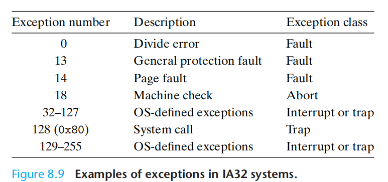

Exceptions are a form of exceptional control flow that are implemented partly by the hardware and partly by the operating system. Because they are partly
implemented in hardware, the details vary from system to system. 

Note： 这与c++/java中的 “exception” 不是同一语境的东西。

# Classes of exceptions

Class |   Cause |  Async/Sync  |   Return behavior|
------------ | -------------| -------------| -------------|
Interrupt |Signal from I/O device | Async |Always returns to next instruction|
Trap |Intentional exception |Sync |Always returns to next instruction |
Fault|Potentially recoverable error |Sync |Might return to current instruction |
Abort| Nonrecoverable error| Sync |Never returns|

Interrupts occur asynchronously as a result of signals from I/O devices that are external to the processor. Hardware interrupts are asynchronous in the sense
that they are not caused by the execution of any particular instruction. Exception handlers for hardware interrupts are often called interrupt handlers. I/O devices such as network adapters, disk controllers, and timer chips trigger interrupts by signaling a pin on the processor chip and placing onto the system bus the exception number that identifies the device that caused the interrupt. After the current instruction finishes executing (ALEX：不能打断当前指令的执行，印象中只有用户态才能响应中断？？), the processor notices that the interrupt pin has gone high, reads the exception number from the system bus, and then calls the appropriate interrupt handler. 

Traps are intentional exceptions that occur as a result of executing an instruction. Like interrupt handlers, trap handlers return control to the next instruction. The most important use of traps is to provide a procedure-like interface between user programs and the kernel known as a system call. A system call runs in kernel mode, which allows it to execute instructions, and accesses a stack defined in the kernel.

A classic example of a fault is the page fault exception, which occurs when an instruction references a virtual address whose corresponding physical page is not resident in memory and must therefore be retrieved from disk. a page is a contiguous block ,typically 4 KB of virtual memory. The page fault handler loads the appropriate page from disk and then returns control to the instruction that caused the fault. When the instruction executes again, the appropriate physical page is resident in memory and the instruction is able to run to completion without faulting.

Aborts result from unrecoverable fatal errors, typically hardware errors such as parity errors that occur when DRAM or SRAM bits are corrupted. Abort
handlers never return control to the application program. 

# tools for monitoring and manipulating processes:

* strace: Prints a trace of each system call invoked by a running program and its children. A fascinating tool for the curious student. Compile your
program with -static to get a cleaner trace without a lot of output related to shared libraries.
* ps: Lists processes (including zombies) currently in the system.
* top: Prints information about the resource usage of current processes.
* pmap: Displays the memory map of a process.
* /proc: A virtual filesystem that exports the contents of numerous kernel data structures in an ASCII text form that can be read by user programs.