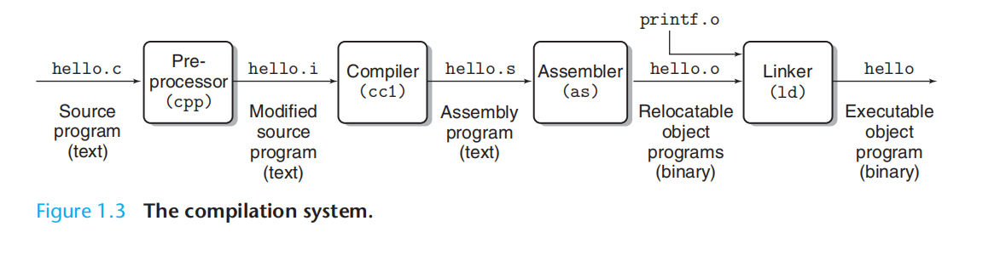
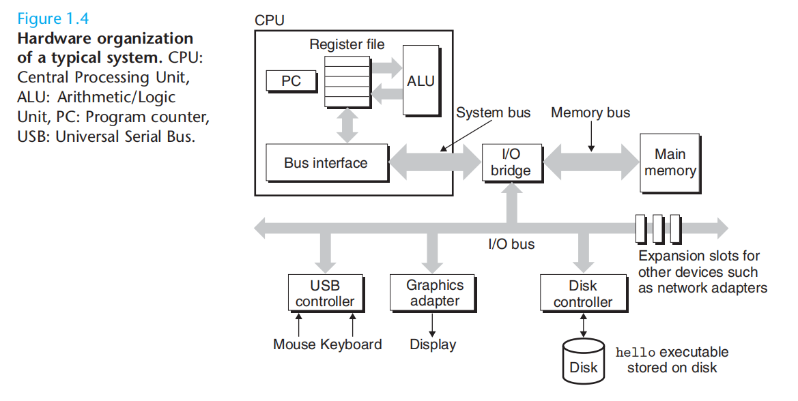
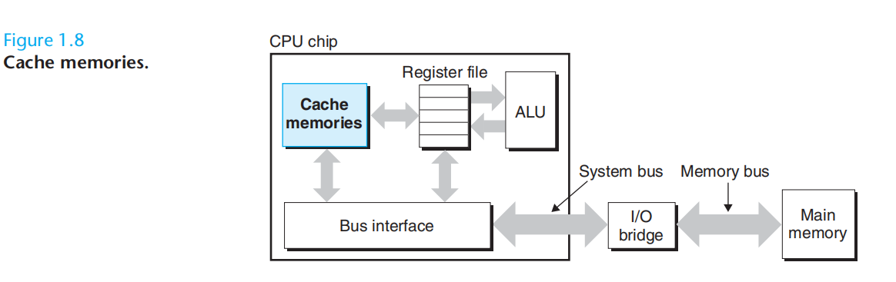
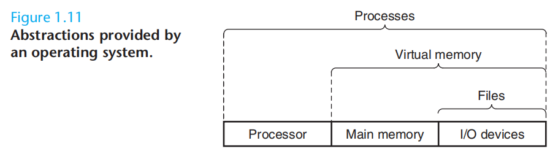
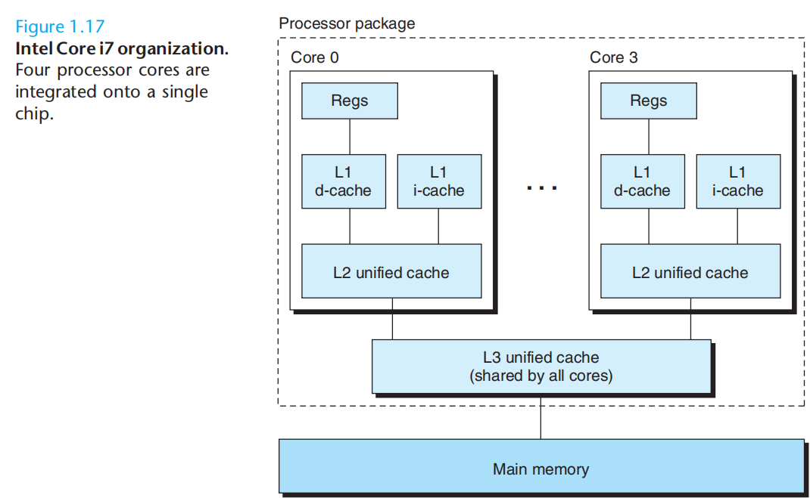

# chp1: A Tour of Computer Systems

## compilation

## Processor

这是一个不包含cache 的简化模型

The central processing unit (CPU), or simply processor, is the engine that interprets (or executes) instructions stored in main memory. At its core is a word-sized storage device (or register) called the program counter (PC). At any point in time, the PC points at (contains the address of) some machine-language instruction in main memory

The processor reads the instruction from memory pointed at by the program counter (PC), interprets the bits in the instruction, performs some simple
operation dictated by the instruction, and then updates the PC to point to the next instruction, which may or may not be contiguous in memory to the instruction that was just executed.

There are only a few of these simple operations, and they revolve around main memory, the register file, and the arithmetic/logic unit (ALU). The register
file is a small storage device that consists of a collection of word-sized registers, each with its own unique name (如 IA-32的 EAX、EBX、ECX、EDX). The ALU computes new data and address values.

## cache
To deal with the processor-memory gap, system designers include smaller faster storage devices called cache memories (or simply caches) that serve as
temporary staging areas for information that the processor is likely to need in the near future.

The idea behind caching is that a system can get the effect of both a very large memory and a very fast one by exploiting locality, the tendency for
programs to access data and code in localized regions. By setting up caches to hold data that is likely to be accessed often, we can perform most memory operations using the fast caches.

locality 对各种不能预先判断的jmp 指令应该是深恶痛绝。

## OS

As this figure suggests,
* files are abstractions for I/O devices, 
* virtual memory is an abstraction for both the main memory and disk I/O devices, and
* processes are abstractions for the processor, main memory, and I/O devices.(alex: 应该是process认为自己独占镇整台computer 资源的含义吧。process is the operating system’s abstraction for a running program. Multiple processes can run concurrently on the same system, and each process appears to have exclusive use of the hardware.)

## multi-core processors and hyperthreading. 

Hyperthreading, sometimes called simultaneous multi-threading, is a technique that allows a single CPU to execute multiple flows of control. It involves
having multiple copies of some of the CPU hardware, such as program counters and register files, while having only single copies of other parts of the hardware, such as the units that perform floating-point arithmetic (alex:浮点运算还是由coprocessor完成，所以此时cpu空转？). Whereas a conventional processor requires around 20,000 clock cycles to shift between different threads, a hyperthreaded processor decides which of its threads to execute on a cycle by-cycle basis. It enables the CPU to make better advantage of its processing resources. For example, if one thread must wait for some data to be loaded into a cache, the CPU can proceed with the execution of a different thread. As an example, the Intel Core i7 processor can have each core executing two threads, and so a four-core system can actually execute eight threads in parallel. （alex: 这two threads 应该没法将core的速度加快，只是能够通过切换thread 减少core的空闲时间。）

