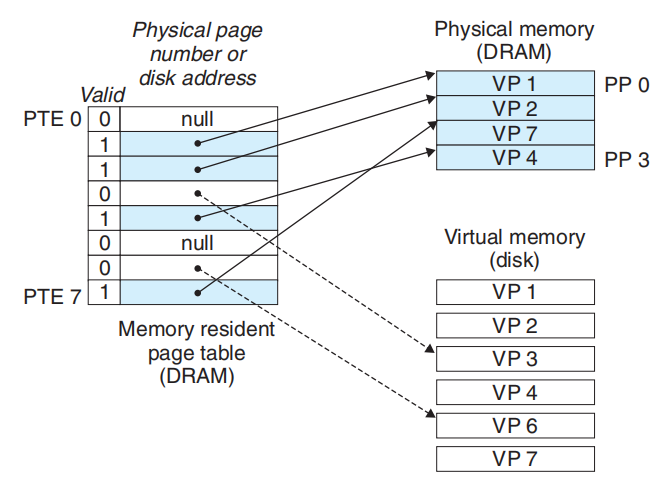

实际上Processes in a system share the CPU and main memory with other processes. 但是为了使process 不用考虑share memory 这复杂的问题。modern systems provide an abstraction of main memory known as virtual memory (VM).Virtual memory is an elegant interaction of hardware exceptions, hardware address translation, main memory, disk files, and kernel software that provides each process with a large, uniform, and private address space. With one clean mechanism, virtual memory provides three important capabilities.
* It uses main memory efficiently by treating it as **a cache for an address space stored on disk**,keeping only the active areas in main memory, and transferring data back and forth between disk and memory as needed. 
* It simplifies memory management by providing each process with a uniform address space. 
* It protects the address space of each process from corruption by other processes.

# Physical and Virtual Addressing

With virtual addressing, the CPU accesses main memory by generating a virtual address (VA), which is converted to the appropriate physical address before being sent to main memory. The task of converting a virtual address to a physical one is known as address translation. Like exception handling, address translation requires close cooperation between the CPU hardware and the operating system. Dedicated hardware on the CPU chip called the memory management unit(MMU)translates virtual addresses on the fly, using a lookup table stored in main memory whose contents are managed by the operating system.

# virtual memory
Conceptually, a virtual memory is organized as an array of N contiguous byte-sized cells stored on disk. Each byte has a unique virtual address that serves as an index into the array. The contents of the array on disk are cached in main memory. As with any other cache in the memory hierarchy, the data on disk (the lower level) is partitioned into blocks that serve as the transfer units between the disk and the main memory (the upper level). VM systems handle this by partitioning the virtual page is P = 2^p bytes in size. Similarly, physical memory is partitioned into physical pages (PPs), also P bytes in size. (Physical pages are also referred to as page frames.)

## VM as a Tool for Caching

pages

* VM 划分为 virtual pages (VPs)
* physical memory is partitioned into physical pages(PPs)

Caching 功能 are provided by a combination of operating system software, address translation hardware in the MMU (memory management unit), and a data structure stored in physical memory known as a page table that maps virtual pages to physical pages. The address translation hardware reads the page table
each time it converts a virtual address to a physical address. 

###  handle of page hits
A control register in the CPU, the page table base register (**PTBR**) points to the current page table.  page table 由page table entries (PTEs)组成。
the CPU hardware performs when there is a page hit.
* Step 1: The processor generates a virtual address and sends it to the MMU.
* Step 2: The MMU generates the PTE address and requests it from the cache/main memory.
* Step 3: The cache/main memory returns the PTE to the MMU.
* Step 3: The MMU constructs the physical address and sends it to cache/main memory.
* Step 4: The cache/main memory returns the requested data word to the processor.

### handle of page fault

### allocate a virtual page

### 提高 page hits rate,减少 thrashing(颠簸)
Although the total number of distinct pages that programs reference during an entire run might exceed the total size of physical memory, the principle of locality promises that at any point in time they will tend to work on a smaller set of active pages known as the **working set** or resident set. After an initial overhead where the working set is paged into memory, subsequent references to the working set result in hits, with no additional disk traffic。 alex:印象中OS课程中有内容就是如何规划 **working set**，让它们作为一个整体倒入倒出。

## VM as a Tool for Memory Management
The combination of demand paging and separate virtual address spaces has a profound impact on the way that memory is used and managed in a system. In
particular, VM simplifies linking and loading, the sharing of code and data, and allocating memory to applications.
alex: 简单的说，由于所有的process， 在os 中都是一个独立的address space,不需要考虑 physical address space,而是运行时交由系统处理。

## VM as a Tool for Memory Protection
也就是页表项上加上权限控制. 比intel 的段保护机制比应该简单多了。

## address translation

### Speeding Up Address Translation with a TLB
As we have seen, every time the CPU generates a virtual address, the MMU must refer to a PTE in order to translate the virtual address into a physical address. In the worst case, this requires an additional fetch from memory, at a cost of tens to hundreds of cycles. If the PTE happens to be cached in L1, then the cost goes down to a handful of cycles. However, many systems try to eliminate even this cost by including a small cache of PTEs in the MMU called a translation lookaside buffer(TLB).

A TLB is a small, virtually addressed cache where each line holds a block consisting of a single PTE.

## Linux Virtual Memory System
Linux organizes the virtual memory as a collection of areas (also called segments).An area is a contiguous chunk of existing (allocated) virtual memory whose pages are related in some way. For example, the code segment, data segment, heap,shared library segment, and user stack are all distinct areas. Each existing virtual page is contained in some area, and any virtual page that is not part of some area does not exist and cannot be referenced by the process. The notion of an area is important because it allows the virtual address space to have gaps. The kernel does not keep track of virtual pages that do not exist, and such pages do not consume any additional resources in memory, on disk, or in the kernel itself. 也就是说，linux 在page 之上加了 areas/segments 这一集合个概念，也就是所谓的段页式管理，段和页都用上了，只是段与intel cpu的segment概念不同，所以也不依赖于intel cpu.

Figure above highlights the kernel data structures that keep track of the virtual memory areas in a process. The kernel maintains a distinct task structure (task_struct in the source code) for each process in the system. The elements of the task structure either contain or point to all of the information that the kernel needs to run the process (e.g., the PID, pointer to the user stack, name of the executable object file, and program counter).

One of the entries in the task structure points to an mm_struct that characterizes the current state of the virtual memory. The two fields of interest to us
are pgd, which points to the base of the level 1 table (the page global directory),and mmap, which points to a list of vm_area_structs (area structs), each of which characterizes an area of the current virtual address space. When the kernel runs this process, it stores pgd in the CR3 control register.

上图的处理过程，简单的说，就是触发常规的page fault处理流程前会检索一下vm_area_struct 这一链表，分为
* 不出现在链表的任意一个area 中，invalid->Segmentation fault
* 出现在链表的一个area 中,normal
* 出现在链表的一个area 中,但不符合protection,Protection exception

# Memory Mapping
Modern systems initialize chunks of virtual memory by associating them with chunks of files on disk, a process known as memory mapping. Memory mapping
provides an efficient mechanism for sharing data, creating new processes, and loading programs. Applications can manually create and delete areas of the virtual address space using the mmap function. However, most programs rely on a dynamic memory allocator such as malloc, which manages memory in an area of the virtual address space called the heap. Dynamic memory allocators are application-level programs with a system-level feel, directly manipulating memory without much help from the type system. Allocators come in two flavors. Explicit allocators require applications to explicitly free their memory blocks. Implicit allocators (garbage collectors) free any unused and unreachable blocks automatically.

# some thinking
再看这些知识，感慨在系统设计的时候，de-coupling 和 abstract的重要。 系统的演化越来越复杂，如果不abstract就难以理解整体；不de-coupling 每一次演化都带来痛苦的大量改动。

