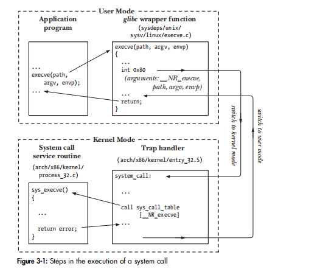
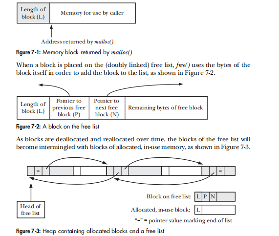

Last time, the booking reading & practise was under the CentOS, this time is under Ubuntu.

总体读后感，这本书虽然被称为linux开发圣经，但是如果用它来学linux os本身并不合适，它虽然尽可能按讲os的方式来叙述，但总体还是仿APUE，把syscall/lib function 分类作为一个个章节来讲。

# Preparation
## env check
```
$ uname -a
Linux minipc 5.3.0-46-generic #38~18.04.1-Ubuntu SMP Tue Mar 31 04:17:56 UTC 2020 x86_64 x86_64 x86_64 GNU/Linux

$ find /lib/ -name "libc*"
$ getconf GNU_LIBC_VERSION


//用来检查file systems which kernel supports
$ cat /proc/filesystems
$ mount      //To list the currently mounted file systems
```
## install lib
```
sudo apt-get install libacl1-dev  libcap-dev libselinux-dev
```
## download source code

http://www.man7.org/tlpi/


## build
* 修改一下 Makefile.inc 的 CFLAGS / LDLIBS macros.
* 进入lib 目录，make
* 需要编译某某目录时，再调用 make, 退出时 make clean
* 不调用根目录的make

这样 git status 看改动比较清晰。

# chp3 SYSTEM PROGRAMMING CONCEPTS 

From a programming point of view, invoking a system call looks much like calling a C function,这是通过 a wrapper function in the C library 来实现的。


the example of the execve() system call. On Linux/x86-32, execve() is system call number 11 (__NR_execve). Thus, in the sys_call_table vector, entry 11 contains the address of sys_execve(), the service routine for this system call. (On Linux, system call service routines typically have names of the form sys_xyz(), where xyz() is the system call in question.)

note
* wrapper function 通过 a trap machine instruction (int 0x80) 转入kernel mode
* 通常的 function call 通过stack来传递参数的，但是syscall 由于user/kernel stack不同，只能通过register来传递参数。

如果调用syscall，由于涉及user/kernel mode 的切换，时间比一般的function call 耗时多很多。
example under folder progconc:
```
$ make
$ time ./syscall_speed
Calling getppid()

real	0m6.590s
user	0m4.722s
sys	0m1.869s
```
如果不调用syscall
```
$ make "DEBUG_FLAG = -DNOSYSCALL"
$ time ./syscall_speed 
Calling normal function

real	0m0.049s
user	0m0.049s
sys	0m0.000s
```

# chp7 MEMORY ALLOCATION
## Adjusting the Program Break
一个process 能够使用的heap 上限称为program break，通过SYSTEM CALL brk()/sbrk()来修改。



* 在一个支持[virtual memory](../CSAPP3/vm.md)的OS 下修改Program Break，只是修改VM的管理信息，并不实际分配physical memory,而是等到实际需要时再分配
* 既然Linux 是一种段页式的管理， Program Break 的扩展也是以 page 为单位。 
* 一般不直接调用brk()/sbrk()； 而是调用 malloc()来在申请heap，它会根据需要调用 brk()/sbrk() 来 increase program break. 
* In general, free() doesn’t lower the program break, but instead adds the block of memory to a list of free blocks that are recycled by future calls to malloc().

```
$ ./free_and_sbrk 100 1024 2

Initial program break:          0x7fffec141000
Allocating 100*1024 bytes
Program break is now:           0x7fffec141000
Freeing blocks from 1 to 100 in steps of 2
After free(), program break is: 0x7fffec141000

$ ./free_and_sbrk 100 10240 2

Initial program break:          0x7fffde75f000
Allocating 100*10240 bytes
Program break is now:           0x7fffde84e000
Freeing blocks from 1 to 100 in steps of 2
After free(), program break is: 0x7fffde84e000
```

Valgrind 是一个比较好用的 memory leak 检测工具，它是类似虚拟机，把被测试放在其中执行。 如果Linux OS可以启动一种 memory debug 模式，程序运行完后，输出free list 等用于管理memory 的数据结构的变化，就可以更好的完成 memory leak 检测功能。实例[log analyzer in C++](../C++/logAnalyzer.md)

## 其他memory 函数
 calloc() and realloc()，realloc(） 不太常用。
 alloca() 不太明白为啥不用定义一个局部变量来替代。 


# chp9 PROCESS CREDENTIALS
是  chp8 USERS AND GROUPS 的强化。 因为一个文件1)创建时owner 赋予一套权限,2)运行者有一套权限，所以得综合考虑
* real user ID and group ID;  运行该文件的id.
* effective user ID and group ID; 考虑suid/sgid 后的实际id
* saved set-user-ID and saved set-group-ID; If the set-user-ID (set-group-ID) permission bit is enabled on the executable, then the effective user (group) ID of the process is made the same as the owner of the executable. If the set-user-ID (set-group-ID) bit is not set, then no change is made to the effective user (group) ID of the process.
* file-system user ID and group ID (Linux-specific); 过时的概念，同effective id.
* supplementary group IDs

```
$ ./idshow 
UID: real=alex (1000); eff=alex (1000); saved=alex (1000); fs=alex (1000); 
GID: real=alex (1000); eff=alex (1000); saved=alex (1000); fs=alex (1000); 
Supplementary groups (8): adm (4) cdrom (24) sudo (27) dip (30) plugdev (46) lpadmin (116) sambashare (126) alex (1000) 

$ su 
Password: 
# chown root:root ./idshow
# chmod 4755 ./idshow
# exit
exit

$ ls -l ./idshow
-rwsr-xr-x 1 root root 32064 Apr 28 13:52 ./idshow
$ ./idshow 
UID: real=alex (1000); eff=root (0); saved=root (0); fs=root (0); 
GID: real=alex (1000); eff=alex (1000); saved=alex (1000); fs=alex (1000); 
Supplementary groups (8): adm (4) cdrom (24) sudo (27) dip (30) plugdev (46) lpadmin (116) sambashare (126) alex (1000) 
```

# chp13 FILE I/O BUFFERING
chp4/5 FILE I/O 讲的file descriptor, a (usually small) nonnegative integer. File descriptors are used to refer to all types of open files, including pipes, FIFOs, sockets, terminals, devices, and regular files. Each process has its own set of file descriptors. alex: 用fd来访问文件的方式，由于没有buffer,编程时一般不直接用，不过OS内部的数据结构是要搞清楚的。

通过fp访问文件， 是标准的 I/O 操作了，理论上修改buffer大小会影响性能，在[log analyzer in C++](../C++/logAnalyzer.md)尝试过，发现自己增大buffer反而降低性能，可能
* 由于现在的磁盘就是有buffer的，修改kernel I/O 本身就没必要
* kernel 默认的就是比较优化了。


**其余章节**
* [chp14-19 FILE SYSTEMS](filesystem.md)
* [chp20-22 signal](signal.md)
* [chp24-28 process](process.md)
* [chp29-33 thread](thread.md)
* [chp37  daemon](daemon.md)
* [chp43-48 IPC](IPC.md)
* [chp56-61 socket](socket.md)