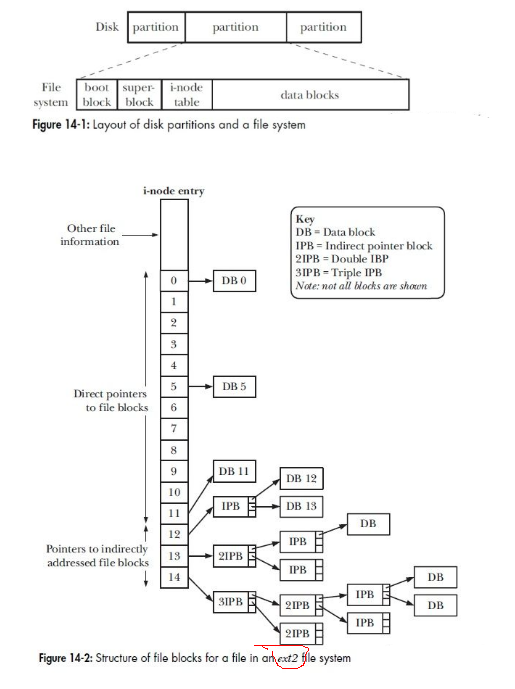
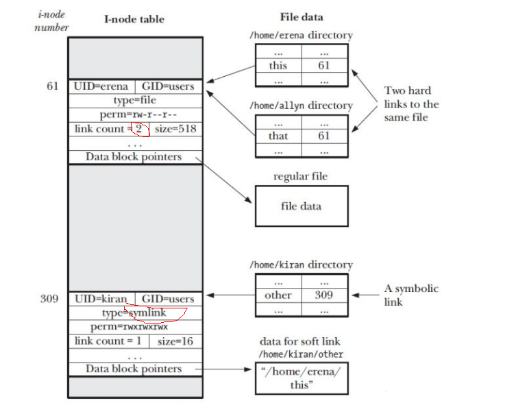
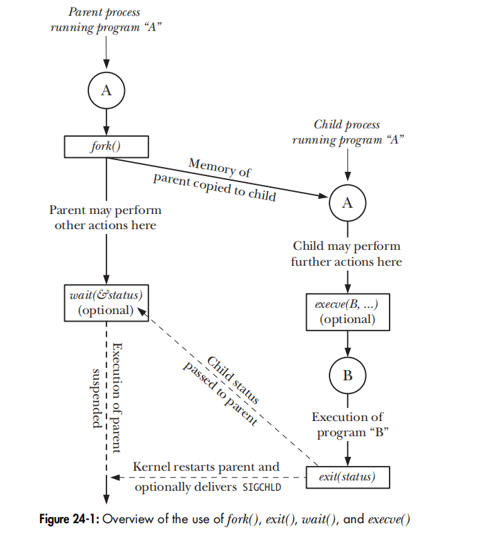
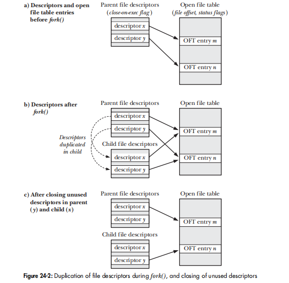
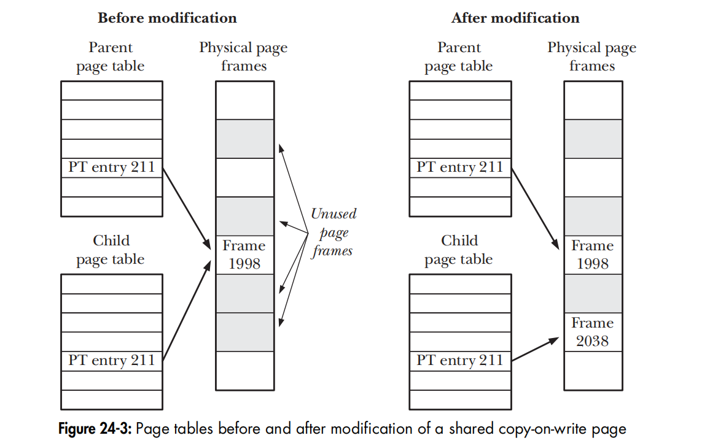
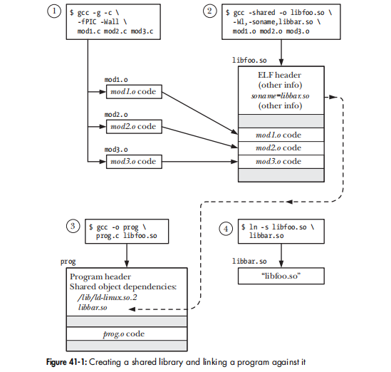
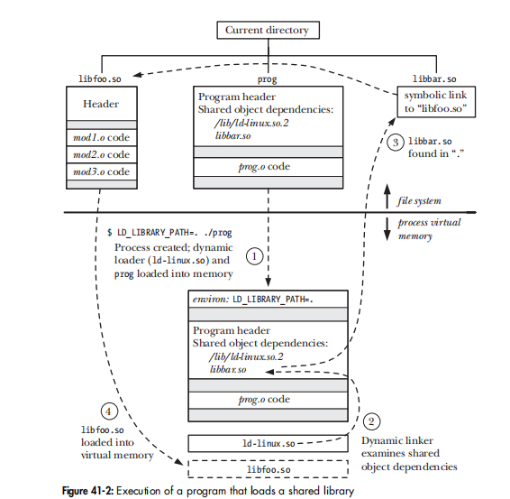

Last time, the booking reading & practise was under the CentOS, this time is under Ubuntu.

# Preparation
## env check
```
$ uname -a
Linux minipc 5.3.0-46-generic #38~18.04.1-Ubuntu SMP Tue Mar 31 04:17:56 UTC 2020 x86_64 x86_64 x86_64 GNU/Linux

$ find /lib/ -name "libc*"
$ getconf GNU_LIBC_VERSION


//用来检查file systems which kernel supports
$ cat /proc/filesystems
$ mount      //To list the currently mounted file systems
```
## install lib
```
sudo apt-get install libacl1-dev  libcap-dev libselinux-dev
```
## download source code

http://www.man7.org/tlpi/


## build
* 修改一下 Makefile.inc 的 CFLAGS / LDLIBS macros.
* 进入lib 目录，make
* 需要进入某目录时再调用 make, 推出时 make clean
* 不调用根目录的make

这样 git status 就关注文档/源代码的改动即可。

## some commands used
```
$ time ps -ef
$ strace ps -ef
$ size libtlpi.a
$ nm -s libtlpi.a
$ objdump -t libtlpi.a

//fig_9_4.png -> images/fig_9_4.png
$ sed -i 's/\w\+.png/images\/&/g' *.md  

//bar1.c -> src/bar1.c
$ sed -n 's/\w\+.c)/src\/&/p' *.md //test only
$ sed -i 's/\w\+.c)/src\/&/g' *.md

```
 https://man.linuxde.net/sed


# chp3 SYSTEM PROGRAMMING CONCEPTS 

From a programming point of view, invoking a system call looks much like calling a C function,这是通过 a wrapper function in the C library 来实现的。


the example of the execve() system call. On Linux/x86-32, execve() is system call number 11 (__NR_execve). Thus, in the sys_call_table vector, entry 11 contains the address of sys_execve(), the service routine for this system call. (On Linux, system call service routines typically have names of the form sys_xyz(), where xyz() is the system call in question.)

note
* wrapper function 通过 a trap machine instruction (int 0x80) 转入kernel mode
* 通常的 function call 通过stack来传递参数的，但是syscall 由于user/kernel stack不同，只能通过register来传递参数。

如果调用syscall，由于涉及user/kernel mode 的切换，时间比一般的function call 耗时多很多。
example under folder progconc:
```
$ make
$ time ./syscall_speed
Calling getppid()

real	0m6.590s
user	0m4.722s
sys	0m1.869s
```
如果不调用syscall
```
$ make "DEBUG_FLAG = -DNOSYSCALL"
$ time ./syscall_speed 
Calling normal function

real	0m0.049s
user	0m0.049s
sys	0m0.000s
```
# chp4/5 FILE I/O

All system calls for performing I/O refer to open files using a file descriptor, a (usually small) nonnegative integer. File descriptors are used to refer to all types of open files, including pipes, FIFOs, sockets, terminals, devices, and regular files. Each process has its own set of file descriptors.
alex: 用fd来访问文件的方式，由于没有buffer,编程时一般不直接用，不过OS内部的数据结构是要搞清楚的。

# chp6 PROCESSES

# chp7 MEMORY ALLOCATION
## Adjusting the Program Break
一个process 能够使用的heap 上限称为program break，通过SYSTEM CALL brk()/sbrk()来修改。在一个支持[virtual memory](../CSAPP3/vm.md)的OS 下修改Program Break，
* 只是修改virual memory  的管理信息，并不实际分配physical memory,physical memory是等到实际需要时再分配
* 既然Linux 是一种段页式的管理， Program Break 的扩展也是以 page 为单位。 
* 一般不直接调用brk()/sbrk()； 而是调用 malloc()来在申请heap，它会根据需要调用 brk()/sbrk() 来 increase program break. 


* In general, free() doesn’t lower the program break, but instead adds the block of memory to a list of free blocks that are recycled by future calls to malloc().

```
$ ./free_and_sbrk 100 1024 2

Initial program break:          0x7fffec141000
Allocating 100*1024 bytes
Program break is now:           0x7fffec141000
Freeing blocks from 1 to 100 in steps of 2
After free(), program break is: 0x7fffec141000

$ ./free_and_sbrk 100 10240 2

Initial program break:          0x7fffde75f000
Allocating 100*10240 bytes
Program break is now:           0x7fffde84e000
Freeing blocks from 1 to 100 in steps of 2
After free(), program break is: 0x7fffde84e000
```

Valgrind 是一个比较好用的 memory leak 检测工具，它是类似虚拟机，把被测试放在其中执行。 如果Linux OS可以启动一种 memory debug 模式，程序运行完后，输出free list 等用于管理memory 的数据结构的变化，就可以更好的完成 memory leak 检测功能。

## 其他memory 函数
 calloc() and realloc()，realloc(） 不太常用。
 alloca() 不太明白为啥不用定义一个局部变量来替代。 

# chp8 USERS AND GROUPS
这应该算是一种最简单的 Authenticate,authorize 功能了,用  user identifiers (UIDs) and group identifiers (GIDs)。

# chp9 PROCESS CREDENTIALS
是  chp8 USERS AND GROUPS 的强化。 因为一个文件创建时owner 赋予一套权限，但是运行该文件不一定是owner,所以需要根据运行者的id 的权限定义如下概念
* real user ID and group ID;  运行该文件的id.
* effective user ID and group ID; 考虑suid/sgid 后的实际id
* saved set-user-ID and saved set-group-ID;

If the set-user-ID (set-group-ID) permission bit is enabled on the executable, then the effective user (group) ID of the process is made the same as the owner
of the executable. If the set-user-ID (set-group-ID) bit is not set, then no change is made to the effective user (group) ID of the process.

* file-system user ID and group ID (Linux-specific); 过时的概念，同effective id.
* supplementary group IDs

```
$ ./idshow 
UID: real=alex (1000); eff=alex (1000); saved=alex (1000); fs=alex (1000); 
GID: real=alex (1000); eff=alex (1000); saved=alex (1000); fs=alex (1000); 
Supplementary groups (8): adm (4) cdrom (24) sudo (27) dip (30) plugdev (46) lpadmin (116) sambashare (126) alex (1000) 

$ su 
Password: 
# chown root:root ./idshow
# chmod 4755 ./idshow
# exit
exit

$ ls -l ./idshow
-rwsr-xr-x 1 root root 32064 Apr 28 13:52 ./idshow
$ ./idshow 
UID: real=alex (1000); eff=root (0); saved=root (0); fs=root (0); 
GID: real=alex (1000); eff=alex (1000); saved=alex (1000); fs=alex (1000); 
Supplementary groups (8): adm (4) cdrom (24) sudo (27) dip (30) plugdev (46) lpadmin (116) sambashare (126) alex (1000) 
```
# chp10 TIME
# chp11 SYSTEM LIMITS AND OPTIONS
# chp12 SYSTEM AND PROCESS INFORMATION
# chp13 
# ACL
    $ mkdir sub

    $ setfacl -d -m u::rwx  sub

# 文件系统






## A directory

is stored in the file system in a similar way to a regular file. Two things distinguish a directory from a regular file:

* A directory is marked with a different file type in its i-node entry。
* A directory is a file with a special organization. Essentially, it is a table consisting of filenames and i-node numbers (index of i-node table).

可以说只是 i-node 的一个wrapper.

##  i-node
是文件系统的核心数据结构，
There is a i-node table, 每一个entry 中的 datablock pointer指向物理文件(data block).

## hard link
    $ touch  abc
    $ ln abc xyz
    $ echo "hard link" >>xyz
    $ cat abc
    hard link
    $ ls -li abc xyz
    7881299347950837 -rwxrwxrwx 2 alex alex 10 Mar 20 21:12 abc
    7881299347950837 -rwxrwxrwx 2 alex alex 10 Mar 20 21:12 xyz
    $ rm abc
    $ ls -li  xyz
    7881299347950837 -rwxrwxrwx 1 alex alex 10 Mar 20 21:12 xyz

也就是directory 的 table 增加一个entry, 不同的filenames 相同的 i-node numbers.

## symbolic link
* directory,如同regular file, table 增加一个entry,指向一个新i-node 
* i-node table 也增加一个entry,类型为 symbolic link:

## inotify (similar to select())
mechanism allows an application to obtain notifications when events (files are opened, closed, created, deleted, modified, renamed, and so on) occur for a set of monitored files and directories.

    $ touch abc

    $ ./demo_inotify abc &
    [1] 399
    Watching abc using wd 1

    $ echo "abcdefg" >>abc
    Read 32 bytes from inotify fd
        wd = 1; mask = IN_MODIFY
    $ mv abc efg
    Read 16 bytes from inotify fd
        wd = 1; mask = IN_MOVE_SELF

# signal
is a notification to a process that an event has occurred. e.g.The abort() function generates a SIGABRT signal for the process,which causes it to dump core and terminate.

we can use the null signal (num 0) to test if a process with a specific process ID exists.(alternative:The /proc/PID interface: For example, if a process with the process ID 12345 exists, then the directory /proc/12345 will exist, and we can check this using a call such as stat().)


sigprocmask()/process;pthread_sigmask()/thread to maintain signal mask(a set of signals whose delivery to the process is currently blocked)

delivered only once even if the signal is generated more than once while blocked or the handler is executing. (Signals Are Not Queued)

    $ ./sig_receiver 60 &
    [2] 73
    [1]   Killed                  ./sig_receiver 600
    $ ./sig_receiver: PID is 73
    ./sig_receiver: sleeping for 60 seconds

    $ ./sig_sender 73 99 10 2
    ./sig_sender: sending signal 10 to process 73 99 times
    ./sig_sender: exiting
    $ ./sig_receiver: pending signals are:
                    2 (Interrupt)
                    10 (User defined signal 1)
    ./sig_receiver: signal 10 caught 1 time

## Reentrant and nonreentrant functions
can safely be simultaneously executed by multiple threads of execution in the same process. A function may be nonreentrant if it updates global or static data structures. (A function that employs only local variables is guaranteed to be reentrant.)

## async-signal-safe functions
is one that the implementation guarantees to be safe when called from a signal handler. A function is async-signal-safe either because it is reentrant or because it is not interruptible by a signal handler.

When a signal handler interrupts a blocked system call, the system call fails with the error EINTR. We can take advantage of this behavior to, for example, set a timer on a blocking system call.
```c

    alarm((argc > 1) ? getInt(argv[1], GN_NONNEG, "num-secs") : 10);
    numRead = read(STDIN_FILENO, buf, BUF_SIZE);
    savedErrno = errno;                 /* In case alarm() changes it */
    alarm(0);                           /* Ensure timer is turned off */
    errno = savedErrno;
    /* Determine result of read() */
    if (numRead == -1) {
        if (errno == EINTR)
            printf("Read timed out\n");
        else
            errMsg("read");
    } else {
        printf("Successful read (%ld bytes): %.*s",
                (long) numRead, (int) numRead, buf);
    }
```

above code show how signal interrupt the read ( the blocking IO), when run

    $ ./timed_read  5    
    `12345678Caught signal  //没有回车,所以read 没有读到任何东西,timers停止了无尽的等待
    Read timed out

## Synchronous and Asynchronous Signal Generation
synchronously generated signals are delivered immediately. For example, a hardware exception triggers an immediate signal, and when a process sends itself a signal using raise(), the signal is delivered before the raise() call returns.

When a signal is generated asynchronously, there may be a (small) delay.The reason for this is that the kernel delivers a pending signal to a process only at the next switch from kernel mode to user mode while executing that process.e.g.rescheduled or completion of a system call.


## Realtime signals
are a POSIX addition to the original signal model, and differ from standard signals in that they are queued, have a specified delivery order, and can be sent with an accompanying piece of data.

## timer/sleep
```c
#include <sys/time.h>
int setitimer(int which, const struct itimerval *new_value,struct itimerval *old_value);
```
When I developing the Statistics framework, use the timer frequently, in SDL you need set timer again when it expired (like alarm(unsigned int seconds) in unix), in unix, you only need specify the interval.

    $ ./ptmr_sigev_signal  2:5 3:5 4:5
    Timer ID: 140737243296384 (2:5)
    Timer ID: 140737243300528 (3:5)
    Timer ID: 140737243300560 (4:5)
    [10:07:12] Got signal 64
        *sival_ptr         = 140737243296384
        timer_getoverrun() = 0
    [10:07:13] Got signal 64
        *sival_ptr         = 140737243300528
        timer_getoverrun() = 0
    [10:07:14] Got signal 64
        *sival_ptr         = 140737243300560
        timer_getoverrun() = 0
    [10:07:17] Got signal 64
        *sival_ptr         = 140737243296384
        timer_getoverrun() = 0
    [10:07:18] Got signal 64
        *sival_ptr         = 140737243300528
        timer_getoverrun() = 0
    ^C

Linux 2.6 can: create multiple timers; choose the signal that is delivered on timer expiration; retrieve the timer overrun count in order to determine if a timer has expired multiple times since the last expiration notification;and choose to receive timer notifications via execution of a thread function instead of delivery of a signal.

# process
## lifecycle


## file descriptors during fork()


## Memory Semantics of fork()


# pthread
## Overview


# THREAD SYNCHRONIZATION

## static mutex
```c
static volatile int glob = 0;
static pthread_mutex_t mtx = PTHREAD_MUTEX_INITIALIZER;

static void *   threadFunc(void *arg)
{
    int loops = *((int *) arg);
    for (j = 0; j < loops; j++) {
        s = pthread_mutex_lock(&mtx);
        glob++;
        s = pthread_mutex_unlock(&mtx);
    }
    return NULL;
}

int main(int argc, char *argv[])
{
    pthread_t t1, t2;
    int loops, s;
    loops = 10000000;
    s = pthread_create(&t1, NULL, threadFunc, &loops);
    s = pthread_create(&t2, NULL, threadFunc, &loops);
    s = pthread_join(t1, NULL);
    s = pthread_join(t2, NULL);
    printf("glob = %d\n", glob);
    exit(EXIT_SUCCESS);
}
```
## dynamic mutex
```c
void foo()
{
    pthread_mutex_t mtx;
    pthread_mutexattr_t mtxAttr;
    int s, type;
    s = pthread_mutexattr_init(&mtxAttr);
    s = pthread_mutexattr_settype(&mtxAttr, PTHREAD_MUTEX_ERRORCHECK);
    s = pthread_mutex_init(mtx, &mtxAttr);
    s = pthread_mutexattr_destroy(&mtxAttr);
}
```
## condition variable
is always used in conjunction with a mutex. The mutex provides mutual exclusion for accessing the shared variable, while the condition variable is used to signal changes in the variable's state.

example:Statically Allocated Condition Variables in producer-consumer
```c
static pthread_mutex_t mtx = PTHREAD_MUTEX_INITIALIZER;
static pthread_cond_t cond = PTHREAD_COND_INITIALIZER;
static int avail = 0; //the number of produced units awaiting consumption

//producer thread
    s = pthread_mutex_lock(&mtx);
    avail++;        /* Let consumer know another unit is available */
    s = pthread_mutex_unlock(&mtx);
    s = pthread_cond_signal(&cond);         /* Wake sleeping consumer */

//consumer thread
    for (;;) {
        s = pthread_mutex_lock(&mtx);
        while (avail == 0) { //cond的作用就是让程序不进入后一个while,而是等调度的通知
            s = pthread_cond_wait(&cond, &mtx);
        }
        while (avail > 0) { /* Consume all available units */
            avail--;
        }
        s = pthread_mutex_unlock(&mtx);
    }

```
# Thread Safety
There are various methods of rendering a function thread-safe. One way is to associate a mutex with the function (or perhaps with all of the functions in a library, if they all share the same global variables). Here introducing the concept: critical section.

A reentrant function achieves thread safety without the use of mutexes. It does this by avoiding the use of global and static variables. Any information that must be returned to the caller, or maintained between calls to the function, is stored in buffers allocated by the caller.

## One-Time Initialization
```c
int pthread_once(pthread_once_t *once_control, void (*init)(void));
```
## Thread-Specific Data
Thread-specific data is a technique for making an existing function thread-safe without changing its interface. A function that uses thread-specific data may be slightly less efficient than a reentrant function, but allows us to leave the programs that call the function unchanged.


```c
static pthread_once_t once = PTHREAD_ONCE_INIT;
static pthread_key_t strerrorKey;

#define MAX_ERROR_LEN 256  
static void destructor(void *buf)
{
    free(buf);
}

static void createKey(void)
{
    int s;
    s = pthread_key_create(&strerrorKey, destructor);
}

char * strerror(int err)
{
    int s;
    char *buf;
    /* Make first caller allocate key for thread-specific data */
    s = pthread_once(&once, createKey);
    buf = pthread_getspecific(strerrorKey);
    if (buf == NULL) {          /* If first call from this thread, allocate
                                   buffer for thread, and save its location */
        buf = malloc(MAX_ERROR_LEN);
        s = pthread_setspecific(strerrorKey, buf);//通过set/get 进行关联
    }
    strncpy(buf, _sys_errlist[err], MAX_ERROR_LEN - 1);
    buf[MAX_ERROR_LEN - 1] = '\0';          /* Ensure null termination */
    return buf;
}
```
用TSD 将strerror() 改造成 thread safe.

## Thread-Local Storage (provided since Linux 2.6)
The main advantage of thread-local storage is that it is much simpler to use than thread-specific data. To create a thread-local variable, we simply include the __thread specifier in the declaration of a global or static variable:
```c
static __thread buf[MAX_ERROR_LEN];
```
TLD 比 TSD 简化太多了。

## summary
所以归纳一下实现thread safe的方法有 mutex/reentrant /tsd/tls 四种.

# Cancel a Thread
self termination: pthread_exit() or returning

cancel a thread; that is, to send it a request asking it to terminate now. 有点类似发signal,主动权在接收方, 运行到cancellation point 时才能响应.

asynchronously cancelable (cancelability type PTHREAD_CANCEL_ASYNCHRONOUS), it may be canceled at any time (i.e., at any machinelanguage instruction); delivery of a cancellation is not held off until the thread next reaches a cancellation point.

# thread: further detail
尽量不要用signal. 
The UNIX signal model was designed with the UNIX process model in mind, and predated the arrival of Pthreads by a couple of decades. The differences between the signal and thread models mean that combining signals and threads is complex, and should be avoided whenever possible. (使用mutex/condition variable)

Alex: signal 是kernel-->user process的通知方式，如果用的话就需要建立process ->thread的消息分发机制。

# Since kernel 2.6.since version 2.4, glibc no longer provides the deprecated LinuxThreads.
    $ getconf GNU_LIBPTHREAD_VERSION
    NPTL 2.27

# Daemon
* [source code](daemon.c)

## Using SIGHUP to Reinitialize a Daemon
to have the daemon establish a handler for SIGHUP, and perform the required steps upon receipt of this signal.

# Shared libraries
    $ gcc -g -fPIC -Wall mod1.c mod2.c mod3.c -shared -o libfoo.so

    $ objdump --all-headers libfoo.so | grep TEXTREL  //检查动态库中是否有不用-fPIC 编译的模块
    //The string TEXTREL indicates the presence of an object module whose text segment contains 
    //a reference that requires run-time relocation.

    $ LD_LIBRARY_PATH=. ./prog    // 就执行 prog的时候替换一下该环境变量



## soname, alias of so
If a shared library has a soname, then this name, rather than the library’s real name, is recorded in the resulting executable.

    $ gcc -g -shared -Wl,-soname,libbar.so -o libfoo.so mod1.o mod2.o mod3.o
    $ objdump -p libfoo.so | grep SONAME
    SONAME libbar.so

    $ ln -s libfoo.so libbar.so Create soname symbolic link in current directory
    $ LD_LIBRARY_PATH=. ./prog

* [my another doc about lib](static_dynamic_lib.md)




# IPC


# book & source code
