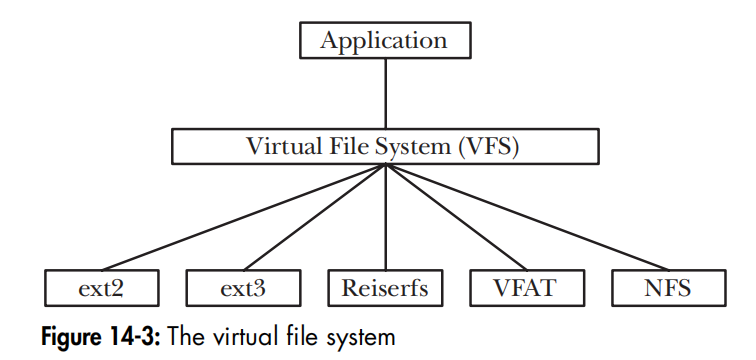
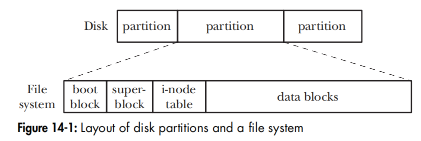
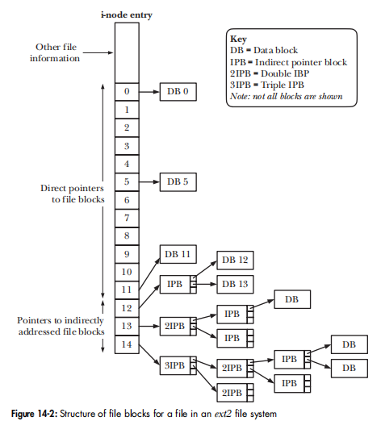
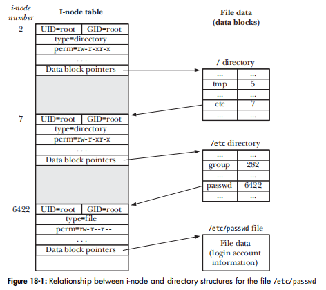
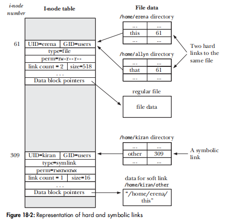

# chp14 FILE SYSTEMS

不像MS-DOS/Windows, Linux 的文件系统与kernel之间是de-coupling的，方法就是通过vfs定义接口，支持相关接口的文件系统就可以mount上去。

列出OS已经加载的driver.
```
$ cat /proc/filesystems
nodev	sysfs
nodev	tmpfs
nodev	bdev
```


##  i-node
是文件系统的核心数据结构，There is a i-node table, 每一个entry 中的 datablock pointer指向物理文件(data block).与ms dos的一维FAT表不同，unix 的i-node表可以是多维的。



# chp15 FILE ATTRIBUTES

# chp16 EXTENDED ATTRIBUTES

# chp17 ACCESS CONTROL LISTS
记得上次在CentOS上，ACL还是需要编译一些东西才能支持，现在这Ubuntu 上是直接支持。

```
$  getfacl  .
# file: .
# owner: alex
# group: alex
user::rwx
group::r-x
other::r-x

$ which getfacl
/usr/bin/getfacl
```
不过感觉没多大用处。

# chp18 DIRECTORIES AND LINKS

## A directory
is stored in the file system in a similar way to a regular file. Two things distinguish a directory from a regular file:
* A directory is marked with a different file type in its i-node entry。
* A directory is a file with a special organization. Essentially, it is a table consisting of filenames and i-node numbers (index of i-node table).

The i-node table is numbered starting at 1, rather than 0, because 0 in the i-node field of a directory entry indicates that the entry is unused. I-node 1 is
used to record **bad blocks** in the file system. The **root directory (/)** of a file system is always stored in i-node entry 2 (as shown in Figure 18-1), so that the kernel knows where to start when resolving a pathname.

下图展示如何找到/etc/passwd 对应的datablock 


## hard link
```
$ touch  abc
$ ln abc xyz
$ echo "hard link" >>xyz
$ cat abc
hard link
$ ls -li abc xyz
7881299347950837 -rwxrwxrwx 2 alex alex 10 Mar 20 21:12 abc
7881299347950837 -rwxrwxrwx 2 alex alex 10 Mar 20 21:12 xyz
$ rm abc
$ ls -li  xyz
7881299347950837 -rwxrwxrwx 1 alex alex 10 Mar 20 21:12 xyz
```
也就是directory 的 table 增加一个entry, 不同的filenames 相同的 i-node numbers.

## symbolic link
* directory,如同regular file, table 增加一个entry,指向一个新i-node 
* 新i-node,类型为 symbolic link:其指向的data block 的内容就是 pathname.




# chp19 MONITORING FILE EVENTS
Starting with kernel 2.6.13, Linux provides the inotify mechanism, which allows an application to monitor file events. 

note:  inotify instance 也是用一个 file descriptor 表示的。
```
#include <sys/inotify.h>
int inotify_init(void); // creates a new inotify instance.
int inotify_add_watch(int fd, const char *pathname, uint32_t mask);// adds or replace a watch item 
int inotify_rm_watch(int fd, uint32_t wd);

int read(inotifyFd, buf, BUF_LEN); //读取 events 

```
example
```
$ touch abc

$ ./demo_inotify abc &
[1] 399
Watching abc using wd 1

$ echo "abcdefg" >>abc
Read 32 bytes from inotify fd
    wd = 1; mask = IN_MODIFY
$ mv abc efg
Read 16 bytes from inotify fd
    wd = 1; mask = IN_MOVE_SELF
```

