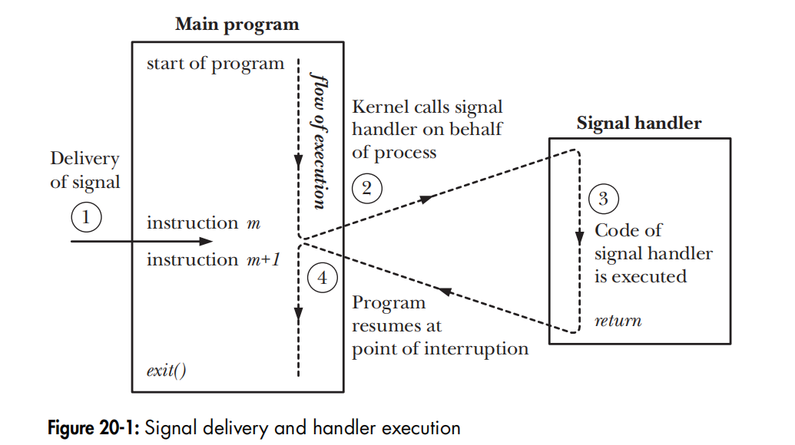
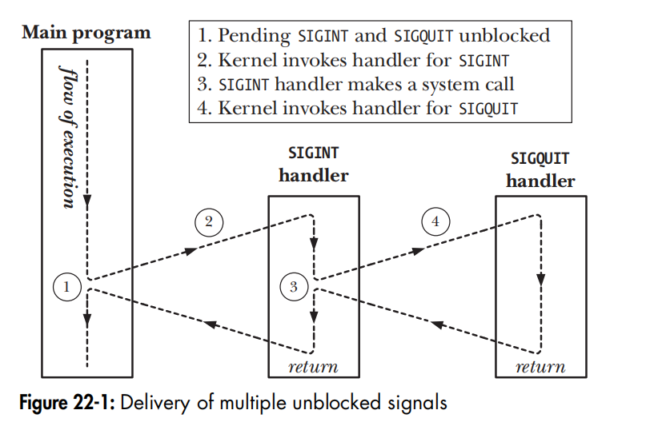

# chp20 SIGNALS: FUNDAMENTAL CONCEPTS
Signal is a notification to a process (可能来自其他process,也可能来自kernel)that an event has occurred. Signals are sometimes described as software interrupts. Signals are analogous to hardware interrupts in that they interrupt the normal flow of execution of a program; in most cases, it is not possible to predict exactly when a signal will arrive.

the usual source of many signals sent to a process is the kernel. 
* A hardware exception, e.g.  dividing by 0;  inaccessible memory
* The user typed one of the terminal special characters that generate signals. These characters include the interrupt character (usually Control-C) and the
suspend character (usually Control-Z) e.g.The abort() function generates a SIGABRT signal for the process,which causes it to dump core and terminate.
* A software event occurred. 

process -->process的signal 基本是用来进程间同步。

Signals fall into two broad categories
* traditional or standard signals, which are used by the kernel to notify processes of events，numbered from 1 to 31.
* realtime signals, 不在这里讨论



* 当一个signal 产生时，它通常是处于pending 状态，target process 下次被调度时才会收到；例外是target process就是自己,这种情况下马上执行。
* 当 process 可以用mask屏蔽某些signal,也可以ignore 某些signal，这都是可以配置的

##  signal()
用来设置signal 的 handler

```
void (*oldHandler)(int);
oldHandler = signal(SIGINT, newHandler);
```
## 发signal

```
#include <signal.h>
int kill(pid_t pid, int sig);
int raise(int sig); //equal to kill(getpid(), sig); or pthread_kill(pthread_self(), sig);
int killpg(pid_t pgrp, int sig);

```
note:
* we can use the null signal (num 0) to test if a process with a specific process ID exists.
* alternative:The /proc/PID interface: For example, if a process with the process ID 12345 exists, then the directory /proc/12345 will exist, and we can check this using a call such as stat().

## Signal Sets
是一数据结构， Multiple signals are represented using a data structure called a signal set, provided by the system data type sigset_t.

## signal mask
For each process, the kernel maintains a signal mask， a set of signals whose delivery to the process is currently blocked. 

```
#include <signal.h>
int sigprocmask(int how, const sigset_t *set, sigset_t *oldset);// pthread_sigmask() in thread
```
用来设置和查询signal mask.

## get pending signals

```
int sigpending(sigset_t *set);
```
## Signals Are Not Queued
delivered only once even if the signal is generated more than once while blocked or the handler is executing. 

    $ ./sig_receiver 60 &
    [2] 73
    [1]   Killed                  ./sig_receiver 600
    $ ./sig_receiver: PID is 73
    ./sig_receiver: sleeping for 60 seconds

    $ ./sig_sender 73 99 10 2
    ./sig_sender: sending signal 10 to process 73 99 times
    ./sig_sender: exiting
    $ ./sig_receiver: pending signals are:
                    2 (Interrupt)
                    10 (User defined signal 1)
    ./sig_receiver: signal 10 caught 1 time

## sigaction()
推荐替代老式的signal();

```
int sigaction(int sig, const struct sigaction *act, struct sigaction *oldact);
```
##  pause(void)
 suspends  process 的执行，直到收到某个signal. 注意，它会消耗掉收到的signal.

# chp21 SIGNALS: SIGNAL HANDLERS
## Designing Signal Handlers
In general, it is preferable to write simple signal handlers. One important reason for this is to reduce the risk of creating race conditions. Two common designs for signal handlers are the following:
* The signal handler sets a global flag and exits. The main program periodically checks this flag.
* The signal handler performs some type of cleanup and then either terminates the process or uses  siglongjmp() to unwind the stack and return control to a predetermined location in the main program.

  
## reentrant
A function is said to be reentrant if it can safely be simultaneously executed by multiple threads of execution in the same process. In this context, “safe” means that the function achieves its expected result, regardless of the state of execution of any other thread of execution.A function may be nonreentrant if it updates global or static data structures. (A function that employs only local variables is guaranteed to be reentrant.)

实际很多库函数都有重入和不可重入两个版本。
```
CRYPT(3)                                                                               Linux Programmer's Manual                                                                              CRYPT(3)

NAME
       crypt, crypt_r - password and data encryption

SYNOPSIS
       #define _XOPEN_SOURCE       /* See feature_test_macros(7) */
       #include <unistd.h>

       char *crypt(const char *key, const char *salt);

       #define _GNU_SOURCE         /* See feature_test_macros(7) */
       #include <crypt.h>

       char *crypt_r(const char *key, const char *salt,
                     struct crypt_data *data);

       Link with -lcrypt.
```
[nonreentrant.c](tlpi-dist/signals/nonreentrant.c),书中的例子改了几行，这样执行能看到一些变化

## async-signal-safe functions
is one that the implementation guarantees to be safe when called from a signal handler. A function is async-signal-safe either because it is reentrant or because it is not interruptible by a signal handler. 按POSIX.1标准，很多库函数应该是async-signal-safe 类型的，但遗憾的是，man 命令并不显示这些内容。

由于一个signal 会随时打断main process 的执行，而在signal  handlers 可能修改全局变量，这样就形成了race condition。 In other words, when writing signal handlers, we have two choices:
* Ensure that the code of the signal handler itself is reentrant and that it calls only async-signal-safe functions.
* Block delivery of signals while executing code in the main program that calls unsafe functions or works with global data structures also updated by the signal handler.

# chp22 SIGNALS: ADVANCED FEATURES
##  A core dump 
is a file containing a memory image of the process at the time it terminated.

## Synchronous and Asynchronous Signal Generation
* synchronously generated signals are delivered immediately. For example, a hardware exception triggers an immediate signal, and when a process sends itself a signal using raise(), the signal is delivered before the raise() call returns.

* When a signal is generated asynchronously, there may be a (small) delay.The reason for this is that the kernel delivers a pending signal to a process only at the next switch from kernel mode to user mode while executing that process.e.g.rescheduled or completion of a system call.




