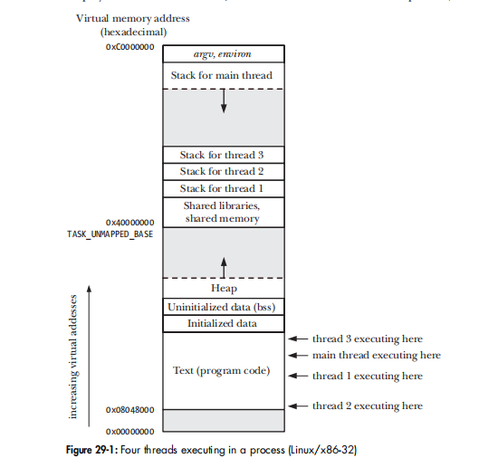
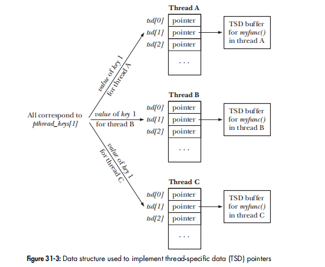

## Overview


# THREAD SYNCHRONIZATION

## static mutex
```c
static volatile int glob = 0;
static pthread_mutex_t mtx = PTHREAD_MUTEX_INITIALIZER;

static void *   threadFunc(void *arg)
{
    int loops = *((int *) arg);
    for (j = 0; j < loops; j++) {
        s = pthread_mutex_lock(&mtx);
        glob++;
        s = pthread_mutex_unlock(&mtx);
    }
    return NULL;
}

int main(int argc, char *argv[])
{
    pthread_t t1, t2;
    int loops, s;
    loops = 10000000;
    s = pthread_create(&t1, NULL, threadFunc, &loops);
    s = pthread_create(&t2, NULL, threadFunc, &loops);
    s = pthread_join(t1, NULL);
    s = pthread_join(t2, NULL);
    printf("glob = %d\n", glob);
    exit(EXIT_SUCCESS);
}
```
## dynamic mutex
```c
void foo()
{
    pthread_mutex_t mtx;
    pthread_mutexattr_t mtxAttr;
    int s, type;
    s = pthread_mutexattr_init(&mtxAttr);
    s = pthread_mutexattr_settype(&mtxAttr, PTHREAD_MUTEX_ERRORCHECK);
    s = pthread_mutex_init(mtx, &mtxAttr);
    s = pthread_mutexattr_destroy(&mtxAttr);
}
```
## condition variable
is always used in conjunction with a mutex. The mutex provides mutual exclusion for accessing the shared variable, while the condition variable is used to signal changes in the variable's state.

example:Statically Allocated Condition Variables in producer-consumer
```c
static pthread_mutex_t mtx = PTHREAD_MUTEX_INITIALIZER;
static pthread_cond_t cond = PTHREAD_COND_INITIALIZER;
static int avail = 0; //the number of produced units awaiting consumption

//producer thread
    s = pthread_mutex_lock(&mtx);
    avail++;        /* Let consumer know another unit is available */
    s = pthread_mutex_unlock(&mtx);
    s = pthread_cond_signal(&cond);         /* Wake sleeping consumer */

//consumer thread
    for (;;) {
        s = pthread_mutex_lock(&mtx);
        while (avail == 0) { //cond的作用就是让程序不进入后一个while,而是等调度的通知
            s = pthread_cond_wait(&cond, &mtx);
        }
        while (avail > 0) { /* Consume all available units */
            avail--;
        }
        s = pthread_mutex_unlock(&mtx);
    }

```
# Thread Safety
There are various methods of rendering a function thread-safe. One way is to associate a mutex with the function (or perhaps with all of the functions in a library, if they all share the same global variables). Here introducing the concept: critical section.

A reentrant function achieves thread safety without the use of mutexes. It does this by avoiding the use of global and static variables. Any information that must be returned to the caller, or maintained between calls to the function, is stored in buffers allocated by the caller.

## One-Time Initialization
```c
int pthread_once(pthread_once_t *once_control, void (*init)(void));
```
## Thread-Specific Data
Thread-specific data is a technique for making an existing function thread-safe without changing its interface. A function that uses thread-specific data may be slightly less efficient than a reentrant function, but allows us to leave the programs that call the function unchanged.



```c
static pthread_once_t once = PTHREAD_ONCE_INIT;
static pthread_key_t strerrorKey;

#define MAX_ERROR_LEN 256  
static void destructor(void *buf)
{
    free(buf);
}

static void createKey(void)
{
    int s;
    s = pthread_key_create(&strerrorKey, destructor);
}

char * strerror(int err)
{
    int s;
    char *buf;
    /* Make first caller allocate key for thread-specific data */
    s = pthread_once(&once, createKey);
    buf = pthread_getspecific(strerrorKey);
    if (buf == NULL) {          /* If first call from this thread, allocate
                                   buffer for thread, and save its location */
        buf = malloc(MAX_ERROR_LEN);
        s = pthread_setspecific(strerrorKey, buf);//通过set/get 进行关联
    }
    strncpy(buf, _sys_errlist[err], MAX_ERROR_LEN - 1);
    buf[MAX_ERROR_LEN - 1] = '\0';          /* Ensure null termination */
    return buf;
}
```
用TSD 将strerror() 改造成 thread safe.

## Thread-Local Storage (provided since Linux 2.6)
The main advantage of thread-local storage is that it is much simpler to use than thread-specific data. To create a thread-local variable, we simply include the __thread specifier in the declaration of a global or static variable:
```c
static __thread buf[MAX_ERROR_LEN];
```
TLD 比 TSD 简化太多了。

## summary
所以归纳一下实现thread safe的方法有 mutex/reentrant /tsd/tls 四种.

# Cancel a Thread
self termination: pthread_exit() or returning

cancel a thread; that is, to send it a request asking it to terminate now. 有点类似发signal,主动权在接收方, 运行到cancellation point 时才能响应.

asynchronously cancelable (cancelability type PTHREAD_CANCEL_ASYNCHRONOUS), it may be canceled at any time (i.e., at any machinelanguage instruction); delivery of a cancellation is not held off until the thread next reaches a cancellation point.

# thread: further detail
尽量不要用signal. 
The UNIX signal model was designed with the UNIX process model in mind, and predated the arrival of Pthreads by a couple of decades. The differences between the signal and thread models mean that combining signals and threads is complex, and should be avoided whenever possible. (使用mutex/condition variable)

Alex: signal 是kernel-->user process的通知方式，如果用的话就需要建立process ->thread的消息分发机制。

# Since kernel 2.6.since version 2.4, glibc no longer provides the deprecated LinuxThreads.
    $ getconf GNU_LIBPTHREAD_VERSION
    NPTL 2.27
