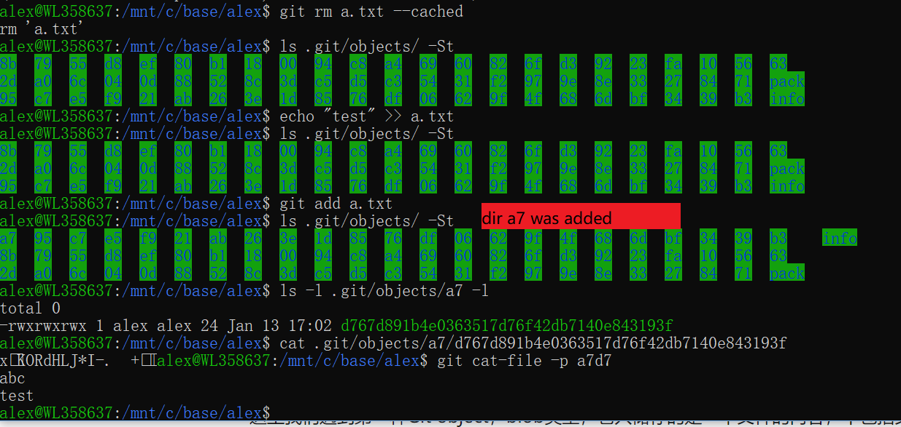
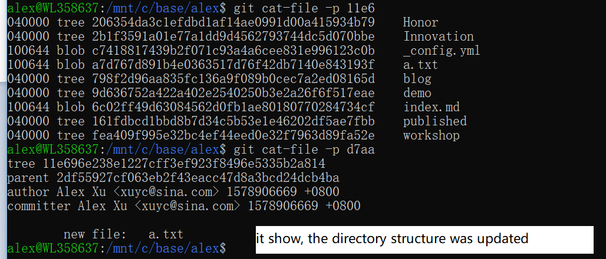

Using git/gerrit more than 9 months, and git/github more than 12 moths, do a review here.

## git 的revision 库设计
做过软件设计,而不是纯粹按要求编码的人应该有一个体会, 数据结构定义了后适合的操作也就确定了. git 作为一个版本管理工具,关键的数据结构设计,如何表示/存储revision? 由于git 诞生在硬盘/带宽已经比较廉价的时代,所以跟前辈的版本管理工具相比,它对节省存储空间/带宽不太关注,所以它对任何时刻寸一个full snapshot, 而git 命令的主要操作是将文件与revision history tree 关联起来. git 不对文件夹管理, 文件应该带full pathname 的.

### git add <file>
it actually add a object.
    
and its path is a SHA1 of file content    

### git commit 
*  
*  

### git commit --amend 
在revision history tree 上建一个sibling node,

## 分布式设计: 
这实际是一个易用性设计

没有它之前, 如果想本地调试,都得 用file_1.c file_2.c 手工实现本地版本管理. 现在则用
### git commit --amend
做些本地帮本管理,调试通过了再 git push
组合 git reflog/git reset, 就像本地有了个时光宝盒, 随意回退.

## Gerrit
在此之前, 我用的remote repo 是git hub. 两者除了review 操作不同外,从存储路径角度gerrit 使用的是虚的路径,实际上用change-id/patchset 取代了本地的branch/commit id的作用.
### init the change
git push origin personal/$USER/sp17 第一用git push 创建remote branch, 本地也由trigger 生成了change-id.
### add patch set
git push origin HEAD:refs/for/personal/$USER/sp17 以后的操作就是根据change-id, patch set 往上递增了. 这时local branch 改名也不受影响.