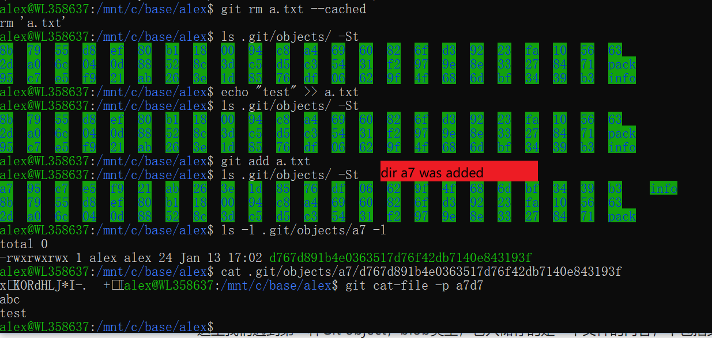

Using git/gerrit more than 9 months, and git/github more than 12 moths, do a review here.

## data structure of git version database
* The .git folder contains the full version database.
* in git repository, everything is an object, include the file/commit/pointer(including branch,tag) is an object, and every object has a SHA1 reference

### git add <file>
mean add the file into the version database, then return a SHA1
    

### git commit 
* after commit, two object created
    
* one object is new directory structure, another is commit itself
    
* can verify by
    
* every commit is a full snapshot of the whole project
    
### git commit --amend 
create a sibling node, instead of child node, in the version history tree.

## distributed
When using the clearcase/svn before, I had rename filename as file_1.c file_2.c, to record the version locally. Now Git is a fully version control system which can run locally.

## data compression
* non-modified file will not dupliacted
* only delta was sent between the local/remote repository
    
## Gerrit
* it a git server with access control
* allows to review commits before they are integrated into a target branch.
* built on top of Git
### push for review
* refer to remote branch
    
* it generate change/patch set
    
* the change-id was generated and inserted into commit message by the commit hook
* Gerrit whill create whether change existed or not, then updte patchset or create a change

## CI/CD behind gerrit
Jenkins

## reference
* google: git/gerrit presentation
