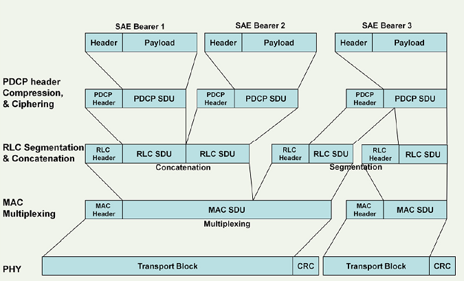
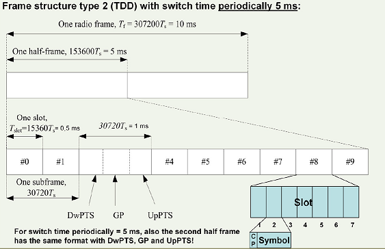
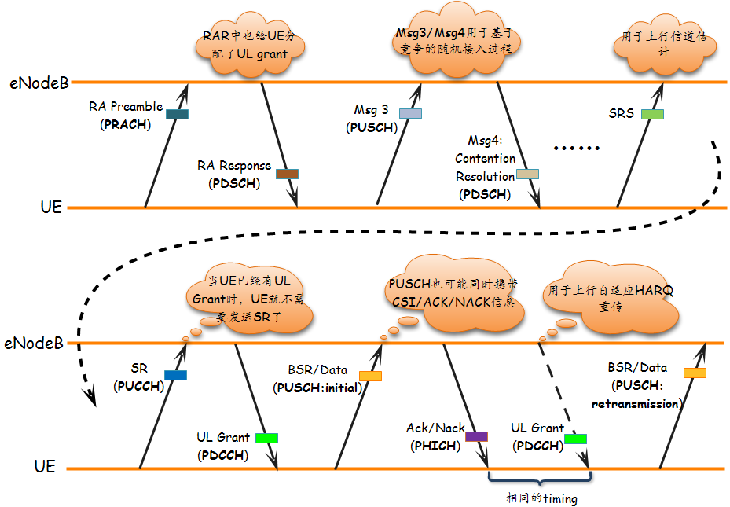
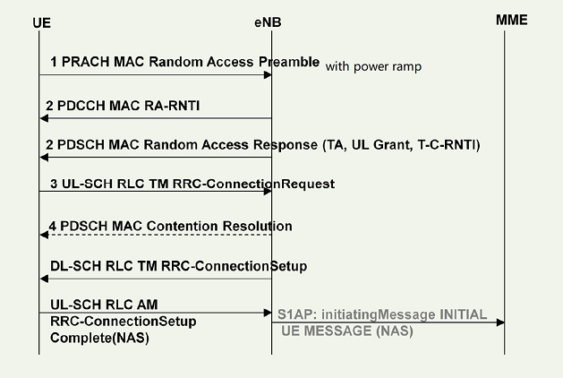
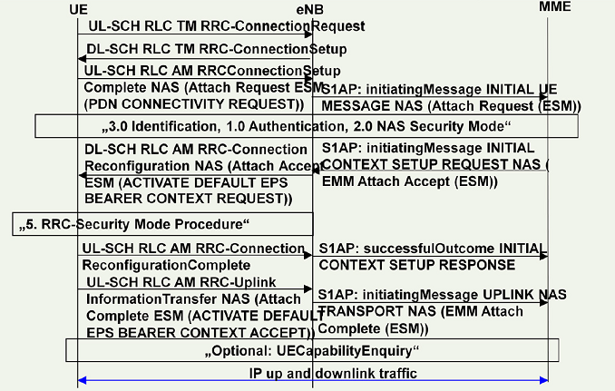
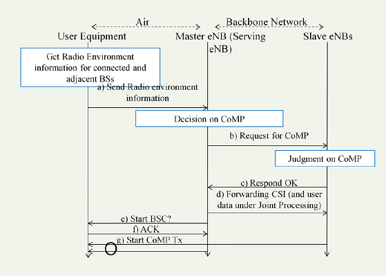

Personal review, something maybe ignored during past daily work.

CONTENTS           
[TOC]
## Overview
* Protocol stack
   
* SDU/PDU
   

## DFT-S-FDMA(clustered)

   
Discrete Fourier Transformation-Spread OFDM : allows multi cluster in UL, allows PUCCH and PUSCH to be transmitted at the same time.

## Cell size dimension
* from power view, decided by  UE Tx power/path loss/eNB acceptable Rx power
* from UE Rx/Tx switch time if TDD
   - decided by the GP of special subframe
   
* Random access phase
   - preamble  detection windows size decided by  Preach format
   - TA command,  its value was detected by eNB during RA phase, in theory, its value will limit the cell size.
* acceptable  "channel delay spread" due to "inter OFDM symbol interference"
   decided by CP length

## Why in LTE the SSS is transmitted before the PSS?
beside carrying PCI info, the PSS/SSS has other function as to detect the CP length/subframe synchronize. Although the SSS seem transmitted a symbol earlier, for PCI decode, Still the PSS is decoded firstly.
   

## HARQ when UL TTI bundling
it is quite special
* only 1 UL grant for the 4 consecutive UL subframe
* only 1 ACK/NACK from eNB related to the last subframe in a bundle, but The maximum number of HARQ retransmissions (maxHARQ-Tx) shall be configured to a value divisible by 4 (i.e. n4, n8, n12, n16, n20, n24).
* modulation order (QM) was fixed to 2UEs for that the TTI bundling mode is selected have to deal with 4 HARQ processes and an RTT of 16 ms which is different from the UEs in normal operation (8 HARQ processes and 8 ms RTT). Accordingly, the timing of thecorresponding acknowledgement of the HARQ process differs between the two modes. The 4 Subframes use RV 0,2,3,1
* so in HARQ Process view: 1 bundle is just treated as 1 transmission, but in time domain, it is still 4 TTI.
* switching on/off TTI bundling need a intra-cell HO to change the UE CONTEXT via  the RRC-ConnectionReconfiguration procedure

## Scheduling timing & HARQ prcess: FDD
* number of HARQ processes are fixed to 8.
* UL harq is synchronous,  UL ACK/NACK was fixed to 4 TTI after transmission
* DL harq is asynchronous, its Harq process and RV is indicated by PDCCH.
   
timing of UL/DL transmission. in above example UL grant happen at n TTI, transmission happen at n+4, retransmission happen at n+8.
   

In UL, retransmissions are either triggered by the PDCCH (adaptive), or by a received (HICH) in case no PDCCH was transmitted (non-adaptive). In case of an adaptive retransmission, the UE uses the resources which are assigned by the PDCCH. If a non-adaptive retransmission takes place, the UE uses the same resources which were previously used by the same HARQ process.

## UL scheduling
   * via SR/BSR
   classified by LCG
   * explicit granted via PDCCH or implicit grant e.g. IUA (SPS of interval 1/2/4ms)
   
   non-adaptive don't need UL grant signalling via PDCCH
## Random access procedure
   

## Attach
   

## Coordinated multiopoint(CoMP) transmission/reception
 is to improve the coverage/throughput at the cell edge.
 * ”joint processing”: eNBs share info
 * ”coordinated scheduling”: UE report bad/good PMI set
    

## Beamforming
* a general signal processing technique used to control the directionality
* increase the reliability of the transmission by combining several decorrelated
signals (diversity),
* enhance the Signal to Interference plus Noise Ratio (SINR) by spatial focusing
of several correlated signals (beamforming),

## Carrier Aggregtion
* UE-->TB-->CC mapping
    
* scheduling only happen on PCell,so from MAC sw view, the SCell is only accessed via the PCell
* SCell are configured based on UE capability. Can have DL only resources or DL
and UL resources. Are Rel. 8/9 compatible. Are configured to be used by the UE
via dedicated RRC Reconfiguration message. Can be dynamically activated/deactivated (MAC based).
* asymmetric of DL/UL CC
    
* MAC handling
  it split into two phase
  - phase 1, scell configuration/deconfiguration, dynamic, ue measurment based
  - activate/deactivate via MAC cmd, usually because of throughput

## RRM
* mac func
    
* goal: maximizie the UEs with satisfied QoS

### QoS
* QCI
* ARP
* GBR/MBR
* AMBR 

### Phases
* admission control
* active queue management (threshold Min/Max)
* rate shapping
* scheduling (weight)

## Scheduling:
the QCI is e2e, each network node shall decided its per Hop policy to ensure the e2e target. in the transport network, it may use he DSCP mapping to different queue with different weight. in Baseband, the similiar policy was used.

### The algorithm:
   * roud robin
   * proportional fair
   * max cell throughput
   * strict priority/delay based....
All algorithm is implement the same frame work (Priority Queue), with differnt weight functions which may
#### time domain
   * constant with priority
   * increase with time
   * decrease with data sent
   * change according to Channel Quality.....  

#### frequency slective/frequency domain
   * each PRB has different weight for a SE/UE   

#### the object of scheduling is frequency domain * time domian
   * SB: scheduling block, (15*12khz)* (1ms),, the smallest scheduling unit:
   * SE: scheduling unit, correspond 1 UE
   * internal scheduling unit: PQ, which corresponding to 
      - Radio bearer for DL,
          
      - LCG for UL
          
## Other summary
*  CQI is Channel Quality Indicator. PMI stands for Pre-coding Matrix Indicator, and RI is Rank Indicator.
* SRB: SRB0 common;SRB1 dedicated for an UE; SRB2 after activated, all NAS go by it
* key tech of LTE: OFDM/SC-FDMA, MIMO, HARQ
* Key tech of LTE-A: CA

## Reference
* Sanchar LTE-A training material
* internal LTE RRM trainning video
* LTE spec, 3gpp 36.3xx
* 温金辉: 深入理解LTE-A