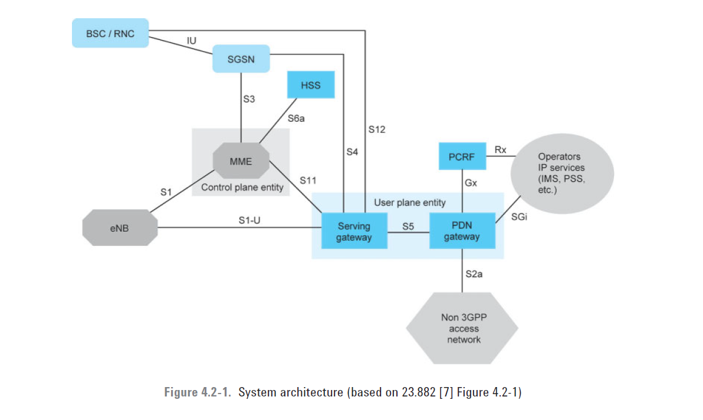
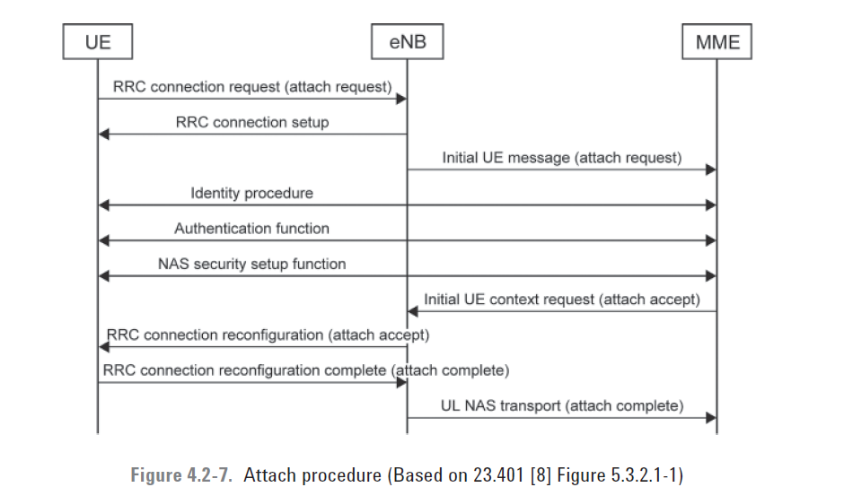

## System architecture

## EMM Procedures
The various EMM procedures are classified as EMM common procedures, EMM specific procedures, or EMM connection management procedures.
### EMM Common Procedures
EMM common procedures can be executed only when there is a signaling connection between the UE and the MME
### EMM-Specific Procedures
The EMM-specific procedures are complete EPC procedures used for handling UE mobility in the MME. They are the attach procedure, the tracking area update procedure, and the detach procedure.

### EMM Connection Management Procedures
The EMM connection management procedures enable the UE to move from the ECM-idle state to the ECM-connected state whenever there is a need for some data or signaling transfer. The EMM connection management procedures are the paging procedure, the service request procedure, and the procedures for the transport and generic transport of NAS messages.
## ESM Procedures
The ESM procedures are used for activation, modification, and deactivation of the user plane EPS bearers, which are used for data transfer between the UE and the IP network.