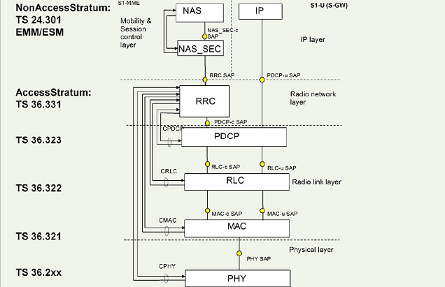
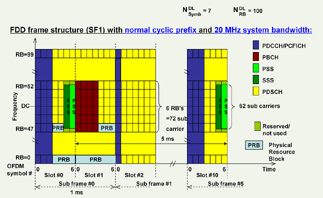
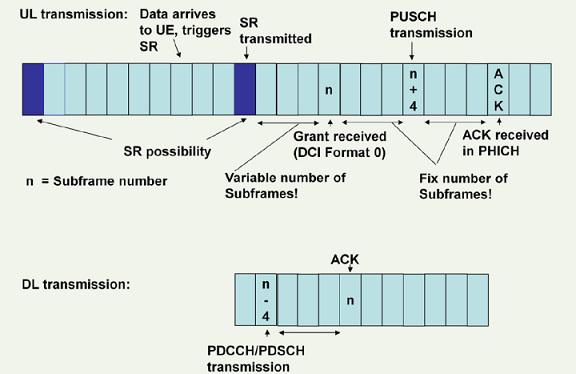
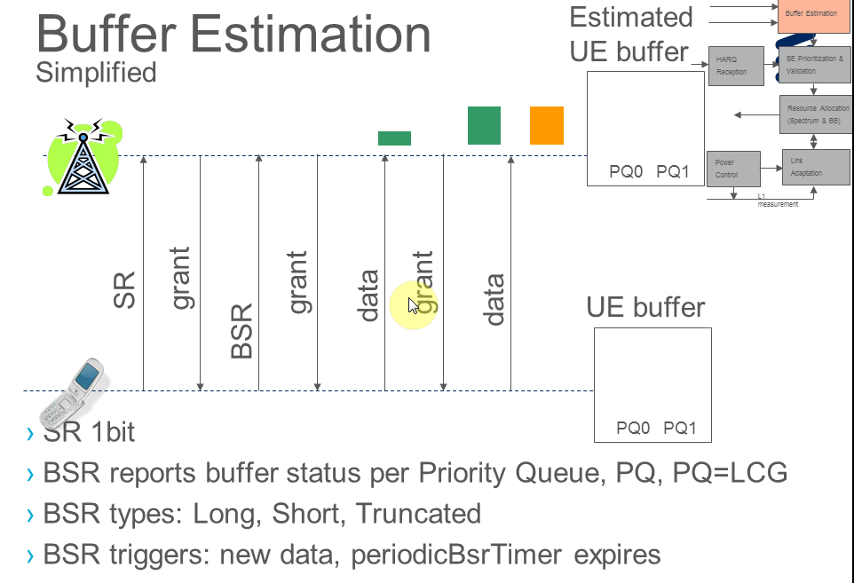

Personal review

## Overview
* Protocol stack
* 
* SDU/PDU
* 

## Cell size dimension
* from power view, decided by  UE Tx power/path loss/eNB acceptable Rx power
* from UE Rx/Tx switch time if TDD
   - decided by the GP of special subframe
   - 
 * Random access phase
   - preamble  detection windows size decided by  Preach format
   - TA command,  its value was detected by eNB during RA phase, in theory, its value will limit the cell size.
* acceptable  "channel delay spread" due to "inter OFDM symbol interference"
   decided by CP length

## Why in LTE the SSS is transmitted before the PSS?
beside carrying PCI info, the PSS/SSS has other function as to detect the CP length/subframe synchronize. Although the SSS seem transmitted a symbol earlier, for PCI decode, Still the PSS is decoded firstly.
    

## HARQ when UL TTI bundling
it is quite special
* only 1 UL grant for the 4 consecutive UL subframe
* only 1 ACK/NACK from eNB related to the last subframe in a bundle, but The maximum number of HARQ retransmissions (maxHARQ-Tx) shall be configured to a value divisible by 4 (i.e. n4, n8, n12, n16, n20, n24).
* modulation order (QM) was fixed to 2UEs for that the TTI bundling mode is selected have to deal with 4 HARQ processes and an RTT of 16 ms which is different from the UEs in normal operation (8 HARQ processes and 8 ms RTT). Accordingly, the timing of thecorresponding acknowledgement of the HARQ process differs between the two modes. The 4 Subframes use RV 0,2,3,1
* so in HARQ Process view: 1 bundle is just treated as 1 transmission, but in time domain, it is still 4 TTI.
* switching on/off TTI bundling need a intra-cell HO to change the UE CONTEXT via  the RRC-ConnectionReconfiguration procedure

## Scheduling timing & HARQ prcess: FDD
* number of HARQ processes are fixed to 8.
* UL harq is synchronous,  UL ACK/NACK was fixed to 4 TTI after transmission
* DL harq is asynchronous, its Harq process and RV is indicated by PDCCH.
* 
* timing of UL/DL transmission. in above example UL grant happen at n TTI, transmission happen at n+4, retransmission happen at n+8.
* 

In UL, retransmissions are either triggered by the PDCCH (adaptive), or by a received (PHICH)
* If non-adaptive retransmission, the UE uses the same resources which were previously used by the same HARQ process, no PDCCH signalling needed.
* If adaptive retransmission, the UE uses the resources which are assigned by the PDCCH.
## UL scheduling
   * via SR/BSR
   classified by LCG
   * explicit granted via PDCCH or implicit grant e.g. IUA (SPS of interval 1/2/4ms)
   * 
   * if retransmission, please refer previous chapter

## Beamforming
* a general signal processing technique used to control the directionality
* increase the reliability of the transmission by combining several decorrelated
signals (diversity),
* enhance the Signal to Interference plus Noise Ratio (SINR) by spatial focusing
of several correlated signals (beamforming),

## Carrier Aggregtion
* UE-->TB-->CC mapping
* 
* scheduling only happen on PCell,so from MAC sw view, the SCell is only accessed via the PCell
* SCell are configured based on UE capability
* Can have DL only resources or DL and UL resources.
* Rel. 8/9 compatible.
* configured via dedicated RRC Reconfiguration message.
* Can be dynamically activated/deactivated (MAC based).
* asymmetric of DL/UL CC
* 

* MAC handling
  it split into two phase
  - phase 1, scell configuration/deconfiguration, dynamic, ue measurment based
  - activate/deactivate via MAC cmd, usually because of throughput

## Scheduler
   Goal: maximizie the UEs with satisfied QoS

### QoS
   * QCI
   * ARP
   * GBR/MBR
   * AMBR 

### Phases
   * admission control
   * active queue management (threshold Min/Max)
   * rate shapping
   * scheduling (weight)

the QCI is e2e, each network node shall decided its per Hop policy to ensure the e2e target. in the transport network, it may use he DSCP mapping to different queue with different weight. in Baseband, the similiar policy was used.
The framework of scheduler is based on 
   * Priority Queue: higher weight mean higher probability of being sceduled
   * weight functions:implements the scheduling algorithm
So scheduler only need care the weight.
### The algorithm examples:
   * roud robin: resource fair
   * proportional fair: a trade off between user fairness and the system performance
   * max cell throughput
   * strict priority:Used for BCCH, PCCH, CCCH, MAC Ctrl
   * delay based: VOIP, usually bundle the voice packets to intervals like 60ms

### weight functions used in frequency slective scheduling
   * each PRB has different weight for a SE/UE   

### the unit of scheduling
   * SB: scheduling block, (15*12khz)* (1ms),, the smallest scheduling unit:
   * SE: scheduling unit, correspond 1 UE
   * internal scheduling queue:
      - Radio bearer for DL,
      - 
      - LCG for UL
      - 

## MISC

* [Physical Layer](phy.md)
* [tm mode](tm_mode.md)
* [Access Stratum](AS.md)
* [Non-Access Stratum](NAS.md)
* [SAE](SAE.md)
* [LTE advanced](lte_a.md)
* [LTE QoS](LTE_QoS.pdf)
* [LTE 接入过程中的安全机制](LTE_RACH_security.pdf)

## Reference
* internal LTE RRM trainning video
* 温金辉: 深入理解LTE-A
* Moray Rumney, LTE and the Evolution to 4G Wireless

