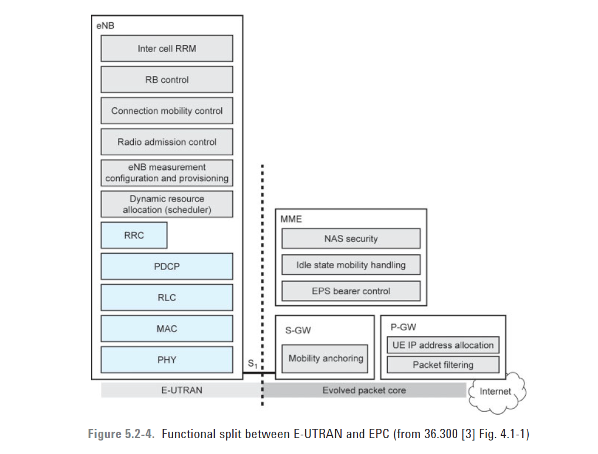
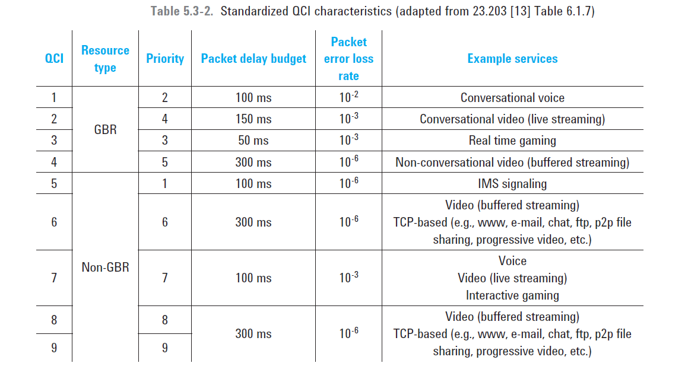

## Functional split

## QoS
The EPS bearer and E-RAB QoS profile includes service level QoS parameters defined by the following:
* QCI

* Allocation and Retention Priority
* Guaranteed Bit Rate
* UE-AMBR/APN-AMBR from HSS

