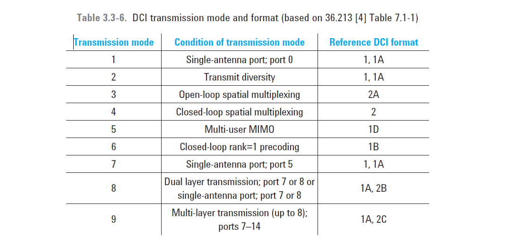

## ovreview
The physical downlink control channel (PDCCH) is the physical channel that carries the channel allocation and control information. 

It consists of one or more consecutive control channel elements (CCEs), where a control channel element corresponds to nine resource element groups. 

The number of OFDM symbols allocated for the PDCCH is given by the control format indicator (CFI) carried on the PCFICH. The CFI can take the values 1, 2, and 3. For transmission bandwidth configurations greater than 10 RB (1.8 MHz), the number of PDCCH symbols per subframe is the CFI value. For transmission bandwidth configurations less than or equal to 10 RB, the number of PDCCH symbols per subframe is the CFI value +1.

The PDCCH supports only the QPSK modulation scheme.

 Multiple PDCCHs can be transmitted in a subframe.

 ## TM mode->DCI

 不同TM mode下, 基站/UE需要的交互的信令不同, 也就是DCI/UCI格式不同.如果定义一个普遍适用的数据结构,就有些字段被空置了. 所以用TM mode 来区分一下scenario, 提高空口信令的数据利用率.

The downlink control information (DCI) is mapped to the PDCCH in the physical layer. 

Each DCI carries its own radio network temporary identity (RNTI) to identify the target user. The DCI can have several formats depending on the transmission mode as shown in Table 3.3-6.
 
* 

 ## blind decodes

 The eNB normally transmits many DCI messages per subframe, each using a different PDCCH. Each message is intended to be received by one or many UEs. A UE does not know which PDCCH channels have been used on a particular subframe by theeNB and, of those used, whether the PDCCH contains a DCI message intended for that UE. To receive DCI messages a UE must perform a large number of blind decodes every subframe. The DCI messages intended for that UE will be decoded successfully,
whereas those not intended for that UE will fail the cyclic redundancy code (CRC) check.

## ref
* Agilent , LTE and the Evolution to 4G Wireless Design and Measurement Challenges