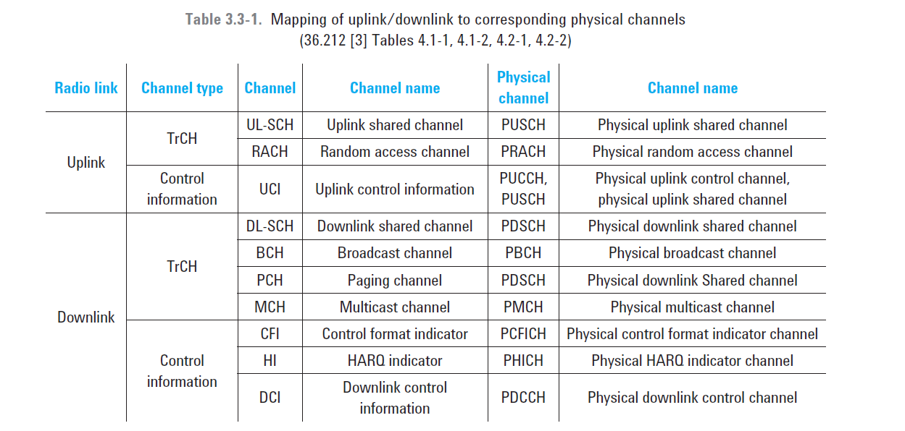

## transport channel
 

## PDCCH
It consists of one or more consecutive control channel elements (CCEs), where a control channel element corresponds to nine resource element groups (REGs). 

The number of OFDM symbols allocated for the PDCCH is given by the control format indicator (CFI) carried on the PCFICH. The CFI can take the values 1, 2, and 3. 

The PDCCH supports only the QPSK modulation scheme.

 ## DCI

 不同TM mode下, 基站/UE需要的交互的信令不同, 也就是DCI/UCI格式不同.如果定义一个普遍适用的数据结构,就有些字段被空置了. 所以用dci来选取不同的的数据结构, 提高空口信令的数据利用率.

The downlink control information (DCI) is mapped to the PDCCH in the physical layer. 

Each DCI carries its own radio network temporary identity (RNTI) to identify the target user. The DCI can have several formats depending on the transmission mode as shown in Table 3.3-6.

* DCI Format 1: Used for scheduling of one PDSCH codeword in one cell. Carrier Indicator, Resource Allocation Header,Resource Block Assignment, MCS Index, HARQ Process Number, NDI, RV Index, TPC Command for PUCCH, DAI (TDD only).
* DCI Format 1A: Used for compact scheduling of one PDSCH codeword in one cell. Carrier

## blind decodes of PDCCH

 The eNB normally transmits many DCI messages per subframe, each using a different PDCCH. Each message is intended to be received by one or many UEs. A UE does not know which PDCCH channels have been used on a particular subframe by theeNB and, of those used, whether the PDCCH contains a DCI message intended for that UE. 
 
 To receive DCI messages a UE must perform a large number of blind decodes every subframe. The DCI messages intended for that UE will be decoded successfully, whereas those not intended for that UE will fail the cyclic redundancy code (CRC) check.

## UCI
Uplink control information (UCI) can be mapped to the PUCCH and PUSCH on the physical layer.

## Uplink Control Signaling
Reporting the channel conditions experienced by the receiver represents the baseline for many adaptation algorithms such as frequency selective scheduling, MIMO precoding, adaptive modulation and coding (AMC), and rank adaptation.

The LTE specifications define four indicators that reflect the channel state information (CSI) as seen by the recipient of the communication (that is, by the UE): the channel quality indicator (CQI), the rank indication (RI), the precoding matrix indicator (PMI), and the precoding type indicator (PTI). The reporting of these indicators is done either aperiodically using the PUSCH or periodically using the PUCCH or PUSCH.

For calculation of these indicators, the UE will generally perform measurements on the cell-specific reference signals (CRS), although the CSI reference signals (CSI-RS) are introduced in Release 10 and can be used in transmission mode 9 (up to 8 layer transmission, ports 7–14). The CSI-RS allows the eNB more flexibility in configuring higher layer operation. 

For MIMO operation the selection of closed-loop mode or open-loop mode depends on the rate of change in the channel conditions. For low speed UEs, closed-loop MIMO with precoding is beneficial as is frequency-selective RB scheduling. Indeed, the likelihood of variable MIMO conditions across the channel means closed-loop MIMO works best in conjunction with frequency selective scheduling. For moderate to high speed UEs, the preferred mode of operation is space frequency block coding (SFBC) transmit diversity or spatial multiplexing with a fixed precoding matrix (open-loop MIMO).

The CQI, PMI, PTI, and RI are reported in control-indication fields on either the PUCCH (periodically) or the PUSCH (aperiodically). The reporting can be roughly categorized in three modes:
* wide band
* ue specific
* eNB selected (via pusch)

