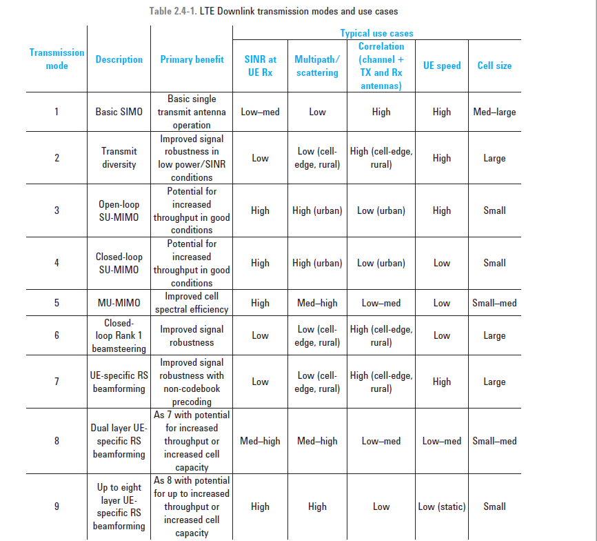

## overview
LTE specifies the way the downlink radio channel will be used by defining a set of transmission modes in 36.213 Section 7.1. There are nine different modes, all of which have different benefits in different use cases depending on the radio environment.

* 

An antenna “port” does not always mean the same thing as a physical antenna. The term antenna port refers to the use of a particular set of reference signals, which are multiplexed onto physical antennas to suit the transmission mode. An example is port 5, used in TM7. The same coded signal is adjusted in phase and fed to multiple physical antennas to create a beamformed signal. This
concentrates the transmitted power towards a specific direction or location, while the UE needs only to estimate the channel from one group of reference signals.

The way in which the different transmission modes are applied to the various downlink signals depends on what use the transmission mode makes of transmit diversity, spatial multiplexing, or cyclic delay diversity (CDD).

## downlink Reference Signals
* 

There are five types of downlink reference signals. 
* In Release 8 there are the cell-specific reference signal (CRS), 
* the MBSFN reference signal, 
* and the UE-specific reference signal (sometimes known as the demodulation or DMRS). 
* In Release 9 the positioning reference signal (PRS) was added and
* in Release 10, the channel state information reference signal (CSI-RS) was added.

From these references the UE can calculate corrections and thus minimize the probability of demodulation errors. The CRS is present in every frame. It is used by the UE to demodulate other
downlink signals and also to report the downlink channel state information on the uplink.

The purpose of the UE-specific RS is to optimize the RS for a specific UE by precoding the UE-specific RS resource elements with the same gain and phase shifts used for the PDSCH dedicated to that UE. In this way the UE no longer needs to be told how the PDSCH has been precoded and can directly decode the PDSCH using the similarly precoded UE-specific RS. This is clearly a benefit to the specific UE but it also means that the REs allocated to the UE-specific RS are of no use to other UEs in the serving cell.In Release 9 the UE-specific RS was extended for two antenna operation (ports 7 and 8). The eNB can apply eigenvectors on each physical antenna to achieve the maximum signal-to-noise ratio (SNR) at the UE receiver. This scheme is also known as dual layer beamforming and in Release 10 was further extended to eight antennas (ports 7 through 14).

The positioning reference signal was added in Release 9 to support the observed time difference of arrival (OTDOA) positioning scheme. The UE measures the time differences between the signals arriving from at least three eNBs and determines position by the intersection of arcs. Positioning reference signals are allocated on virtual antenna port 6.

##  uplink Reference Signals
* 

The DMRS is used for synchronization and uplink channel estimation. There are two types of DMRS; one for the PUSCH and one for the PUCCH. The DMRS for the PUSCH are assigned to SC-FDMA symbol #3 (normal CP case) and SC-FDMA symbol #2 (extended CP case) in a PUSCH slot. The DMRS for the PUCCH is assigned according to the PUCCH format and cyclic prefix mode. For example, when the PUCCH format is set to 1/1a/1b and normal cyclic prefix is selected, the DMRS for the PUCCH is assigned to the SC-FDMA symbols #2, #3, and #4 in a PUCCH slot.

The eNB can request transmission of the SRS, which allows the eNB to estimate the uplink channel characteristics for arbitrary channel bandwidths. This estimate cannot be done using the PUCCH demodulation reference signal that is fixed to the bandwidth of the associated PUSCH/PUCCH. The SRS length, frequency-domain starting position, and other parameters are determined by the SRS configuration

## TM 9
Support for up to eight layers was introduced in Release 10. In principle this would require the extension of the CRS from four layers to eight layers, consuming significant downlink resources in every subframe, regardless of whether any UE were actually allocated an eight-layer downlink transmission. As an alternative to a direct extension of the CRS, Release 10 introduced the
CSI-RS. This reference signal performs the same basic function as the CRS; that is, it provides a known amplitude and phase reference to the UE. However, the CSI-RS has two distinct differences from the CRS. 
* First, the CSI-RS can be scheduled as required rather than being present in every frame.
* Second, the CSI-RS is used only for reporting of channel state information by the UE on the uplink and (unlike the CRS) is not used for demodulation.
* 
* CSI-RS mapping for eight antennas on virtual antenna ports 15 through 22. The CSI-RS can be
allocated with a periodicity of 5, 10, 20, 40 and 80 subframes. This range helps optimize the trade-offs between the accuracy of channel sounding with the overhead of transmitting the CSI-RS

* 

* 由于TM9的测量导频CSI-RS可以是用户级配置，从而能更精准的对相邻小区发送的数据流进行测量，并协调调度。根据实验室结果来看，基于TM9的下行 CoMP技术可使边缘速率提升20%-40%。

## ref
* Agilent , LTE and the Evolution to 4G Wireless Design and Measurement Challenges