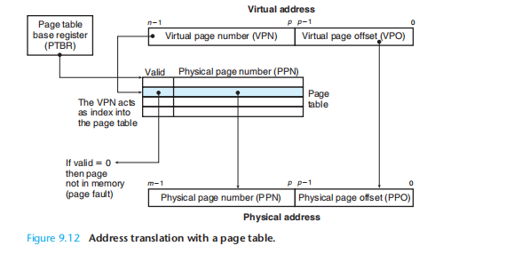

从第一版看到第三版，他这本书是非常全，对应国内多门课，如计算机原理/计算机组成。

# chp 7: linking
Linking is the process of collecting and combining various pieces of code and data into a single file that can be loaded (copied) into memory and executed.
Linking can be performed
* at compile time, when the source code is translatedinto machine code; 
* at load time, when the program is loaded into memory and executed by the loader; and even 
* at run time, by application programs.


To build the executable, the linker (ld under Linux) must perform two main tasks:
* Symbol resolution. Object files define and reference symbols. The purpose of symbol resolution is to associate each symbol reference with exactly one
symbol definition.
* Relocation. Compilers and assemblers generate code and data sections that start at address 0. The linker relocates these sections by associating a memory
location with each symbol definition, and then modifying all of the references to those symbols so that they point to this memory locatiion.


## Linux下ELF(Executable and Linkable Format)
文件类型分为以下几种：
* 可重定位文件，例如SimpleSection.o；
* 可执行文件，例如/bin/bash；
* 共享目标文件，例如/lib/libc.so。
* Core dump文件

### ELF文件中典型的section如下：
* .text: 已编译程序的二进制代码
* .rodata: 只读数据段，比如常量
* .data: 已初始化的全局变量和静态变量
* .bss: 未初始化的全局变量和静态变量，所有被初始化成0的全局变量和静态变量
* .sysmtab: 符号表，它存放了程序中定义和引用的函数和全局变量的信息. (Alex, 这是等其他.o文件中的.rel.text，.rel.data 来指向的)
* .debug: 调试符号表，它需要以'-g'选项编译才能得到，里面保存了程序中定义的局部变量和类型定义，程序中定义和引用的全局变量，以及原始的C文件
* .line: 原始的C文件行号和.text节中机器指令之间的映射。A mapping between line numbers in the original C source program
and machine code instructions in the .text section. It is only present if the compiler driver is invoked with the -g option.
* .strtab: 字符串表，内容包括.symtab和.debug节中的符号表。 A string table for the symbol tables in the .symtab and .debug
sections, and for the section names in the section headers. A string table is a sequence of null-terminated character strings. (Alex:这样就避免了字符串出现在代码中)

### 对于可重定位的文件
由于在编译时，并不能确定它引用的外部函数和变量的地址信息，因此，编译器在生成目标文件时，增加了两个section：
* .rel.text 保存了程序中引用的外部函数的重定位信息，这些信息用于在链接时重定位其对应的符号。A list of locations in the .text section that will need to be modified
when the linker combines this object file with others. In general, any instruction that calls an external function or references a global variable
will need to be modified. On the other hand, instructions that call local functions do not need to be modified.
* .rel.data 保存了被模块引用或定义的所有全局变量的重定位信息，这些信息用于在链接时重定位其对应的全局变量。 Relocation information for any global variables that are referenced or defined by the module. In general, any initialized global variable whose initial value is the address of a global variable or externally defined
function will need to be modified。

e.g.<br>
当g.o调用一个外部的函数puts()时，那么编译器会生成一条call指令，指令的操作数是一个占位符，而与此同时生成一条重定位条目（relocation entry）放在.rel.text section中，类似的，当模块调用一个外部变量时，编译器会生成一条重定位条目放在.rel.data section中。

[main()](main.c) [f()](foo.c)  [g()](goo.c)

```
$ gcc -c main.c
$ objdump -r main.o

main.o:     file format elf64-x86-64

RELOCATION RECORDS FOR [.text]:
OFFSET           TYPE              VALUE 
000000000000000f R_X86_64_PLT32    f-0x0000000000000004
000000000000001b R_X86_64_PLT32    g-0x0000000000000004
0000000000000024 R_X86_64_PC32     j-0x0000000000000004


RELOCATION RECORDS FOR [.eh_frame]:
OFFSET           TYPE              VALUE 
0000000000000020 R_X86_64_PC32     .text

```
可以看到main() 中的f(),g(),j 因为在main.c中没有define, 所以都需要relocation.

* .rela.eh_frame：

这个section同.rel.text一样属于重定位信息的section，只不过它包含的是eh_frame的重定位信息 (When using languages that support exceptions, such as C++, additional information must be provided to the runtime environment that describes the call frames that much be unwound during the processing of an exception. This information is contained in the special sections.eh_frameand.eh_framehdr.)

可以disable

```
$ gcc -c -fno-asynchronous-unwind-tables main.c
$ objdump -r main.o

main.o:     file format elf64-x86-64

RELOCATION RECORDS FOR [.text]:
OFFSET           TYPE              VALUE 
000000000000000f R_X86_64_PLT32    f-0x0000000000000004
000000000000001b R_X86_64_PLT32    g-0x0000000000000004
0000000000000024 R_X86_64_PC32     j-0x0000000000000004


```


### 对于可执行文件
由于它已经全部完成了重定位工作，可以直接加载到内存中执行，所以它不存在.rel.text和.rel.data这两个section。但是，它增加了一个section .init: 这个section里面保存了程序运行前的初始化代码
* .init:

[static variable with initial value](static.c)

```
$ gcc static.c
$ objdump -d a.out

a.out:     file format elf64-x86-64


Disassembly of section .init:

00000000000004b8 <_init>:
 4b8:	48 83 ec 08          	sub    $0x8,%rsp
 4bc:	48 8b 05 25 0b 20 00 	mov    0x200b25(%rip),%rax        # 200fe8 <__gmon_start__>
 4c3:	48 85 c0             	test   %rax,%rax
 4c6:	74 02                	je     4ca <_init+0x12>
 4c8:	ff d0                	callq  *%rax
 4ca:	48 83 c4 08          	add    $0x8,%rsp
 4ce:	c3                   	retq   
```

### 其他 section

* dynamic relocation entries 

 Display the dynamic relocation entries in the file


```
$ gcc main.c foo.c goo.c
$ objdump -R a.out
a.out:     file format elf64-x86-64

DYNAMIC RELOCATION RECORDS
OFFSET           TYPE              VALUE 
0000000000200df0 R_X86_64_RELATIVE  *ABS*+0x00000000000005f0
0000000000200df8 R_X86_64_RELATIVE  *ABS*+0x00000000000005b0
0000000000201008 R_X86_64_RELATIVE  *ABS*+0x0000000000201008
0000000000200fd8 R_X86_64_GLOB_DAT  _ITM_deregisterTMCloneTable
0000000000200fe0 R_X86_64_GLOB_DAT  __libc_start_main@GLIBC_2.2.5
0000000000200fe8 R_X86_64_GLOB_DAT  __gmon_start__
0000000000200ff0 R_X86_64_GLOB_DAT  _ITM_registerTMCloneTable
0000000000200ff8 R_X86_64_GLOB_DAT  __cxa_finalize@GLIBC_2.2.5


```


* .dynsym: 

这个section保存与动态链接相关的导入导出符号，不包括模块内部的符号。而.symtab则保存所有符号，包括.dynsym中的符号。

* .init和.init_array: 
这个section中保存了该可执行程序main函数执行之前的初始化代码， 比如设置环境变量，给main函数传递参数等

* .fini和.fini_array: 
这个section中保存了该可执行程序main函数正常退出之后执行的代码。

*  .dynamic
 这个section里保存了动态链接器所需要的基本信息，比如依赖哪些共享对象、动态链接符号表的位置、动态链接重定位表的位置、共享对象初始化代码的地址等。它是由是由Elfxx_Dyn（Elf32_Dyn或者Elf64_Dyn）组成的数组。Elfxx_Dyn结构由一个类型值加上一个附加的数值或指针，对于不同的类型，后面附加的数值或者指针有着不同的含义。


# chp 8 virtual memory
## virtual address
With virtual addressing, the CPU accesses main memory by generating a virtual address (VA), which is converted to the appropriate physical address before being sent to main memory. The task of converting a virtual address to a physical one is known as address translation. Like exception handling, address translation requires close cooperation between the CPU hardware and the operating system. Dedicated hardware on the CPU chip called the memory management unit(MMU)translates virtual addresses on the fly, using a lookup table (TLB????) stored in main memory whose contents are managed by the operating system.

## virtual memory
Conceptually, a virtual memory is organized as an array of N contiguous byte-sized cells stored on disk. Each byte has a unique virtual address that serves as an index into the array. The contents of the array on disk are cached in main memory. As with any other cache in the memory hierarchy, the data on disk (the lower level) is partitioned into blocks that serve as the transfer units between the disk and the main memory (the upper level). VM systems handle this by partitioning the virtual page is P = 2^p bytes in size. Similarly, physical memory is partitioned into physical pages (PPs), also P bytes in size. (Physical pages are also referred to as page frames.)

如果没有virtual memory，程序员就需要考虑实际physical memory大小，才program 运行时自己作load in/load out 的工作。 有了virtual memory 这块工作就交给cpu+OS了。 

## handle of page fault


## allocate a virtual page


## address translation




### Speeding Up Address Translation with a TLB
As we have seen, every time the CPU generates a virtual address, the MMU must refer to a PTE in order to translate the virtual address into a physical address. In the worst case, this requires an additional fetch from memory, at a cost of tens to hundreds of cycles. If the PTE happens to be cached in L1, then the cost goes down to a handful of cycles. However, many systems try to eliminate even this cost by including a small cache of PTEs in the MMU called a translation lookaside buffer(TLB).

A TLB is a small, virtually addressed cache where each line holds a block consisting of a single PTE.


