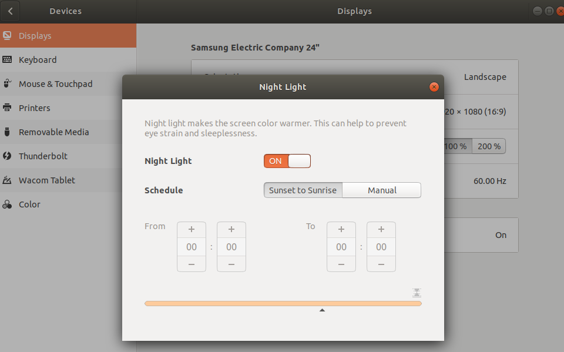
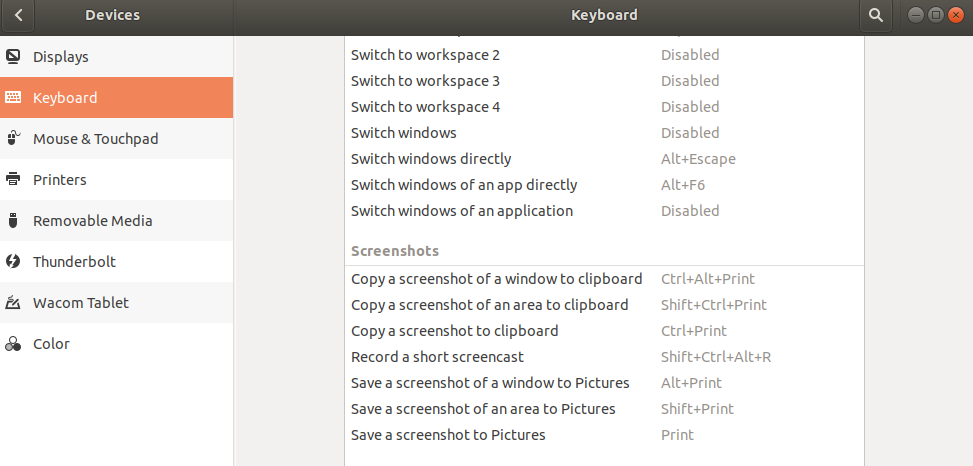
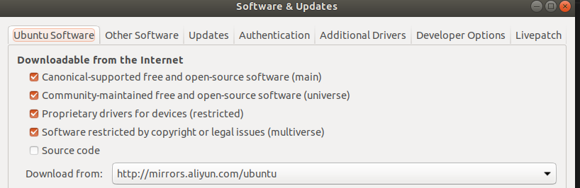
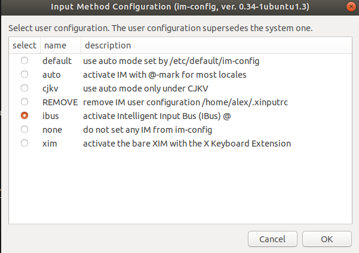
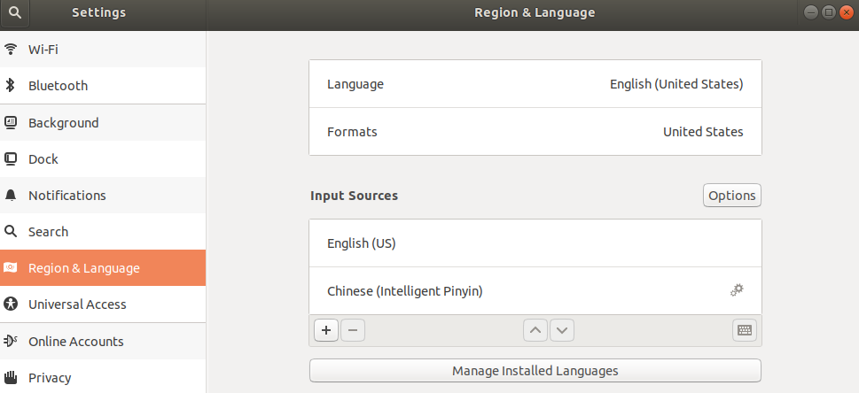

Now moving from CentOS to Ubuntu in mini pc, maybe keep sync with my WSL env.

There are lots of wrong guide on web, some make task more difficult, here record some tips used.

# 安装的时候选择最小化安装
## "System program problem detected" 
just ignore it via
>sudo rm /var/crash/* 

# 尝试夜间模式

# screen snapshot
using the KolourPaint and the internal function (e.g. shift+ctrl+print).

or shift+print

# change the repo source
no need to change manually, just changing it in GUI.

# torrent tool
Deluge, guide 

https://deluge.readthedocs.io/en/latest/intro/01-install.html

# chinese input
ibus

# office suite
WPS

# SW dev & blogging
VS Code
