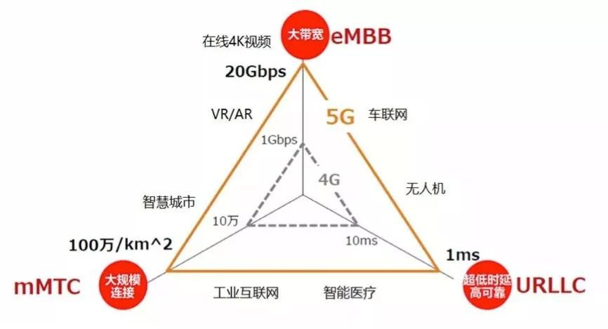
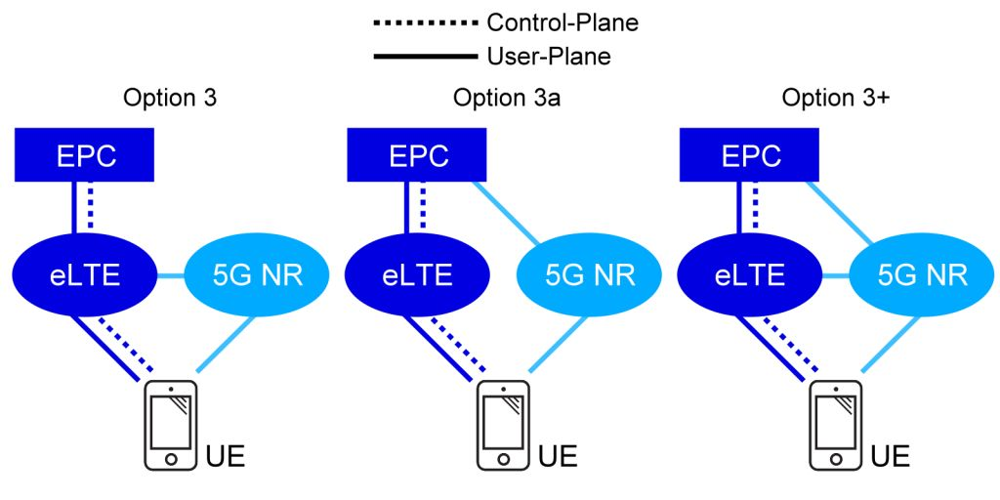

***5G*** 
## target

## co-exist with 4G

## key technology
### numerology
5G NR将引入可扩展的OFDM间隔参数配置。这一点至关重要，因为当FFT（Fast Fourier Transform，快速傅里叶变换）为更大带宽扩展尺寸时，必须保证不会增加处理的复杂性。而为了支持多种部署模式的不同信道宽度，如上图所示，5G NR必须适应同一部署下不同的参数配置，在统一的框架下提高多路传输效率。另外，5G NR也能跨参数实现载波聚合，比如聚合毫米波和6GHz以下频段的载波，因而也就具有更强的连接性能。

### CP-OFDM
CP-OFDM（循环前缀正交频分复用）加窗技术，大量的分析和试验结果表明，它能有效减少频带内和频带外的辐射，从而显著提高频率局域化。CP-OFDM技术的效果已被实践证实，现在正广泛应用于LTE网络体系中。

### 自包含集成子帧（Self-contained integrated subframe）
上图展示的是一个TDD下行链路子帧的例子，从网络到设备的数据传输和从设备发回的确认信号都在同一个子帧内。而且通过5G NR独立集成子帧，每个TTI都以模块化处理完成，比如同意下载→数据下行→保护间隔→上行确认。

### LDPC/POLAR
LDPC编码已被证明，对于需要一个高效混合HARQ体系的无线衰落信道来说，它是理想的解决方案。从下图可以看出，LDPC的传输效率远超LTE Turbo，且易平行化的解码设计，能以低复杂度和低时延，扩展达到更高的传输速率。
POLAR 由于效率接近香浓极限,但是时延长,所以只用于控制信道.

### 波束形成（beamforming）
波束成型技术将信号传送给特定的用户，减少附近其他用户的干扰。在大规模MIMO基站上信号处理算法规划出最佳的路径到达用户，通过规划信号传播和抵达时间，波束成型允许多用户和天线在天线阵列上同时交换更多的信息。而对毫米波来说，波束成型则应对另一组问题：信号会被物体阻挡并且会在长距离上衰.

### 4G QCI->5G network slicing
5G network slicing is a network architecture that enables the multiplexing of virtualized and independent logical networks on the same physical network infrastructure.[1] Each network slice is an isolated end-to-end network tailored to fulfil diverse requirements requested by a particular application.[2]

For this reason, this technology assumes a central role to support 5G mobile networks that are designed to efficiently embrace a plethora of services with very different service level requirements (SLA). The realization of this service-oriented view of the network leverages on the concepts of software-defined networking (SDN) and network function virtualization (NFV) that allow the implementation of flexible and scalable network slices on top of a common network infrastructure.

LTE 中QoS的实现是PCRF或手机给某种类型的业务分配不同的QCI, 让后在各个network node 根据QCI给予不同的优先级，类似service differential.

5G中就不同业务走不同的NFV(Network Function Virtualization)虚拟网络，不仅仅是优先级，而是该虚拟网络就是满足一定SLA的,类似RSVP.

### network node change

5G由于使用Massive MIMO技术,由于实在没办法在一个天线下面插64根馈线挂在挂杆上，因此5G设备厂家将RRU与天线合成了一个设备--AAU（Active Antenna Unit，有源天线单元）。

在4G网络中，BBU与RRU需要使用光纤来进行连接，而光纤中的射频信号传输标准叫做CPRI（Common Public Radio Interface）。CPRI在4G中传输BBU与RRU间的用户数据一直没啥毛病，但是在5G中，由于Massive MIMO等技术的使用，5G单小区的的容量基本可以达到4G的10倍以上，相当于BBU与AAU间传输的数据速率要达到4G的10倍以上。而如果继续使用传统的CPRI技术的话，那么使用光纤、光模块带宽就要N倍增加，而光纤、光模块的价格则也要翻几番的增长。于是乎，为了节约成本，通信设备商们把CPRI协议升级成了eCPRI，这个升级倒是很简单，其实就是将CPRI传输的节点从原来的物理层与射频间，上移到了物理层内，并将传统的物理层分割成了高层物理层与低层物理层。
