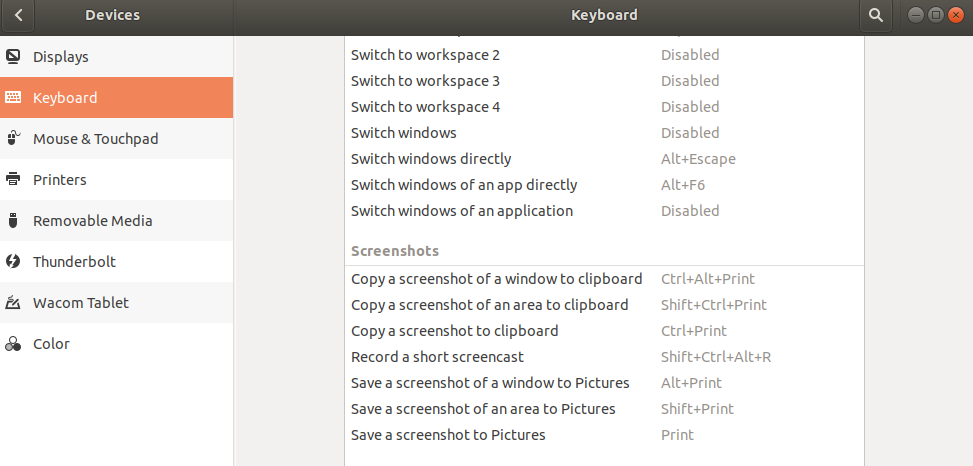

Now moving from CentOS to Ubuntu in mini pc, maybe keep sync with my WSL env.

There are lots of wrong guide on web, some make task more difficult, here record some tips used.

# install
安装的时候选择最小化安装
## "System program problem detected" 
just ignore it via
>sudo rm /var/crash/* 

# daily usage
## 定时关机
```
$ shutdown -h 00:59
Shutdown scheduled for Thu 2020-04-23 00:59:00 CST, use 'shutdown -c' to cancel.
$ 
```
## screen snapshot
使用OS内置功能截屏即可,shortcut key can be configured:



## change the repo source
不用一些guide 说的手动修改, just changing it in GUI.


## chinese input
需要安装
* ibus
* m$字体
* 输入法  https://github.com/libpinyin/ibus-libpinyin

# tools
## install deb package
e.g.
```
 sudo dpkg -i baidunetdisk_linux_3.0.1.2.deb 
```
## torrent tool Deluge
https://deluge.readthedocs.io/en/latest/intro/01-install.html

## paint tool
KolourPaint

## wps office suite
https://linux.wps.com/
## foxit pdf reader
https://www.foxitsoftware.com/pdf-reader/

# VS Code
## PlantUML support
* install the PlantUML extension
* sudo apt install default-jre
* sudo apt install graphviz
## C/C++ Suppport
## Python 3 support
## Golang support

