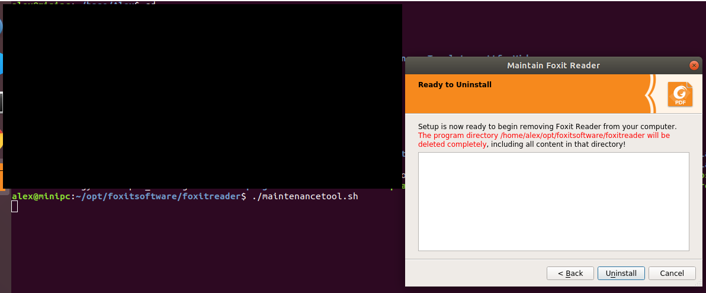

Now moving from CentOS to Ubuntu in mini pc, maybe keep sync with my WSL env.

There are lots of wrong guide on web, some make task more difficult, here record some tips used.

# 安装的时候选择最小化安装
## "System program problem detected" 
just ignore it via
>sudo rm /var/crash/* 


# 尝试夜间模式


# 定时关机
```
$ shutdown -h 00:59
Shutdown scheduled for Thu 2020-04-23 00:59:00 CST, use 'shutdown -c' to cancel.
$ 
```

# screen snapshot
使用OS内置功能截屏即可， 如 shift+ctrl+print 后paste 到KolourPaint。
using the KolourPaint and the internal function (e.g. shift+ctrl+print).


或者 shift+print 直接保存。

# change the repo source
不用一些guide 说的手动修改, just changing it in GUI.


# torrent tool
Deluge, guide 

https://deluge.readthedocs.io/en/latest/intro/01-install.html


# chinese input
需要安装
* ibus
* m$字体
* 输入法  https://github.com/libpinyin/ibus-libpinyin


# office suite
WPS，支持PDF。
## uninstall the foxit pdf reader



# SW dev & blogging
VS Code
