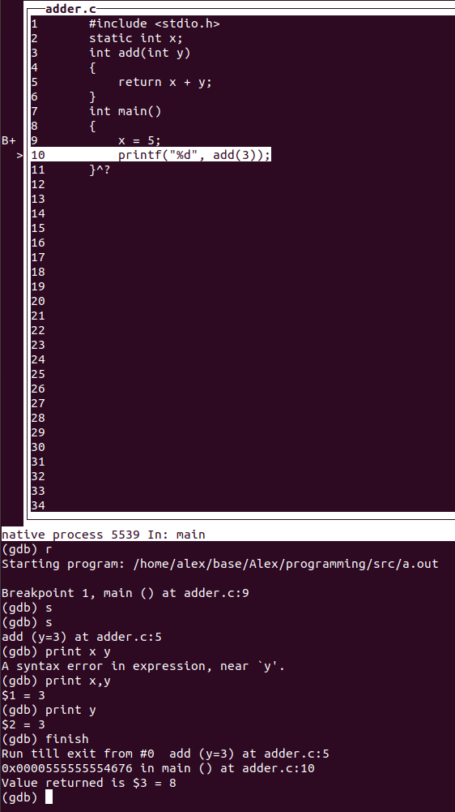

# syntax
```
gdb    [-help] [-nx] [-q] [-batch] [-cd=dir] [-f] [-b bps]
          [-tty=dev] [-s symfile] [-e prog] [-se prog] [-c core]
          [-x cmds] [-d dir] [prog[core|procID]]
```
# cmd sample
## watch/breakpoint
```
watch <expr> 为表达式（变量）expr设置一个观察点。一量表达式值有变化时，马上停住程序。 
rwatch <expr> 当表达式（变量）expr被读时，停住程序。 
awatch <expr> 当表达式（变量）的值被读或被写时，停住程序。 
info watchpoints 列出当前所设置了的所有观察点。
break <行号或函数名>
clear/delete 删除断点
```
## execute
```
call <函数名> 
break     设置断点
run       开始重新运行
next      单步执行
step      单步进入;如果其后输入finish 表示执行到函数的return
skip      在step时跳过一些不想关注的函数或者某个文件的代码  
continue  继续运行被调试的程序。
until     继续运行到指定位置
```
## check
```
print <变量名>
print <变量名>=<new value>   set 一个变量
backtrace
list <linenumber/fuction name/c file name/>        列出代码
info             一大堆子命令,可以
disassemble <函数名> 

```
## process
```
Inferior         process control
frame 3  切换到 stack frame 3,显示最后执行的代码

```


# tips
##  when "set" don't work, use the "print" to set variable value
```
(gdb) set i = 7
Ambiguous set command "i = 7": inferior-tty, input-radix, interactive-mode.
(gdb) print i=7
$5 = 7
```

## 检查内存。

* x/nfu address
* n:number 几个数据单元
* f:format 格式类型 x 十六进制 d 十进制 o 八进制
* u:unit 单元类型 b:byte 1个字节 w:word 4个字节 
```
(gdb) print s
$1 = 0x400620 "abcde"
(gdb) x/8cb 0x400620
0x400620:	97 'a'	98 'b'	99 'c'	100 'd'	101 'e'	0 '\000'	0 '\000'0 '\000'
```
## stdin 重定向
一般执行时
```
./a.out  [arg list] < input.txt
```
gdb 则
```
gdb a.out [arg list]
(gdb) r < input.txt
```

# 多文件调试/coredump
## preparation
```
#compile
gcc -g *.c 

#允许core dump
ulimit -c unlimited
ulimit -a

#run
$ ./a.out
Segmentation fault (core dumped)
```
## debug

```
$gdb a.out core.9074 

#check the source files list
(gdb) info sources

(gdb) backtrace 
#0  0x00000000004005e4 in list_size (h=0x7ffeb48638d0) at linked_list.c:14
#1  0x0000000000400929 in core_dump_test () at test_linked_list.c:38
#2  0x0000000000400964 in main () at test_linked_list.c:45

#set breakpoints
(gdb) break linked_list.c:14
(gdb) break test_linked_list.c:core_dump_test
(gdb) break test_linked_list.c:main

#next
(gdb) n

#if not coredump, start the program
(gdb) run

#use n/s/continue
(gdb) continue
Continuing.

Breakpoint 1, list_size (h=0x7ffffffee2e0) at linked_list.c:14
14              p = p->next;

#find out the root cause
(gdb) print p
$1 = (node_t *) 0x0

#list code nearby
(gdb) l
9       int list_size(const list_t *h) {
10          node_t *p = *h;
11          int r = 0;
12          do {
13              r += 1;
14              p = p->next;
15          } while (p);
16          return r;
17      }
18
(gdb)

```


# gdb attach
to debug the running process

```
$ ./a.out &
[1] 160

$ su       #otherwise attach failure

# gdb attach 160

(gdb) list main
1       #include <unistd.h>
2
3       int main(int argc, char *argv[])
4       {
5         int i;
6         for(i = 0; i < 6000; i++)
7         {
8           sleep(10);
9         }
10        return 0;

(gdb) break main:6
Breakpoint 1 at 0x7f38bc200659: file loop_sleep.c, line 6.
(gdb) continue

(gdb) finish
Run till exit from #0  0x00007f38bbae49a4 in __GI___nanosleep (requested_time=requested_time@entry=0x7fffc6a3a170, remaining=remaining@entry=0x7fffc6a3a170)
    at ../sysdeps/unix/sysv/linux/nanosleep.c:28
0x00007f38bbae48aa in __sleep (seconds=0) at ../sysdeps/posix/sleep.c:55
55      ../sysdeps/posix/sleep.c: No such file or directory.
Value returned is $4 = 0
(gdb) l
50      in ../sysdeps/posix/sleep.c
(gdb) finish
Run till exit from #0  0x00007f38bbae48aa in __sleep (seconds=0) at ../sysdeps/posix/sleep.c:55
main (argc=1, argv=0x7fffc6a3a2b8) at loop_sleep.c:6
6         for(i = 0; i < 6000; i++)
Value returned is $5 = 0
(gdb) print i
$6 = 30

(gdb) clear
Deleted breakpoint 1
(gdb) c

```
## if debug info missing in running process
Runnig process a.out was complied without -g, then comipile a gdb version of a.out, e.g. "hello" firstly.
```bash
# gdb hello <pid>
```
or

```bash
# gdb hello
(gdb)attach <pid>
```
or 
```bash
# gdb attach 160
(gdb) file hello
```

# tui
带上这参数，就有点gui味道了。
```bash
$ gdb a.out -tui

```


# multi-thread 

```bash
set pagination off
set logging file threads.txt
set logging on
thread apply all bt
set logging off
```