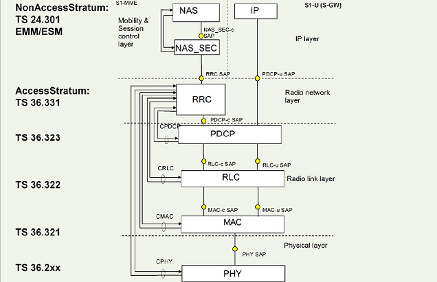
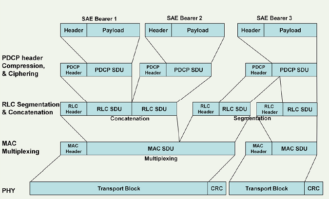
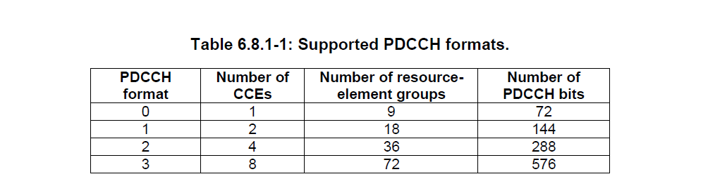
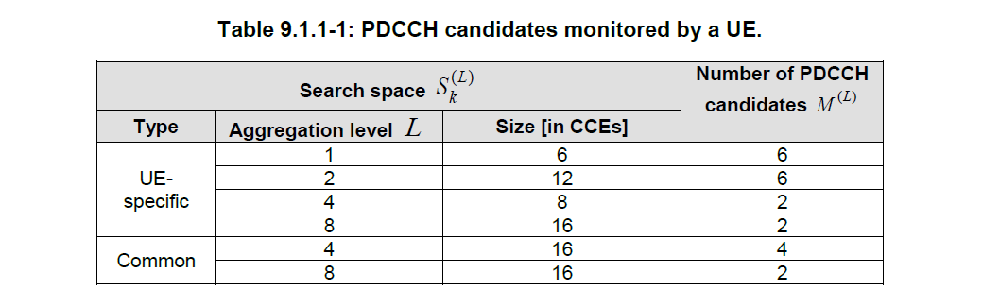
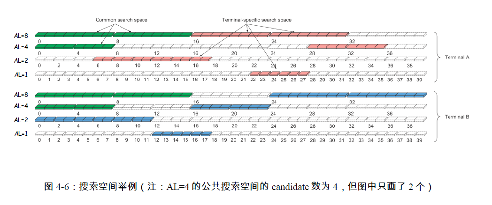

The access stratum (AS) contains the functionality associated with access to the radio network and the control of active connections between a UE and the radio network. The AS consists of a user plane and a control plane. The user plane is mainly concerned with carrying user data—e.g., internet protocol (IP) packets—through the access stratum. The control plane is concerned with controlling the connection between the UE and the network.

# Overview
 

 

# Physical Layer Downlink Control Information
The eNB normally transmits many DCI messages per subframe, each using a different PDCCH. Each message is intended to be received by one or many UEs. A UE does not know which PDCCH channels have been used on a particular subframe by the eNB and, of those used, whether the PDCCH contains a DCI message intended for that UE. **To receive DCI messages** a UE must perform a large number of blind decodes every subframe. The DCI messages intended for that UE will be decoded successfully, whereas those not intended for that UE will fail the cyclic redundancy code (CRC) check.

The intended recipient or recipients of a DCI message are distinguished by use of a different radio network temporary identity (RNTI), which is an identifier used by the UE MAC. This identifier is encoded into the CRC of the message. A UE will be able to successfully decode only those DCI messages that contain an RNTI the UE is expecting to receive.

common RNTI ==>Common search space (starting from CCE 0)
* SI-RNTI and P-RNTI for system information (SI) and paging (P) messages 
* RA-RNTI for random access

ue specific RNTI ==>UE-specific search space
* the cell RNTI, or C-RNTI, SPS C-RNTI / Temporary C-RNTI

DCI carry on PDCCH, whose format is:
 

PDCCH candidates monitored by a UE.
 

 an example
  

## eNodeB
在调度时，会针对每个待调度的UE，从对应的搜索空间中选择一个可用的PDCCH candidate。如果能分配到CCE就调度，否则就不调度。发给不同UE的PDCCH可以有不同的聚合等级。(alex:所以存在cce blocking 这种情况，如PDCCH 就一个symbol的话，就支持不料几个UE)

## UE 
事先并不知道接收到的PDCCH 携带的是哪种格式的DCI (refer [Physical Layer](phy.md))，也不知道该DCI 使用哪个PDCCH candidate 进行传输，所以UE 必须进行PDCCH盲检以接收对应的DCI。

* UE 通过PSS/SSS，确定了物理层小区ID（PCI）和frame timing（说得通俗一点，就是subframe number #0 所在的位置，但此时还不知道system frame number）
* 接着UE 就可以进行信道估计并进一步解调PBCH，从而获取system frame number、PHICH 占用的资源分布和天线端口数。
* 再通过解调PCFICH 获取CFI，就知道了控制区域占用的OFDM符号数。
* TM mode ==> RS Pattern; PCI ==>RS pattern 的offset; 两者结合==>PDCCH在一个子帧内的CCE分布 
* 传输模式或状态下（如随机接入时使用RA-RNTI）==>最多有2种可能的DCI format

UE对于不同的期望信息，UE尝试使用相应的X-RNTI、可能的DCI format、可能的聚合等级（Aggregation Level，简称AL）去与属于自己的搜索空间内的CCE做CRC校验。如果CRC校验成功，那么UE就知道这个信息是自己需要的，也就知道相应的DCI format，从而进一步解出DCI内容。UE不知道要收到的PDCCH使用哪种聚合等级，所以UE会把所有可能性都尝试一遍。例如：对于公共搜索空间，UE需要分别按Aggregation Level = 4和Aggregation Level = 8来搜索。当按AL = 4盲检时，16个CCE需要盲检4次，即有4个PDCCH candidate；当按AL = 8盲检时，16个CCE需要盲检2次，也就是有2个PDCCH candidates；那么对于公共空间来说，一共有4+2=6个PDCCH candidates。而对于UE特定的搜索空间，UE需要分别按Aggregation Level = 1、2、4、8来盲检一遍，此时一共有6+6+2+2=16个PDCCH candidates。（见36.213的Table 9.1.1-1）

e.g.
如果UE期待接收DL-SCH并使用TM 3，当UE对使用C-RNTI扰码的PDCCH进行解码时，只会使用自己的C-RNTI对DCI format 1A和DCI format 2A进行尝试解码。如果同时该UE期望在该子帧内接收系统信息（SI），则会使用SI-RNTI对DCI format 1A和DCI format 1C进行尝试解码。更确切地说，UE使用对应DCI format的payload长度来尝试盲检。在成功解码PDCCH之前，UE会在每一个可能的PDCCH candidate上尝试解码，一旦解码成功就停止解码过程。

# Medium Access Control (MAC)
The medium access control (MAC) layer is a protocol layer that runs in both the UE and the eNB. It has different behaviors when running in each, generally giving commands in the eNB and responding to them in the UE.

The random access procedure enables the UE to establish initial contact with the network, which is usually 
* the first thing a UE does after acquiring system information.
* Other scenarios in which the procedure is used are after failure of the radio link to reacquire a connection with the network, and
* during the handover procedure.

Random access can be
* [contention-based](http://sharetechnote.com/html/RACH_LTE.html#PRACH_on_Handover_Contention) or 
* [non-contention-based](http://sharetechnote.com/html/RACH_LTE.html#PRACH_on_Handover_NonContention). 
For the contention-based procedure, the physical random access channel (PRACH) preamble is chosen by the UE from a set of preambles whose configuration is broadcast in the SI messages. Since there is a possibility of two UEs choosing the same preamble at the same time, there are a few subsequent 
steps to allow the network to uniquely identify each UE. In contrast, for non-contention based random access, the eNB MAC assigns a dedicated preamble to each UE, which allows the UE to be uniquely identified from the start of the procedure.

The UE decodes the random access channel (RACH) transport channel configuration options from the SI messages. This informs the UE of the allowed random access configurations in the cell. The random access procedure is initiated by the UE’s MAC transmitting a PRACH preamble on the RACH. The eNB MAC can choose to respond to the UE’s MAC PRACH preamble with an uplink grant including an estimate of the UE’s timing alignment, or with a back-off value to the UE not to perform another random access for the signaled back-off duration. The uplink grant transmission is done on the DL-SCH transport channel
addressed with a random access radio network temporary identity (RA-RNTI).

If the eNB MAC provides an uplink grant, the UE schedules a UL-SCH transmission and starts a timing alignment timer. The eNB MAC periodically sends the timing advance MAC control element to the UE, whereupon the UE applies the timing advance and restarts its timing alignment timer. The UE MAC can also signal a scheduling request (SR) to signal to the eNB MAC that the UE needs more uplink resources. The SR can be used only if the UE’s timing alignment timer is running. After the UE’s timing alignment timer expires, the UE has to use the random access procedure before scheduling further uplink transmissions.

The MAC also participates in the contention resolution procedure. The UE MAC starts the contention resolution timer after performing a scheduled transmission in response to a random access uplink grant. If, during the period that the contention resolution timer is running, the UE MAC detects its cell radio network temporary identity (C-RNTI) on the PDCCH or detects a match of the UE’s contention resolution identity in a DL-SCH transmission addressed to the UE’s temporary C-RNTI, then the UE’s contention has been successfully resolved.

# Radio Link Controller (RLC)
The RLC has three modes of operation:
* transparent mode (TM), 
* unacknowledged mode (UM), and 
* acknowledged mode (AM).

# Packet Data Convergence Protocol (PDCP)
The packet data convergence protocol (PDCP) layer acts as a portal between the various higher layers of the protocol stack (RRC, RTP, UDP, TCP, etc.) and the RLC layer.

PDCP can operate on either of two planes,
* the control plane or
* the user plane. 
The control plane is used for RRC messages. The user plane is used for all other data.

# Radio Resource Control (RRC)
The radio resource control (RRC) layer is a layer 3 (L3) protocol in the radio interface and is located at the top of the access stratum (AS) of the air interface. The RRC provides access through which higher layer signaling entities can gain services in the form of signaling transfer from the AS.

