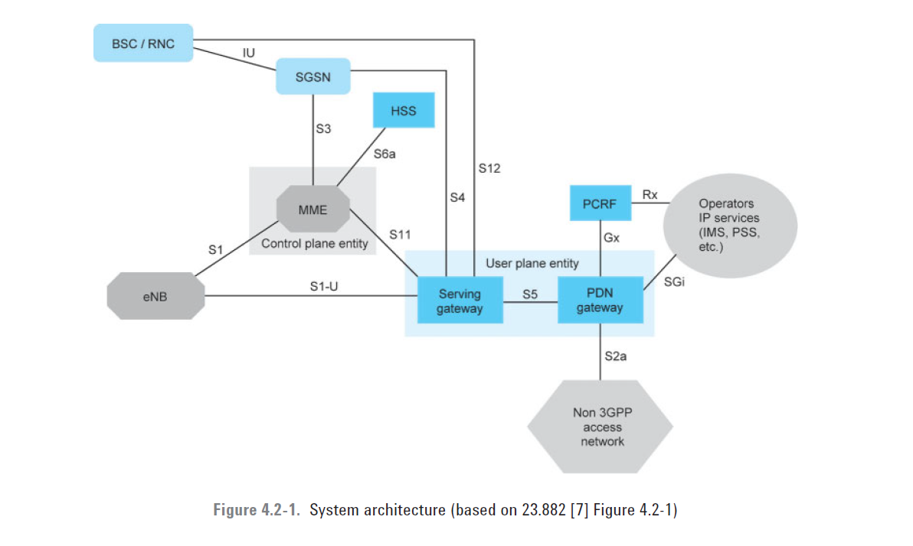
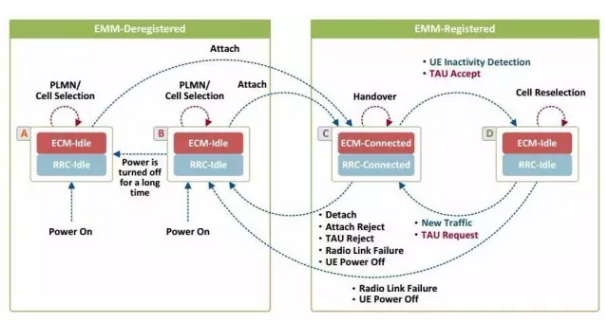
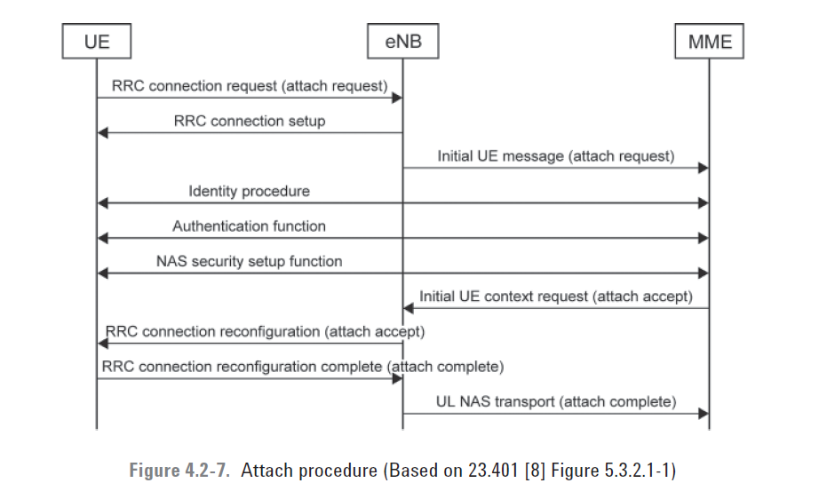

## System architecture

## ECM ECM(EPS Connection Management）
ECM包含UE与eNB之间的RRC连接和eNB与MME之间的S1信令连接的逻辑连接。当ECM建立和终止时，RRC和S1信令连接全部建立和终止。一个建立的ECM连接，意味着UE与eNB之间具有RRC连接，MME与eNB之间具有S1信令连接。

## EMM (EPS Mobility Management）
EMM主要用于实现用户当前位置的跟踪，以及UE的切换、位置更新等移动性管理。

The various EMM procedures are classified as EMM common procedures, EMM specific procedures, or EMM connection management procedures.
### EMM Common Procedures
EMM common procedures can be executed only when there is a signaling connection between the UE and the MME
### EMM-Specific Procedures
The EMM-specific procedures are complete EPC procedures used for handling UE mobility in the MME. They are the attach procedure, the tracking area update procedure, and the detach procedure.

### EMM Connection Management Procedures
The EMM connection management procedures enable the UE to move from the ECM-idle state to the ECM-connected state whenever there is a need for some data or signaling transfer. The EMM connection management procedures are the paging procedure, the service request procedure, and the procedures for the transport and generic transport of NAS messages.
## ESM (EPS Session Management) 
ESM过程发起的前提条件：EMM上下文已经存在；已发起NAS安全交换。

The ESM procedures are used for activation, modification, and deactivation of the user plane EPS bearers, which are used for data transfer between the UE and the IP network.