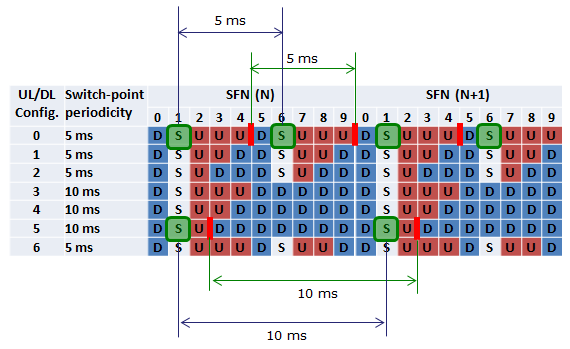
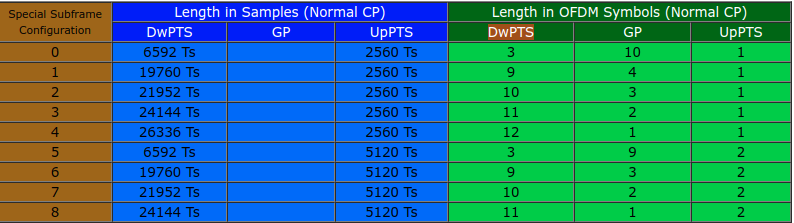

Personal review

# Cell size dimension
* from power view, decided by  UE Tx power/path loss/eNB acceptable Rx power
* if TDD, as UE Rx/Tx switch time needed， decided by the GP of special subframe，
   
   

 * Random access phase
   - preamble  detection windows size decided by  Preach format & Ncs.
   - TA command,  its value was detected by eNB during RA phase, in theory, its value will limit the cell size.
* acceptable  "channel delay spread" due to "inter OFDM symbol interference",  decided by CP length

# Why in LTE the SSS is transmitted before the PSS?

Three major synchronization requirements can be identified in the LTE system:
1. Symbol and frame timing acquisition, by which the correct symbol start position is determined, for example to set the Discrete Fourier Transform (DFT) window position;
2. Carrier frequency synchronization, which is required to reduce or eliminate the effect of frequency errors arising from a mismatch of the local oscillators between the transmitter and the receiver, as well as the Doppler shift caused by any UE motion;
3. Sampling clock synchronization

so PSS/SSS is designed as:
* 在FDD小区内，PSS总是位于slot #0和slot #10 的最后一个OFDM符号上，使得UE在不考虑循环前缀（CP）长度下获得slot边界定时；SSS直接位于PSS之前；
* In a TDD cell, the PSS is located in the 3rd symbol of DwPTS, while the SSS is located three symbols earlier(alex: end of the first Downlink subframe，这样无论是FDD还是TDD，SSS都在子帧0和5上传输);

Synchronization and Cell Search：

* 一般来说应该UE先对可能存在小区的频率范围内测量小区信号强度，据此找到一个可能存在小区的中心频点；note:[RSSI](https://www.sharetechnote.com/html/Handbook_LTE_RSSI.html) 
* 然后在这个中心频点周围收PSS，这两个信号和系统带宽没有限制，配置是固定的，而且信号本身以5ms为周期重复，并且是ZC序列，具有很强的相关性，因此可以直接检测并接收到，据此可以得到小区Id，同时得到小区定时的5ms边界；（UE不知道解出的PSS是radio frame 中的第一个还是第二个）
* LTE中，SSS的设计有其特别之处：2个SSS（SSS1位于子帧0，SSS2位于子帧5）的值来源于168个可选值的集合，在同一个小区中，SSS2与SSS1使用相同的2个m-sequence，不同的是，在SSS2中，这2个sequence（X和Y）在频域上交换了一下位置。通过尝试解码SSS，UE就能确定这是TDD还是FD，解出来的是SSS1还是2就能确定radio frame 的边界。

* 5ms边界得到后，根据PBCH的时频位置，使用滑窗方法盲检测，一旦发现CRC校验结果正确，则说明当前滑动窗就是10ms的帧边界，并且可以根据PBCH的内容得到系统帧号和带宽信息，以及PHICH的配置；
至此，UE实现了和eNB的定时同步。

alex: 正是因为PSS检测时，频率/时间未知，所以为了减少解码的effort, PSS设计只有3个取值，对应三种不同的Zadoff-Chu序列

# HARQ when UL TTI bundling
it is quite special
* only 1 UL grant for the 4 consecutive UL subframe
* only 1 ACK/NACK from eNB related to the last subframe in a bundle, but The maximum number of HARQ retransmissions (maxHARQ-Tx) shall be configured to a value divisible by 4 (i.e. n4, n8, n12, n16, n20, n24).
* modulation order (QM) was fixed.  to UEs for that the TTI bundling mode is selected have to deal with 4 HARQ processes and an RTT of 16 ms which is different from the UEs in normal operation (8 HARQ processes and 8 ms RTT). Accordingly, the timing of thecorresponding acknowledgement of the HARQ process differs between the two modes. The 4 Subframes use RV 0,2,3,1
* so in HARQ Process view: 1 bundle is just treated as 1 transmission, but in time domain, it is still 4 TTI.
* switching on/off TTI bundling need a intra-cell HO to change the UE CONTEXT via  the RRC-ConnectionReconfiguration procedure

# Scheduling timing & HARQ prcess: FDD
* number of HARQ processes are fixed to 8.
* UL harq is synchronous,  UL ACK/NACK was fixed to 4 TTI after transmission
* DL harq is asynchronous, its Harq process and RV is indicated by PDCCH.

* timing of UL/DL transmission. in above example UL grant happen at n TTI, transmission happen at n+4, retransmission happen at n+8.

In UL, retransmissions are either triggered by the PDCCH (adaptive), or by a received (PHICH)
* If non-adaptive retransmission, the UE uses the same resources which were previously used by the same HARQ process, no PDCCH signalling needed.
* If adaptive retransmission, the UE uses the resources which are assigned by the PDCCH.

# UL scheduling
   * via SR & BSR, classified by LCG 
   
   UE通过SR告诉eNodeB是否需要上行资源以便用于UL-SCH传输，但并不会告诉eNodeB有多少上行数据需要发送（这是通过BSR上报的）,只有处于RRC_CONNECTED态且保持上行同步的UE才会发送SR；且SR只能用于请求新传数据（而不是重传数据）的UL-SCH资源。SR的周期是通过IE：SchedulingRequestConfig的sr-ConfigIndex字段配置的。      由于SR资源是UE专用且由eNodeB分配的，因此SR资源与UE一一对应且eNodeB知道具体的对应关系。也就是说，UE在发送SR信息时，并不需要指定自己的ID（C-RNTI），eNodeB通过SR资源的位置，就知道是哪个UE请求上行资源。SR资源是通过IE：SchedulingRequestConfig的sr-PUCCH-ResourceIndex字段配置的。   UE在某些情况下可能没有SR资源。

   - 场景一：从36.331可以看出，SchedulingRequestConfig是一个UE级的可选的IE（optional），默认为release。如果 eNodeB不给某UE配置SR（这取决于不同厂商的实现），则该UE只能通过随机接入过程来获取UL grant（在RAR中分配）。是否配置SR主要影响用户面的延迟，并不影响上行传输的功能！   
   - 场景二：UE在获得初始同步以后，随着时间的推移，由于信道情况的改变或者UE（以及eNodeB）的时钟漂移，UE可能重新变为失步状态。为此eNodeB会周期性的为UE发送TA命令，指导UE进行上行的同步，并且eNodeB为每个UE配置了一个Time Alignment Timer，规定了TA的有效期，为此eNodeB需要在UE的能力和系统的开销之间进行折中。UE在每次接收到eNodeB的TA命令后，都将此定时器重置为零。在Time Alignment Timer超时以后，如果UE未能收到任何的TA命令，那么UE认为上行已经失步，此时UE不能再进行任何的上行数据传输，而必须通过随机接入的过程来对上行的TA进行重新初始化。当UE丢失了上行同步，它也会释放SR资源，如果此时有上行数据要发送，也需要触发随机接入过程。

   * explicit granted via PDCCH or implicit grant e.g. IUA (SPS of interval 1/2/4ms)
   * RAR of RACH process

   

   * if retransmission, please refer previous chapter

# Beamforming
* a general signal processing technique used to control the directionality
* increase the reliability of the transmission by combining several decorrelated
signals (diversity),
* enhance the Signal to Interference plus Noise Ratio (SINR) by spatial focusing
of several correlated signals (beamforming),

# Carrier Aggregtion
* UE-->TB-->CC mapping

* scheduling only happen on PCell,so from MAC sw view, the SCell is only accessed via the PCell
* SCell are configured based on UE capability
* Can have DL only resources or DL and UL resources.
* Rel. 8/9 compatible.
* configured via dedicated RRC Reconfiguration message.
* Can be dynamically activated/deactivated (MAC based).
* asymmetric of DL/UL CC

* MAC handling, it split into two phase
  - phase 1, scell configuration/deconfiguration, dynamic, ue measurment based
  - activate/deactivate via MAC cmd, usually because of throughput

# Scheduler
   Goal: maximizie the UEs with satisfied QoS

## QoS
   * QCI
   * ARP
   * GBR/MBR
   * AMBR 

## Phases
   * admission control
   * active queue management (threshold Min/Max)
   * rate shapping
   * scheduling (weight)

the QCI is e2e, each network node shall decided its per Hop policy to ensure the e2e target. in the transport network, it may use he DSCP mapping to different queue with different weight. in Baseband, the similiar policy was used.
The framework of scheduler is based on 
   * Priority Queue: higher weight mean higher probability of being sceduled
   * weight functions:implements the scheduling algorithm
So scheduler only need care the weight.
## The algorithm examples:
   * roud robin: resource fair
   * proportional fair: a trade off between user fairness and the system performance
   * max cell throughput
   * strict priority:Used for BCCH, PCCH, CCCH, MAC Ctrl
   * delay based: VOIP, usually bundle the voice packets to intervals like 60ms

## weight functions used in frequency slective scheduling
   * each PRB has different weight for a SE/UE   

## the unit of scheduling
   * SB: scheduling block, (15*12khz)* (1ms),, the smallest scheduling unit:
   * SE: scheduling unit, correspond 1 UE
   * internal scheduling queue:
      - Radio bearer for DL,
      - LCG for UL

# RNTI during RACH
Random Access process plays two main roles - establishment of uplink synchronization and establishment of a unique UE ID (C-RNTI) known to both the network and the UE.So Random Access is used not only for initial access, but also after periods of uplink inactivity when uplink sync got lost in LTE_ACTIVE states.
 

* RA-RNTI（ Random Access-RNTI）
RA-RNTI = msg 1 时Preamble的时频位置对应到PRACH_Config中的索引；理论取值：1~60（0x0001~0x003C）
使用：eNB回复msg2时 ，在PDCCH上用RA-RNTI加扰，收端UE知道自己之前 Preamble的发送位置，就用RA-RNTI来盲检PDCCH；如有，则说明接入被响应，在依据PDCCH上的指示 去PDSCH上读取RA Response消息（MSG2）。

* T-CRNTI : It stands for Temporary C-RNTI. Mainly used during RACH
在MSG2里，ENB给用户分配一个T-CRNTI。用于随后的Msg中标识UE，当然UE有C-RNTI也可以不用TC-RNTI，此种情况是，这个用户已经在网络中，并且分配过CRNTI。用户获取T-CRNTI后，会在MSG3传输中使用此RNTI。在正常的竞争随机接入中，msg3是RRC信令，则Msg4的PDCCH用Temporary C-RNTI 加扰， msg4中应当携带48bits的MAC控制元素“UE Contention Resolution Identity”，该控制元素就是msg3的SDU。如果该控制元素和UE保存的msg3的SDU相等，则认为自己的msg3被基站正确接收了，竞争解决完成。

* C-RNTI : It stands for Cell RNTI. Used for the transmission to a specific UE after RACH.C-RNTI并不是一开始就有，而是在用户入网之后基站给入网成功的用户分配的。UE若处于RRC_CONNECTED模式，说明已经分配到了C-RNTI，接入时需要上报；UE若处于IDLE模式，说明还没有C-RNTI；在用户切换的时候，则用户可以将本小区分配的C-RNTI带入下一个小区，则不用再重新分配C-RNTI。

about the attach procedure can check  [Non-Access Stratum](NAS.md)

# Reference
* internal LTE RRM trainning video
* 温金辉: 深入理解LTE-A
* Moray Rumney, LTE and the Evolution to 4G Wireless
* http://sharetechnote.com/

