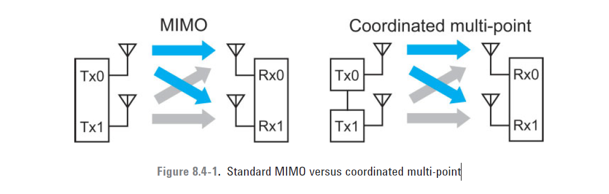

## Release 11
This subset of Release 10 is what is meant by the term LTE-Advanced.
The original key features of LTE-Advanced proposals were the following:

*  Support of Wider Bandwidths: Carrier Aggregation
*  Uplink Transmission Scheme
   
   Several enhancements were introduced to the uplink for LTE-Advanced:
   -  Spatial Multiplexing and Transmit Diversity

    require the support of more than one uplink transmitter.
   -  Clustered SC-FDMA

    The uplink multiple access scheme has been enhanced by adopting clustered discrete Fourier transform spread OFDM (DFT-S-OFDM). This scheme is similar to SC-FDMA but has the advantage that it allows non-contiguous (clustered) groups of subcarriers to be allocated for transmission by a single UE, thus increasing the flexibility available for frequency-selective scheduling. Clustered SC-FDMA was chosen in preference to pure OFDM in order to avoid a large increase in peak-to-average power ratio (PAPR).
   - Simultaneous PUCCH/PUSCH Transmission

    In Release 8 the user data carried on the physical uplink shared channel (PUSCH) and the control data carried on the physical uplink control channel (PUCCH) are time-multiplexed as shown earlier in Figure 3.2.13. It is also possible to multiplex control data with user data on the PUSCH. LTE-Advanced introduces a new mechanism for simultaneous transmission of control and data by allowing the PUSCH and the PUCCH to be transmitted simultaneously.

* Downlink Transmission Scheme
  TM 9 

* Relaying

## Release 11
### Coordinated Multi-Point Transmission (CoMP)
The goal of CoMP is to improve the coverage of high data rates and cell-edge throughput, and
also to increase system throughput. Figure 8.4-1 compares standard MIMO with CoMP.

The primary difference between standard MIMO and CoMP is that for the latter, the transmitters are not physically co-located. In the case of downlink CoMP, however, there is the possibility of linking the transmitters at baseband (shown as the link between the transmitters on the right half of Figure 8.4-1) to enable sharing of payload data for the purposes of coordinated precoding. This sharing is not physically possible for the uplink, which limits the options for uplink CoMP. For the standard
network topology in which the eNBs are physically distributed, provision of a high capacity, low latency baseband link is challenging and would probably require augmentation of the X2 inter-eNB interface using fiber. However, a cost-effective solution for inter-eNB connectivity is offered by the move towards a network architecture in which the baseband and RF transceivers are located at a central site with distribution of the RF to the remote radio heads via fiber.

## Release 12
