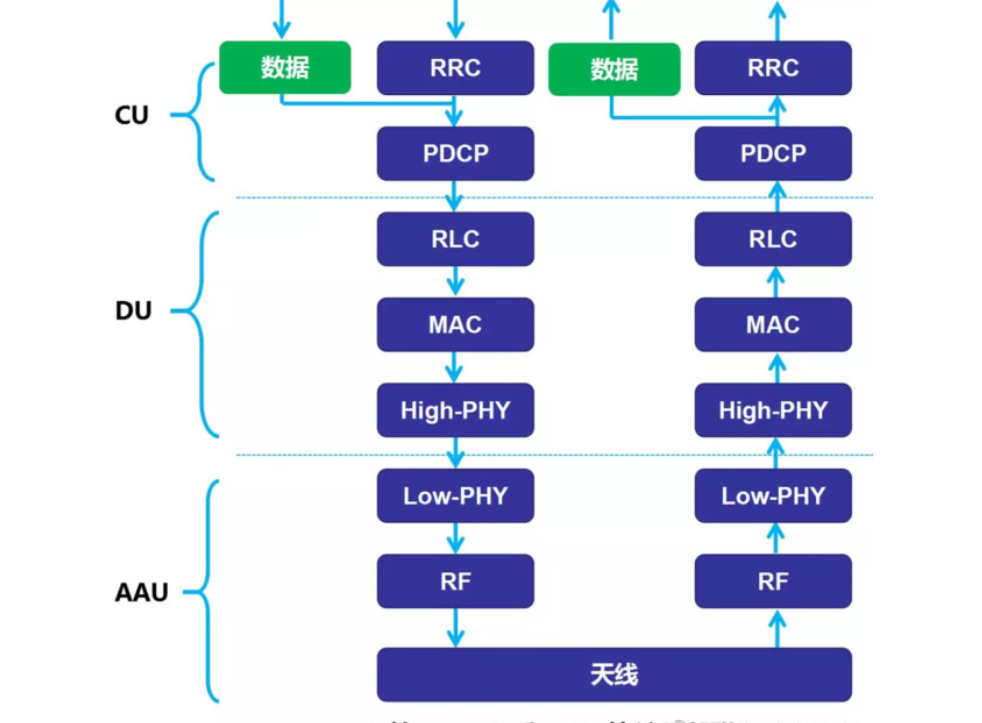

## O-RAN Alliance
The next generation end-to-end networks will be virtualized, cloud-native, software-defined, highly programmable, automated, and sliceable. 

## TIP (Telecom Infra Project)
by facebook, Vodafone.
https://telecominfraproject.com

## major players
### Altiostar
Telefonica said it will be developing Distributed Units based on Intel’s FlexRAN reference platform which includes Intel XEON-based servers. Remote Radio Units (RRUs) would be connected to DUs using the O-RAN Aliance’s fronthaul interface specification.

The ecosystem appears to combine SuperMicro’s Intel-based servers with Altiostar’s virtual baseband technology for the DUs. Gigatera Communications is the company that owns KMW, the antenna and RF component manufacturer that designs Remote Radio Heads. Xilinx is an RF System on Chip provider and said it would be providing Telefónica with a “unique and flexible platform for radio, fronthaul, and acceleration for 4G and 5G networks.”

It said, “Edge-computing applications running in the Telco cloud can benefit from the strong capillarity of the access network, hence tailoring the service behavior to the instantaneous user conditions as well as the status of the live network.”

### Mavenir
An OpenRAN-based Virtualized RAN, vEPC and IMS Core, with all mobile network elements located on a very small number of servers in a single enclosure essentially representing a complete ‘mobile network in a box.’

Mavenir’s vRAN extends the virtualization to the edge of the network and provides strategic differentiation by enabling the Remote Radio Units (RRUs) to interwork with the virtualized Cloud Base Band Unit (vBBU) over ethernet Fronthaul (FH), overcoming the traditional constraints of Common Public Radio Interface (CPRI™) over fiber.

### JMA
says it has, is a 100% virtualized baseband unit along with the radios, all from one company. And Landry said, “When we talk about virtualization of the RAN, there are several layers you can choose to virtualize. We elected to take the more difficult part and virtualize the lowest level of the RAN in pure software as well.”

In terms of the lower layers of the baseband, Landry said, “You have to figure out how to modulate which bits into which areas of phase and time of the spectrum which connects to the mobile phones out there. It’s a very dynamic situation. Sometimes it’s easier to do in hardware. We took the act of engineering all the layers in software. We don’t need to use an FPGA. It just runs in software.” He said JMA virtualizes Layers 1, 2 and 3 of the baseband unit.

### VMware and Deutsche Telekom

are collaborating on a virtual RAN (vRAN) platform, based on O-RAN standards.

The Open RAN solution architecture leverages standards-based Intel processors and FlexRAN, a vRAN software reference platform, to run vRAN workloads on top of VMware’s telco cloud platform, optimized for real-time and low latency workloads. The solution will also feature a VMware-developed pre-standard, near-real-time RAN Intelligent Controller (RIC) that will adopt O-RAN open interfaces with required enhancements to enable real-time radio resource management capabilities to be delivered as applications on top of the platform. VMware, Deutsche Telekom and Intel are collaborating with an open partner ecosystem to develop this solution, and key initial partners include Cohere Technologies and Mavenir.

## progress 
### Vodafone 
made good on its promise in October 2019 to fast track OpenRAN technology into its networks. Just a month later, it announced plans for a tender spanning the entirety of its European footprint, covering over 100,000 sites and 400 million people across 14 countries. The site ambitions represent 1.5 percent of all global operator sites.
### Telefonica
joins existing investors Rakuten, Cisco, Qualcomm, Tech Mahindra and Fidelity. Representatives from all these investors (except Fidelity) will form a new technology advisory committee at Altiostar.

### Deutsche Telekom

###  AT&T
Most major operators are already well down the path of this disaggregation, or virtualization, of their core. For instance, AT&T is on the final legof having 75% of its core network virtualized by 2020.

## vRAN
* Protocol stack
    

in 5G, Baseband/RRU have new function split, it seem CU will be virtualized.

## Reference
