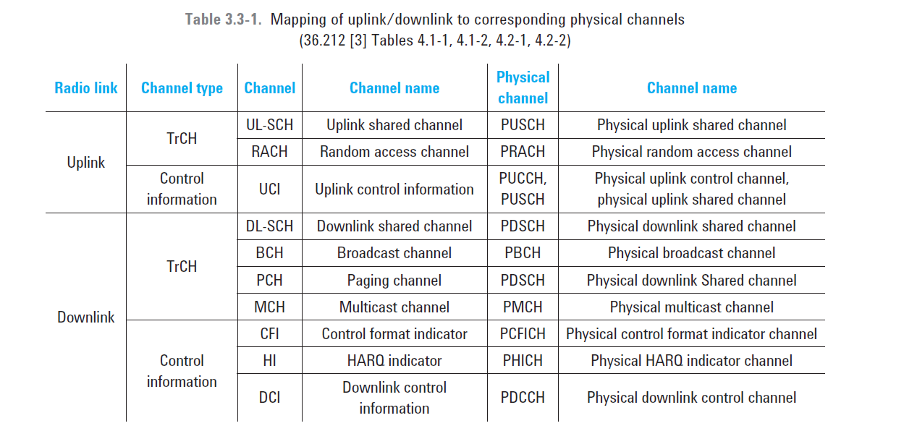
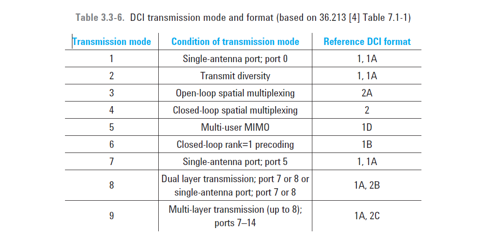
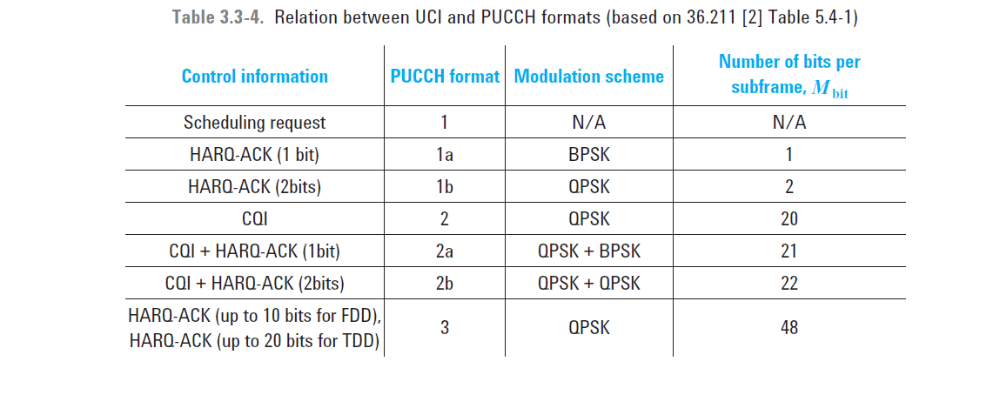

# channel
 LTE 中 transport channel 没有像WCDMA中那么重要。

# PDCCH
It consists of one or more consecutive control channel elements (**CCEs**), where a control channel element corresponds to nine resource element groups (**REGs**).The number of OFDM symbols allocated for the PDCCH is given by the control format indicator (**CFI**) carried on the PCFICH. The CFI can take the values 1, 2, and 3. The PDCCH supports **only the QPSK** modulation scheme.

note： 
* RB(Resource Block) = 12 carrier(180kHz) * 1 slot
* RB pair = 2 RB = 180kHz * 1ms 是最小的调度单位
* RE(Resource Element) = symbol 信息就调制在它上面. reference signal的是一定的pattern占用RE, CCE类似
* REG(Resource Element Group) = 4个连续未被占用的RE
* CCE (control channel elements) =  9 REG. 是PDCCH的分配单位。

## aggregation level

PDCCH | format Number of CCEs (n)| Number of REGs |Number of PDCCH bits|
------|--------------------------|----------------|--------------------|
0 |1 |9| 72|
1 |2 |18| 144|
2 |4 |36 |288|
3 |8 |72 |576|

to simplify the decoding process, a PDCCH with a format consisting of n CCEs may only start with a CCE with a number equal to a multiple of n.

The number of CCEs aggregated for transmission of a particular PDCCH is known as the **aggregation level** and is determined by the eNodeB according to the channel conditions.

## DCI
The downlink control information (DCI) is mapped to the PDCCH in the physical layer.(alex:不同TM mode下, 基站/UE需要的交互的信令不同, 也就是DCI/UCI格式不同.如果定义一个普遍适用的数据结构,就有些字段被空置了. 所以用dci来选取不同的的数据结构, 提高空口信令的数据利用率).

e.g.

* DCI Format 1: Used for scheduling of one PDSCH codeword in one cell. Carrier Indicator, Resource Allocation Header,Resource Block Assignment, MCS Index, HARQ Process Number, NDI, RV Index, TPC Command for PUCCH, DAI (TDD only).
* DCI Format 1A: Used for compact scheduling of one PDSCH codeword in one cell. Carrier

## PDCCH CRC Attachment
 a **16-bit CRC** appended to each PDCCH.This could in theory be achieved by adding an identifier to the PDCCH payload; however, it turns out to be more efficient to scramble the CRC with the **UE identity**, which saves the additional payload but at the cost of a small increase in the probability of falsely detecting a PDCCH intended for another UE. 也就是说 **UE identity** 不放在PDCCH payload 中，而是用它来加扰CRC.

## PDCCH Construction
* DCI format * system bandwidth ==> DCI 需要的bits
* 为了UE 解码方便，加 padding bits
* 作 rate-matching for the convolutional code； 然后加载到分配的CCE上。

# blind decodes of PDCCH
 （alex:对以PDCCH中是否包含给自己的DCI,和它出现在什么位置，这一切UE都是没法事先知道。如果设计协议让UE在确定位置解码，就类似于PBCH扩容，但这样空口的利用率就低了）. To receive DCI messages a UE must perform a large number of blind decodes every subframe. The DCI messages intended for that UE will be decoded successfully, whereas those not intended for that UE will fail the cyclic redundancy code (CRC) check.  盲检 search space 的确定参看 [Access Stratum](AS.md)

# UCI
Uplink control information (UCI) can be mapped to the PUCCH and PUSCH on the physical layer.

# Uplink Control Signaling
Reporting the channel conditions experienced by the receiver represents the baseline for many adaptation algorithms such as frequency selective scheduling, MIMO precoding, adaptive modulation and coding (AMC), and rank adaptation.

The LTE specifications define four indicators that reflect the channel state information (CSI) as seen by the recipient of the communication (that is, by the UE): 
* the channel quality indicator (CQI), 
* the rank indication (RI), 
* the precoding matrix indicator (PMI), 
* and the precoding type indicator (PTI).
 
The reporting of these indicators is done either aperiodically using the PUSCH or periodically using the PUCCH or PUSCH.

For calculation of these indicators, the UE will generally perform measurements on the cell-specific reference signals (CRS), although the CSI reference signals (CSI-RS) are introduced in Release 10 and can be used in transmission mode 9 (up to 8 layer transmission, ports 7–14). The CSI-RS allows the eNB more flexibility in configuring higher layer operation. 

For MIMO operation the selection of closed-loop mode or open-loop mode depends on the rate of change in the channel conditions. For low speed UEs, closed-loop MIMO with precoding is beneficial as is frequency-selective RB scheduling. Indeed, the likelihood of variable MIMO conditions across the channel means closed-loop MIMO works best in conjunction with frequency selective scheduling. For moderate to high speed UEs, the preferred mode of operation is space frequency block coding (SFBC) transmit diversity or spatial multiplexing with a fixed precoding matrix (open-loop MIMO).

The CQI, PMI, PTI, and RI are reported in control-indication fields on either the PUCCH (periodically) or the PUSCH (aperiodically). The reporting can be roughly categorized in three modes:
* wide band
* ue specific
* eNB selected (via pusch)

