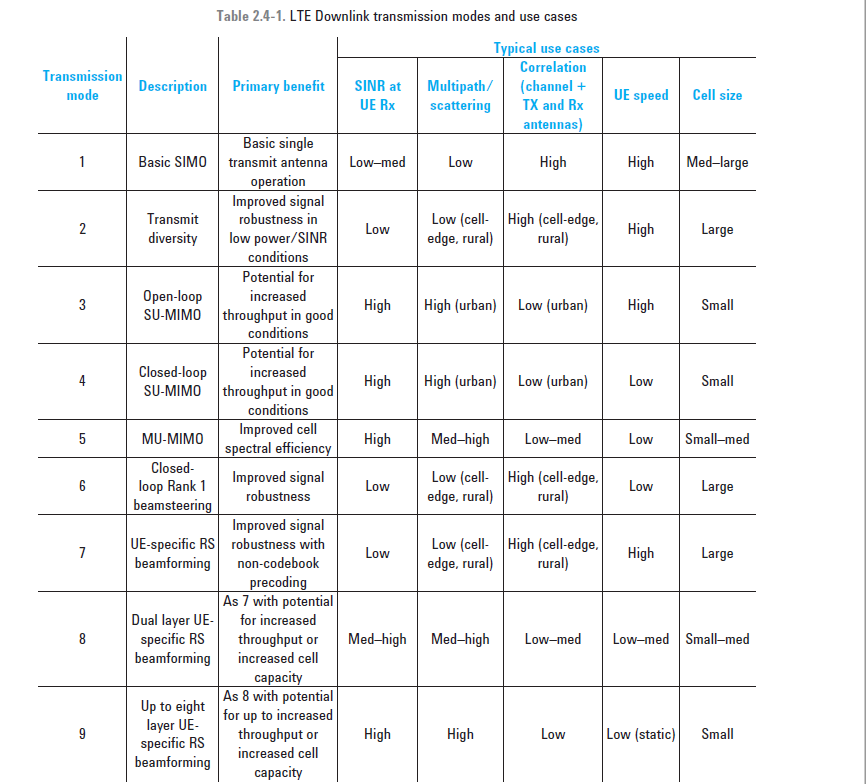
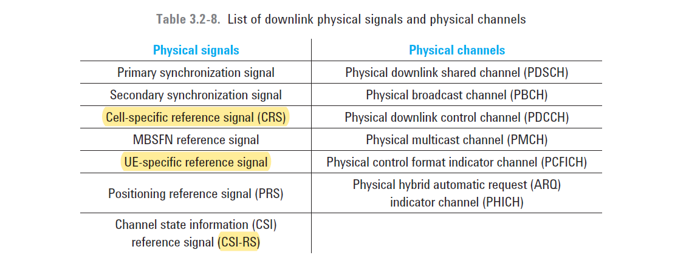
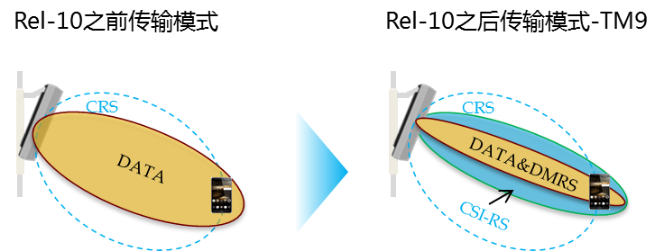
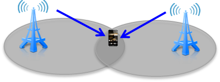
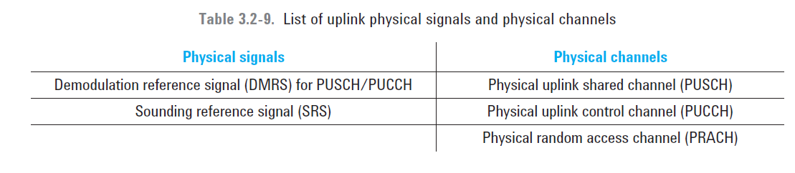

# overview
LTE specifies the way the downlink radio channel will be used by defining a set of transmission modes in 36.213 Section 7.1. There are nine different modes, all of which have different benefits in different use cases depending on the radio environment.

An antenna “port” does not always mean the same thing as a physical antenna. The term antenna port refers to the use of a particular set of reference signals, which are multiplexed onto physical antennas to suit the transmission mode. 

An example is port 5, used in TM7. The same coded signal is adjusted in phase and fed to multiple physical antennas to create a beamformed signal. This concentrates the transmitted power towards a specific direction or location, while the UE needs only to estimate the channel from one group of reference signals.

The way in which the different transmission modes are applied to the various downlink signals depends on what use the transmission mode makes of 
* transmit diversity, 
* spatial multiplexing, or 
* cyclic delay diversity (CDD).

# downlink Reference Signals

There are five types of downlink reference signals. 
* In Release 8 there are the cell-specific reference signal (CRS), 
* the MBSFN reference signal, 
* and the UE-specific reference signal (sometimes known as the demodulation or DMRS). 
* In Release 9 the positioning reference signal (PRS) was added and
* in Release 10, the channel state information reference signal (CSI-RS) was added.

From these references the UE can calculate corrections and thus minimize the probability of demodulation errors. 
* The CRS is present in every frame. It is used by the UE to demodulate other
downlink signals and also to report the downlink channel state information on the uplink.

* The purpose of the UE-specific RS is to optimize the RS for a specific UE by precoding the UE-specific RS resource elements with the same gain and phase shifts used for the PDSCH dedicated to that UE. In this way the UE no longer needs to be told how the PDSCH has been precoded and can directly decode the PDSCH using the similarly precoded UE-specific RS. This is clearly a benefit to the specific UE but it also means that the REs allocated to the UE-specific RS are of no use to other UEs in the serving cell.In Release 9 the UE-specific RS was extended for two antenna operation (ports 7 and 8). 

* The positioning reference signal was added in Release 9 to support the observed time difference of arrival (OTDOA) positioning scheme. The UE measures the time differences between the signals arriving from at least three eNBs and determines position by the intersection of arcs. Positioning reference signals are allocated on virtual antenna port 6.

# TM 9
Support for up to eight layers was introduced in Release 10. In principle this would require the extension of the CRS from four layers to eight layers, consuming significant downlink resources in every subframe, regardless of whether any UE were actually allocated an eight-layer downlink transmission. As an alternative to a direct extension of the CRS, Release 10 introduced the
CSI-RS. This reference signal performs the same basic function as the CRS; that is, it provides a known amplitude and phase reference to the UE. However, the CSI-RS has two distinct differences from the CRS. 
* First, the CSI-RS can be scheduled as required rather than being present in every frame.
* Second, the CSI-RS is used only for reporting of channel state information by the UE on the uplink and (unlike the CRS) is not used for demodulation.

* CSI-RS mapping for eight antennas on virtual antenna ports 15 through 22. The CSI-RS can be
allocated with a periodicity of 5, 10, 20, 40 and 80 subframes. This range helps optimize the trade-offs between the accuracy of channel sounding with the overhead of transmitting the CSI-RS

* 由于TM9的测量导频CSI-RS可以是用户级配置，从而能更精准的对相邻小区发送的数据流进行测量，并协调调度。根据实验室结果来看，基于TM9的下行 CoMP技术可使边缘速率提升20%-40%。

#  uplink Reference Signals

The DMRS is used for synchronization and uplink channel estimation. There are two types of DMRS; 
* one for the PUSCH and
* one for the PUCCH.

The eNB can request transmission of the SRS, which allows the eNB to estimate the uplink channel characteristics for arbitrary channel bandwidths. This estimate cannot be done using the PUCCH demodulation reference signal that is fixed to the bandwidth of the associated PUSCH/PUCCH. The SRS length, frequency-domain starting position, and other parameters are determined by the SRS configuration

# some concept
## TB
从MAC层发往物理层的数据是以传输块（Transport Block，TB）的形式组织的。一个TB对应包含一个MAC PDU的数据块，这个数据块会在一个TTI内发送，同时也是HARQ重传的单位。如果UE不支持空分复用，则一个TTI至多会发送一个TB；如果UE支持空分复用，则一个TTI至多会发送2个TB。

## codeword
一个码字（codeword）是对在一个TTI上发送的一个TB进行CRC插入、码块分割并为每个码块插入CRC、信道编码、速率匹配之后，得到的数据码流。每个码字与一个TB相对应，因此一个UE在一个TTI至多发送2个码字。码字可以看作是带出错保护的TB。

## layer
对1个或2个码字进行加扰（scrambling）和调制（modulation）之后得到的复数符号（调制符号）进行层映射（layer mapping，见36.211的6.3.3节）后，会映射到一个或多个传输层（transmission layer，通常也称为layer）。每层对应一条有效的数据流。

传输层的个数，即层数被称为“传输阶”或“传输秩（rank）”。传输秩是可以动态变化的。

## precoding
预编码（precoding）是使用预编码矩阵将层（layer）映射到天线端口（antenna port）的过程。预编码矩阵是R×P 的矩阵，其中R 为传输秩，即使用的传输层数，P 为天线端口的个数。

码本（codebook）是有限的可用预编码矩阵的集合。UE 只能从码本中选择合适的预编码矩阵（PMI）进行上报；而对于基于码本的预编码，eNodeB 只能从码本中选择合适的预编码矩阵，并通过DCI 告诉UE 对应的下行PDSCH 传输所使用的预编码矩阵。

## antenna port
天线端口（antenna port）是逻辑上的概念，一个天线端口可以是一个物理发射天线，也可以是多个物理发射天线的合并。在这两种情况下， UE 的接收机（receiver）都不会去分解来自同一个天线端口的信号，因为从终端的角度来看，不管信道是由单个物理发射天线形成的，还是由多个物理发射天线合并而成的，这个天线端口对应的参考信号（Reference Signal）就定义了这个天线端口，终端都可以根据这个参考信号得到这个天线端口的信道估计。

