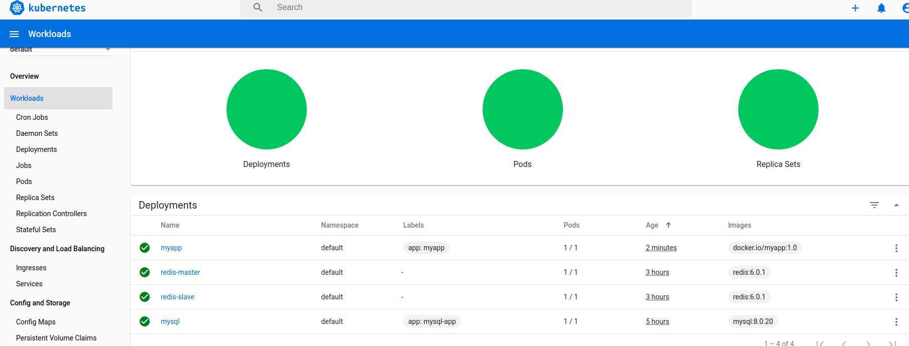

# Overview
A web system 
* developed by Go language
* delivered as docker image
* deployed in k8s
* loose coupling with Redis/Mysql

# Manage cluster via dashboard

# Code & configuration
* [Source code](https://github.com/yc-alex-xu/Alex/go)
* [image in dockub](https://hub.docker.com/repository/docker/justware/myapp)
* [K8S deployment](https://github.com/yc-alex-xu/Alex/microk8s)