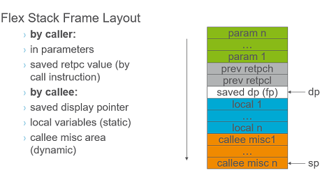

**dsp mem optimization**

*Xu YangChun Aug/21/2019*

# Problem
The DSP/thread run out of memory due to new feature

# analysis
The cause is that an new U16 field was added to the strcuture, then more space is needed for the array which allocated statically.

the code just for illustration

```c
/* global variables */
var1;
var2;

typedef struct _SeDataS
{
	U16 abc;
	U16 def; //added in the project
} _SeDataS;

_SeDataS _SchedData[MAX_];
varm;

void _start()//entry point of the thread
{
  _init();
  func1();
  func2();
  _main();
  funcn();
}
```  

since the dynamic allocated memory (heap ) is not supported in this dsp role(can allocate but can't release) , 
so the memory optimization limited to satic allocated memory (stack) including the local or global variable for this thread/dsp.

<!-- pagebreak -->
# reduce global variables' space via bits field
The usual way is:changing the normal field in struct to bits field. 

it is easy to understand, but involve several files, and may need to resolve "address of bits fields" error. Above all,  there is few space left to optimize since the tricks was used many times before,and it has performance penalty. 

shown as an example 
```c
struct bits
{
	unsigned short low : 2;
	unsigned short mid: 10;
	signed short : 4;
};
unsigned short i = 0x12;
int main()
{
	struct bits b = {-1};//line 10
	unsigned short xxx;
	xxx = i;
	b.mid = 33;
	xxx = b.mid;
	return 0;
}
```
its asm code show that it need extra instructions 
```asm
	mv         *dp(-2), a0h 	// 10 bits.c
	or         49152, a0h   	// 10
	mv         a0h, *dp(-2) 	// 10
	mv         *dp(-2), a0h 	// 10
	and        49167, a0h   	// 10
	mv         a0h, *dp(-2) 	// 10
	mv         #i, r0       	// 12
	mv         *r0, a0h     	// 12
	mv         a0h, *dp(-3) 	// 12
	mv         *dp(-2), a0h 	// 13
	and        49167, a0h   	// 13
	addh       528, a0      	// 13
	mv         a0h, *dp(-2) 	// 13
	mv         *dp(-2), a0h 	// 14
	exz        a0, 20, 9, a0h	// 14
	mv         a0h, *dp(-3) 	// 14
*/
```
# reduce global variables' space via stack frame change 


As illustrated above,the local variables ared allocate inside one specific stack frame. so when compiler met a **function or code block**, stack frame added, space grow; when it met function return or end of code block, stack frome decreased, space decreased. 
so if we tell can put two variables which are located different level of stack frome to stack frame of the the same level, 
 thne stack space can be reused.


# solution
***original code***
```c
void _main()
{
  _traceS trace;
  while(expr)
  {
    Succeeded =
        _assignSpectrumToSe(
            &trace
        );
    if (Succeeded) //var trace not used by this block 
    {
      _ginrWeighterDataS ginrWeightDataS;
	  ... 
    }    
  }
}
```
***refactoring, just adding 1 set of {}***
```c
void SESCHEDFO_main()
{

 while(expr)
  {
    {/adding 1 stack framed via the {}
    _traceS trace;
    Succeeded =
        _assignSpectrumToSe(
            &trace
        );
    }
    if (Succeeded)
    {
        _ginrWeighterDataS ginrWeightDataS;
    }    
  }
}
```
***result:memory usage reduced by 26 words ***

## reason behind
example below, after adding two sets of {}, memory can be saved via time mulitplexing of stack frame

[C code show stack reuse](flacc/stack_reuse.c)

[asm code after compilation](flacc/stack_reuse.s)

after stack reuse, Stack allocation: 16 <br>
if not, Stack allocation shall be 6 * 2 * 2 = 24 words<br>
so 8 words were saved.


## The difficulty of this solution is:
* optimizaiotn is only meaningful in the CriticalPath
* how many space can be save is difficult to calculate
* no tool to find the CriticalPath

Last sprint, I used git reflog/reset several round to find out the CriticalPath : _main().

# Anonymous union
many fieled actually are not used at the same time,e.g. the firt half time abc is used, the later def is used they can share space via union in theory.

```c
//abc,def was organized to a union
typedef struct _SeDataS
{
	union
	{
		U16 abc;
		U16 def;
	};
} _SeDataS;	
//code needn no change
_SchedData[i].abc = xxx;
```
If named union, it will require lots code changes.

The problem  is that current compiler don't support it, so it need wait for clang migration.


# Supplements
Here only list some tricks I use in last sprint,the topic about algorithm change is not covered, an example of removing the big auxiliary Space in the merge sort functionwill discuss next time .


