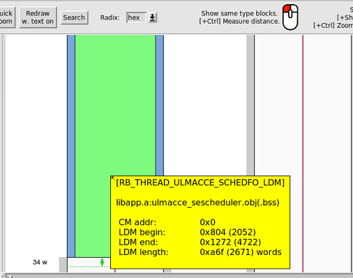

## dsp mem optimization
*Xu YangChun Aug/21/2019*

### Problem
The DSP/thread run out of memory, shown in abstract:
```c
/* global variables */
var1;
var2;
/*
typedef struct _SeDataS
{
	U16 abc;
	U16 def; //added in the project
} _SeDataS;
*/	
_SeDataS _SchedData[MAX_];
....
varm;

void ULMACCE_SCHEDFO_start()
{
  SESCHEDFO_init();
  func1();
  func2();
  ....  
  SESCHEDFO_main();
  ....
  funcn();
}
```  
When building, it was reported that the thread's heap+stack usage is over limit.


### analysis
The direct cause is that an U16 field was added to _SeDataS, so extra 24 words space is needed.
Althogh the error is "heap+stack", heap release is not supported in this dsp role, so the memory optimization limited to either inside functions or outside the functions, in other words, local or global variable.

<!-- pagebreak -->
### reduce global variables' space via bits field
The usual way used by developers before: changing the normal field in struct to bits field. it is easy to understand, but involve several files, and need to resolve "address of bits fields" error. And the deadly side effect is that it was used serveral years, so there is few space left to optimize, and there is performance penalty. 

```c
struct bits
{
	unsigned short low : 2;
	unsigned short mid: 10;
	signed short : 4;
};
unsigned short i = 0x12;
int main()
{
	struct bits b = {-1};//line 10
	unsigned short xxx;
	xxx = i;
	b.mid = 33;
	xxx = b.mid;
	return 0;
}
```
and its asm code
```asm
	mv         *dp(-2), a0h 	// 10 bits.c
	or         49152, a0h   	// 10
	mv         a0h, *dp(-2) 	// 10
	mv         *dp(-2), a0h 	// 10
	and        49167, a0h   	// 10
	mv         a0h, *dp(-2) 	// 10
	mv         #i, r0       	// 12
	mv         *r0, a0h     	// 12
	mv         a0h, *dp(-3) 	// 12
	mv         *dp(-2), a0h 	// 13
	and        49167, a0h   	// 13
	addh       528, a0      	// 13
	mv         a0h, *dp(-2) 	// 13
	mv         *dp(-2), a0h 	// 14
	exz        a0, 20, 9, a0h	// 14
	mv         a0h, *dp(-3) 	// 14
*/
```
### stack resue to reduce local variable space

As illustrated above, the local variables ared allocated/released with stack frame, if we tell the complier to allocate the variable in the stack frames of the same level,  stack space can be reused, as explained in asm below:

```c
#include <stdlib.h>
int s;
int main()
{
	{
	 int xxx = rand();//line 6
	 int yyy = rand();
	 int xxx_2 = rand();
	 int yyy_2 = rand();
	 int xxx_3 = rand();
	 int yyy_3 = rand();
	 
	 if (xxx>100)
		 s +=(xxx+yyy + xxx_2+yyy_2+xxx_3+yyy_3);
	}
	{
	 int xxx = rand();//line 17
	 int yyy = rand();
	 int xxx_2 = rand();
	 int yyy_2 = rand();
	 int xxx_3 = rand();
	 int yyy_3 = rand();
	 if (yyy>300)
		 s -=(xxx+yyy + xxx_2+yyy_2+xxx_3+yyy_3); //line 24
	}
	return s;
}
```
its asm code is:
```asm
	callr      #rand        	// 6 a.c (*), CurrBundle: 4, CriticalPath: 4
	mv         a0h, *dp(-1) 	// 6 (*), CurrBundle: 1, CriticalPath: 1, 1-byte Folded Spill
|	callr      #rand        	// 7 (*)
	.rule_off               	// 7
	copy       a0, a5       	// 7 (*), CurrBundle: 1, CriticalPath: 1
|	callr      #rand        	// 8 (*)
	copy       a0, a6       	// 8 (*), CurrBundle: 1, CriticalPath: 1
|	callr      #rand        	// 9 (*)
	copy       a0, a7       	// 9 (*), CurrBundle: 1, CriticalPath: 1
|	callr      #rand        	// 10 (*)
	copy       a0, a4       	// 10 (*), CurrBundle: 1, CriticalPath: 1
|	callr      #rand        	// 11 (*)
	.rule_on
	mv         *dp(-1), a1h 	// (*), 1-byte Folded Reload
	cmp        101, a1h     	// 13 (*), CurrBundle: 2, CriticalPath: 2
	if         .a1:ge       	// 14
|	addh       a1h, a5      	// 14 (*)
|	mv         #s, r0       	// 14
	if         .a1:ge       	// 14
|	addh       a5h, a6      	// 14 (*)
|	mv         *r0, a1h     	// 14
	addh       a6h, a7, .a1:ge	// 14 (*)
	addh       a7h, a4, .a1:ge	// 14 (*)
	addh       a4h, a0, .a1:ge	// 14 (*)
	addh       a1h, a0, .a1:ge	// 14 (*)
	mv         a0h, *r0, .a1:ge	// 14 (*), CurrBundle: 7, CriticalPath: 7
	callr      #rand        	// 17 (*), CurrBundle: 1, CriticalPath: 1
	mv         a0h, *dp(-1) 	// 17 (*), CurrBundle: 1, CriticalPath: 1, 1-byte Folded Spill
|	callr      #rand        	// 18 (*)
	.rule_off               	// 18
	copy       a0, a5       	// 18 (*), CurrBundle: 1, CriticalPath: 1
|	callr      #rand        	// 19 (*)
	copy       a0, a6       	// 19 (*), CurrBundle: 1, CriticalPath: 1
|	callr      #rand        	// 20 (*)
	copy       a0, a7       	// 20 (*), CurrBundle: 1, CriticalPath: 1
|	callr      #rand        	// 21 (*)
	copy       a0, a4       	// 21 (*), CurrBundle: 1, CriticalPath: 1
|	callr      #rand        	// 22 (*)
	.rule_on                	// 23
	cmp        301, a5h     	// 23 (*)
	brr        #.LBB0_2, .a5:lt	// 23 (*), CurrBundle: 2, CriticalPath: 2

// Procedure estimates:
// Code size: 101 words (28 bits/instr)
// Instructions / cycles: 57 / 39
// Loop weighted cycles: 39
// Stack allocation: 16
```

### solution
***original code***
```c
void SESCHEDFO_main()
{
  ULMACCE_LAPCSPLIB_traceS trace;
  ....
  while(expr)
  {
    assignSpectrumSucceeded =
        ULMACCE_SCHEDLIB_assignSpectrumToSe(
            &trace
        );
    //it is found that trace was not used inside this block at all 
    if (assignSpectrumSucceeded)
    {
      ULMACCE_PUSCHTPS_ginrWeighterDataS ginrWeightDataS;
	  ... 
    }    
  }
}
```
***refactoring***
```c
void SESCHEDFO_main()
{

 while(expr)
  {
    BOOL isNs05seTypeDowngraded = FALSE;
    {
    ULMACCE_LAPCSPLIB_traceS trace;
	...
    assignSpectrumSucceeded =
        ULMACCE_SCHEDLIB_assignSpectrumToSe(
            &trace
        );
    }
    if (assignSpectrumSucceeded)
    {
        ULMACCE_PUSCHTPS_ginrWeighterDataS ginrWeightDataS;
    }    
  }
}
```
result:memory usage reduced by 26 words 

The difficulty of this solution is:
* optimizaiotn is only meaningful in the CriticalPath
* how many space can be save is difficult to calculate
* no tool to find the CriticalPath
Last sprint, I used git reflog/reset several round to find out the CriticalPath in thread level: SESCHEDFO_main().

### looking forward: Anonymous union
If two fieled don't appear at the same time, they can share space via union

```c
//abc,def was organized to a union
typedef struct _SeDataS
{
	union
	{
		U16 abc;
		U16 def;
	};
    .....
} _SeDataS;	
//code needn no change
_SchedData[i].abc = xxx;
```
If using the named union, it will require lots code changes.The only problem of the solution is that current compler don't support it, so it need wait for clang migration completion.

### reduce more global variable?
Can we design SW in data driven way, if a global variable is not used in later phase, its space can be reused by another gloabal variable only used in later phase.

### Supplements
Here only list some tricks I use in last sprint, the topic about algorithm change is not covered, a seperate example about it will be shared via gerrit link.


