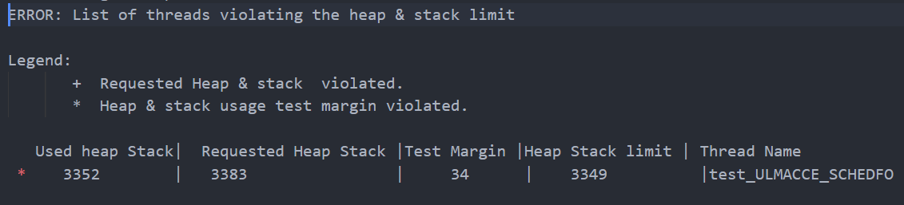
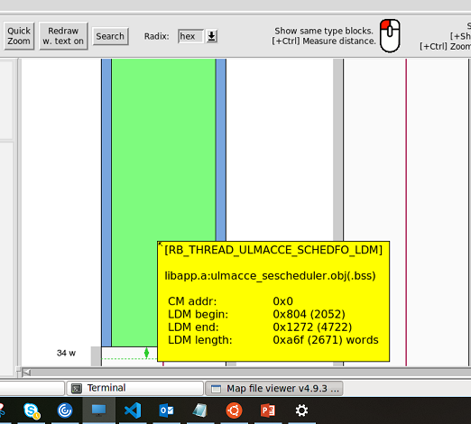
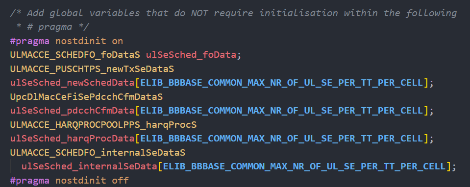
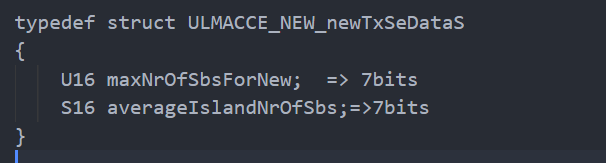
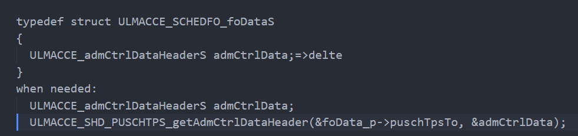
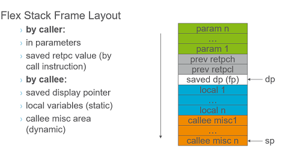

<!-- pagebreak -->
***heap/stack size optimization*** 

CONTENTS             
[TOC]
*Xu YangChun Aug/12/2019*

<!-- pagebreak -->
## Introduction
During the maintenance phase, you may met the memory run out issue. If unfortunately, it is legacy code's issue, you have to find out where and how to free some space. This short article take scheduler thread(a FO of MAC layer) as example to describe the methods can be employed.

<!-- pagebreak -->
## the issue
* error reported when building

* memory map illustrated


<!-- pagebreak -->
## global variables refactor
***main approach is reducing its data type's size***



### packing

### cutting


### Pros & cons
* direct, easy to understand
* performance penalty
[asm code](https://github.com/justwawre/about/blob/master/workshop/dsp_mem_opt/bits.c)
* few left to optimize
e.g 
 csiRequestBits  actually  need 3 bits only
below U16 var actually , but the change needs lots efforts, especially in test code which use it as U16.

### limitation of the compiler Flacc
* don't support c99 fully
* maybe new compiler clang change the situation

<!-- pagebreak -->
## local variables refactor
***stack resue is an edge tool***



### a simple example in outline
```c
void SESCHEDFO_main()//500+ loc
{
    U16 a;
    {
        U16 b;
    } 

    {
        U16 c;
    }  
    while(expr)
    {
        U16 d;
    }
}
```

### another example
***original code***
```c
void SESCHEDFO_main()//500+ loc
{
  ULMACCE_LAPCSPLIB_traceS trace;
  ULMACCE_SCHEDLIB_traceHeaderS* traceHeader_p;

  traceHeader_p = &trace.header;
  traceHeader_p->cellId = foData_p->commonCellTo.cellInfo.cellId;

  while(expr)
  {
    trace.specificInfo.traceEntryInfo.nrOfSchedulableSes = nrOfSchedulableSes;
    
    BOOL isNs05seTypeDowngraded = FALSE;
    assignSpectrumSucceeded =
        ULMACCE_SCHEDLIB_assignSpectrumToSe(
            &trace
        );
    
    if (assignSpectrumSucceeded)
    {
      ULMACCE_PUSCHTPS_ginrWeighterDataS ginrWeightDataS;

    }    
  }
}
```
***after refactor***
```c
void SESCHEDFO_main()//500+ loc
{

  while(expr)
  {
    BOOL isNs05seTypeDowngraded = FALSE;
    {
    ULMACCE_LAPCSPLIB_traceS trace;
    ULMACCE_SCHEDLIB_traceHeaderS* traceHeader_p;
    traceHeader_p = &trace.header;
    traceHeader_p->cellId = foData_p->commonCellTo.cellInfo.cellId;
    trace.specificInfo.traceEntryInfo.nrOfSchedulableSes = nrOfSchedulableSes;

    assignSpectrumSucceeded =
        ULMACCE_SCHEDLIB_assignSpectrumToSe(
            &trace
        );
    }
    
    if (assignSpectrumSucceeded)
    {
        ULMACCE_PUSCHTPS_ginrWeighterDataS ginrWeightDataS;

    }    
  }
}
```
result:
Decreased stack use in test_ULMACCE_SCHEDFO: by 26 words or 1.0%; new stack 2668 vs stack 2694 

***assume***
***how much saved = how much resued - how much compiler alredy optimzed***

### Pros & cons
* indirect & difficult to calculate
* more effort to read code
* no tool to find out the deepest  call sequence in stack   


<!-- pagebreak -->
## data structure refactor 
**e.g. any duplicate?**
```c
typedef struct ULMACCE_SESCHEDFO_seListS
{
  S16 size;
  S16 nrOfActiveElements;
  S16 startIndex;
  S16 iteratorIndex;
  ULMACCE_SESCHED_seDataS* se_p[ULMACCE_PUSCH_MAX_SE_LIST_SIZE];
} ULMACCE_SESCHEDFO_seListS;


typedef struct ULMACCE_SCHEDFO_foDataS
{
  ULMACCE_SCHEDFO_fodS fod;
  ULMACCE_SESCHEDFO_seListS inputNewSeList;
  ULMACCE_SESCHEDFO_seListS scheduledNewSeList;
} ULMACCE_SCHEDFO_foDataS;
```
** in the fod, there is two list: inputNewSeList, scheduledNewSeList.
actually one se can only appear in 1 list, why need 2 space? **


**e.g. duplicte index?**
```c
#pragma nostdinit on
ULMACCE_SCHEDFO_foDataS ulSeSched_foData;
ULMACCE_PUSCHTPS_newTxSeDataS
ulSeSched_newSchedData[ELIB_BBBASE_COMMON_MAX_NR_OF_UL_SE_PER_TT_PER_CELL];
UpcDlMacCeFiSePdcchCfmDataS
ulSeSched_pdcchCfmData[ELIB_BBBASE_COMMON_MAX_NR_OF_UL_SE_PER_TT_PER_CELL];
ULMACCE_HARQPROCPOOLPPS_harqProcS
ulSeSched_harqProcData[ELIB_BBBASE_COMMON_MAX_NR_OF_UL_SE_PER_TT_PER_CELL];
ULMACCE_SCHEDFO_internalSeDataS
  ulSeSched_internalSeData[ELIB_BBBASE_COMMON_MAX_NR_OF_UL_SE_PER_TT_PER_CELL];
#pragma nostdinit off

{//loop
  newSchedData_p = ulSeSched_newSchedData;
  pdcchCfmData_p = ulSeSched_pdcchCfmData;
  harqProcData_p = ulSeSched_harqProcData;
  internalSeData_p = ulSeSched_internalSeData;
  newSchedData_p++;
  //and the other 3 pointer ++
}
 ``` 

merging 4 pointer into 1 index

```c
static U16 seIndex = 0;

{//loop
  newSchedData_p = &testdata_newSchedData[seIndex];
  harqProcData_p = &testdata_harqProcData[seIndex];
  pdcchCfmData_p = &testdata_pdcchCfmData[seIndex];
  internalSeData_p = &testdata_internalSeData[seIndex];
  seIndex++;
}
 ``` 
ULMACCE_PUSCHTPS_newTxSeDataS has much bigger size than reTx, why occupy the same size? 
can the array only store the common field which used in scheudling algorith (weight/sort)
the less important field just put a linked list implement via array?

<!-- pagebreak -->
## code refactor 
e.g. algorithm 


